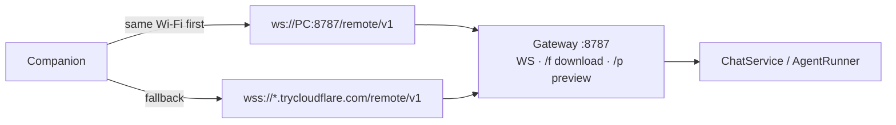
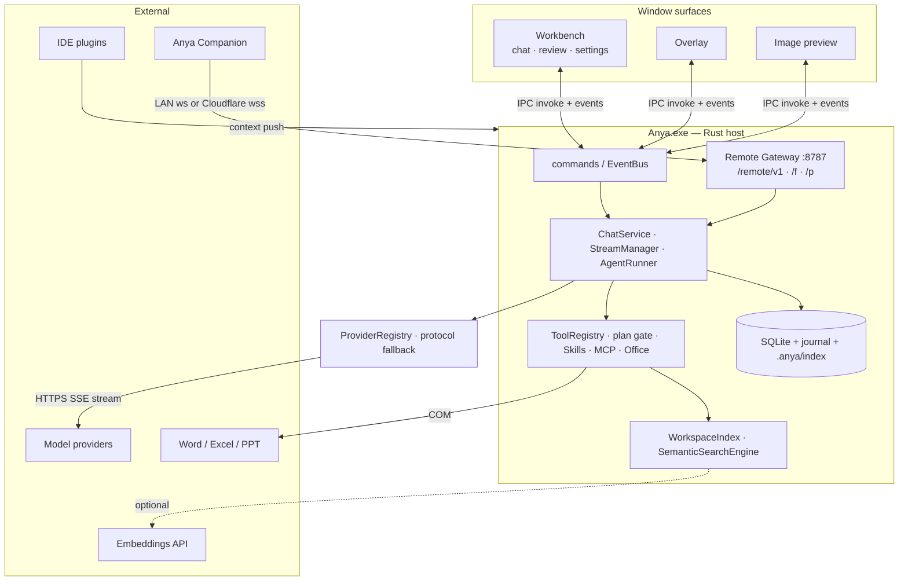

# Anya

<p align="center">
  
</p>

<h1 align="center">Anya</h1>

<p align="center"><strong>A desktop agent you can summon anytime.</strong></p>

<p align="center">
  Press a shortcut, and Anya is there — ready to help with documents, code, and everyday work.<br />
  Connect DeepSeek, OpenAI-compatible, Responses, or Anthropic Messages providers.
</p>

<p align="center">
  <a href="./README.md">English</a>
  &nbsp;·&nbsp;
  <a href="./README.zh-CN.md">简体中文</a>
</p>

<p align="center">
  
  
  
  
</p>

<p align="center">
  This repo
  &nbsp;·&nbsp;
  Phone: <a href="https://github.com/rururunu/AnyaAndroid">rururunu/AnyaAndroid</a>
</p>

---

## At a glance

|                 |                                                                                                                             |
| --------------- | --------------------------------------------------------------------------------------------------------------------------- |
| **Overlay**     | Double-tap <kbd>Alt</kbd> from any app. Ask, attach context, keep going.                                                    |
| **Workbench**   | Full desktop UI for pinned chats, project workspaces, archive / restore, review, and embedded settings.                     |
| **Agent**       | Ask / Agent / Plan / Image; tools, Skills, MCP, Office; complex tasks may auto-plan with a write gate.                      |
| **Companion**   | [Android remote](https://github.com/rururunu/AnyaAndroid) — scan a QR, then chat, approve, and share files from your phone. |
| **RAG**         | Optional semantic workspace search (API or local embeddings). Off until enabled; no model is downloaded beforehand.         |
| **Local-first** | Keys, history, and settings stay on your machine by default.                                                                |

**Docs:** [Architecture](./docs/architecture-overview.md) · [Releases](./docs/release.md) · [Index](./docs/README.md)

---

## Overlay — ask from anywhere

Double-tap <kbd>Alt</kbd> to show or hide the floating window. Ask a question, follow up in place, and switch Agent / model / approval under the composer.

<p align="center">
  
</p>

Anya can pick up the current text selection or Explorer selection. Paste or drag images and files into the input when you need richer context.

<p align="center">
  
</p>

<p align="center">
  
</p>

Summoning outside an IDE starts a **Quick Ask** session — not bound to a workspace, so history does not land in the wrong project. Bind a folder only when you choose one in the overlay (or with `/work`), or when you trigger from an IDE that is actually in the foreground.

Need more room? Use **Open conversation in workbench** on the overlay to move that same session into the full desktop UI — progress, tools, and history continue there.

### IDE context plugins

Companion plugins push active file, workspace, language, and selection to the local Anya app (best-effort; the editor keeps working if Anya is not running).

- [Visual Studio Code](https://marketplace.visualstudio.com/items?itemName=Anya.anya-ide-context)
- [IntelliJ Platform](https://plugins.jetbrains.com/plugin/33163-anya-ide-context)

---

## Companion — phone remote

[Anya Companion](https://github.com/rururunu/AnyaAndroid) is the Android console for this desktop app. The Agent still runs here; the phone is a remote — chat, tool approvals, workspace files, and file transfer (up to 500MB).

1. Open **Connect phone** in Anya and wait for the QR (LAN address, and a public tunnel host if you enabled it).
2. Install Companion and scan (or paste host / token). Deep link: `anya://pair`.
3. Same Wi-Fi uses `ws://PC:8787/remote/v1`. Away from home, Cloudflare Quick Tunnel `wss://`.
4. Phone → desktop uses chunked upload. Desktop → phone: tap the offer card, then HTTP `/f/{id}` with Range (resumable). A new chat from the phone FAB stays unbound — it does not inherit the desktop workspace.



Docs: [Companion README](https://github.com/rururunu/AnyaAndroid) · [Companion architecture](https://github.com/rururunu/AnyaAndroid/blob/main/docs/ARCHITECTURE.md)

---

## Workbench — every session in one place

The workbench is the full desktop surface: Quick Ask threads from the overlay sit beside pinned chats and project workspaces.

<p align="center">
  
</p>

| Area           | What it is for                                                                                                          |
| -------------- | ----------------------------------------------------------------------------------------------------------------------- |
| **Pinned**     | Keep important threads at the top.                                                                                      |
| **Workspaces** | Bind chats to a project folder; pin, reorder, collapse, archive, restore, or open the folder directly.                  |
| **Quick Ask**  | Temporary overlay sessions — continue, start new, or keep a long run here while you still summon the overlay elsewhere. |

### Review changes

When Agent edits files, Anya shows a per-file summary and a focused Diff view.

<p align="center">
  
</p>

- Task list and verification stay on the conversation timeline.
- Open **Review** for side-by-side or unified diffs.
- Undo covers changes Anya applied in the current session (checkpoints).

### Settings

Configure models, providers, agent behavior, Image generation, RAG search, and extensions from the embedded settings page (no separate settings window). Optional frosted-glass chrome blurs the titlebar and sidebars.

<p align="center">
  
</p>

Common controls include provider and model protocol, disabled models, model-specific reasoning effort, vision / multimodal fallback, language, tool approval mode, Agent display density, context-window budget, **Image** providers/models, and **RAG Search** (API or local embeddings; off by default).

Reasoning controls follow the selected model's advertised family. DeepSeek exposes disabled / low / high / max; GPT, Grok, Claude, Qwen, Kimi, and other compatible families expose the levels their endpoint supports. Unsupported values are clamped before a request is sent.

---

## Capabilities

### Ask / Agent / Plan / Image

| Mode      | Intent                              | Typical tools / constraints                                                        |
| --------- | ----------------------------------- | ---------------------------------------------------------------------------------- |
| **Ask**   | Read-only investigation             | Files, search, LSP, other read-only tools                                          |
| **Agent** | Default; change the world carefully | Files, PowerShell, Git, Skills, MCP, sub-agents; complex tasks may auto-enter Plan |
| **Plan**  | Agree on steps before writes        | Write tools locked; `update_tasks` + end-of-message approval card                  |
| **Image** | Every turn draws a picture          | Only `generate_image`; Settings → Image providers (not chat providers)             |

Ask withholds write / shell / git. Agent enables them under your approval policy. Plan (manual or auto) blocks writes via the plan gate until you approve at the end of the assistant reply. Image mode pins the Images API tool and prompt so each turn produces a real image. All four share the same `AgentRunner` loop — policy lives in tool exposure, approval, plan/image gates, not a second orchestrator.

### Timeline

Assistant turns interleave **reasoning**, **reply text**, and **tool activity** in chronological order — live and after reload. Long thinking no longer hides the work that happened mid-thought.

### Integrations

| Integration            | Role                                                                                              |
| ---------------------- | ------------------------------------------------------------------------------------------------- |
| **Microsoft Office**   | Context and `word_*` / `excel_*` / `ppt_*` tools when Word, Excel, or PowerPoint is running (COM) |
| **Skills**             | Built-in and vendor playbooks (docx, pandoc, research, review, …); can run as sub-agents          |
| **MCP**                | Stdio and remote MCP servers                                                                      |
| **LSP**                | Diagnostics when configured                                                                       |
| **Pinned-image badge** | Optional PixPin / Snipaste badge to open a chat with that image                                   |
| **Sub-agents**         | Split larger work while progress stays visible on the main thread                                 |
| **Memory**             | Local memory tools; optional mem0 cloud sync                                                      |
| **Web search**         | Serper or Tavily when an API key is set                                                           |
| **RAG Search**         | Optional semantic re-rank on `search_codebase` (OpenAI-compatible `/embeddings` or local ONNX)    |
| **Companion**          | [Android remote](https://github.com/rururunu/AnyaAndroid) over LAN or Cloudflare Tunnel           |

### Model providers

| Provider                 | How you connect                                                                            |
| ------------------------ | ------------------------------------------------------------------------------------------ |
| **DeepSeek**             | API key; native thinking and cache usage                                                   |
| **Gemini**               | Google sign-in (Antigravity OAuth)                                                         |
| **OpenAI-compatible**    | Base URL + key; Chat Completions or Responses protocol                                     |
| **Anthropic-compatible** | Base URL + key; Anthropic Messages protocol                                                |
| **Custom**               | Presets for MiMo, Zhipu GLM, Volcengine Ark, MiniMax, Kimi, and other compatible providers |

For image input with a text-only primary model, set a vision model or enable multimodal split analysis in Settings. The composer shows session token estimates, cache usage, and context usage; you can change model and thinking level while tools run. For a custom provider, select the protocol explicitly when discovery cannot advertise it.

---

## Install and get started

1. Download the MSI from [Releases](../../releases) and install.
2. Open **Settings** from the tray icon and connect a model provider.
3. Double-tap <kbd>Alt</kbd>, ask a question, press <kbd>Enter</kbd> — or move the session to the workbench when you need the full UI.

| Shortcut                                            | Action                                             |
| --------------------------------------------------- | -------------------------------------------------- |
| Double-tap <kbd>Alt</kbd>                           | Show or hide the overlay                           |
| <kbd>Ctrl</kbd> + <kbd>Alt</kbd> + <kbd>Space</kbd> | Fallback summon shortcut                           |
| <kbd>Enter</kbd>                                    | Send                                               |
| <kbd>/</kbd>                                        | Slash commands                                     |
| <kbd>Esc</kbd>                                      | Clear input; may close the window in some contexts |

---

## Data and privacy

API keys, OAuth tokens, settings, and chat history stay on your machine by default. Context capture is local; the message and attached context leave the device only when you send them to your configured provider.

When [Companion](https://github.com/rururunu/AnyaAndroid) is paired, chat events and files you share also travel to that phone over LAN or your Cloudflare tunnel.

Web search, MCP, mem0 cloud sync, and the optional **RAG API** backend send data to those services — enable them only if you accept their policies. Local RAG models stay on disk after the first download.

Crash recovery uses a local SQLite journal so interrupted streaming turns can settle on next launch instead of leaving the UI stuck “executing”.

---

## Architecture (summary)

Anya is a single-process **Tauri 2** app: WebView2 (Vue 3 + Pinia) for presentation, and a Rust host for OS integration, chat domain logic, model I/O, and tools.



Primary path:

```text
invoke("chat")
  → ChatService::send
  → StreamManager / AgentRuntime
  → AgentRunner::run
  → AIProvider::stream + ToolRegistry
  → EventBus → UI
  → ConversationManager persists messages (+ work_timeline)
```

`AgentRunner` owns the model↔tools loop. `AgentRuntime` owns run lifecycle (cancel, soft-inject, debug). Ask / Agent / Plan / Image share that loop; Plan gates writes via `plan_mode` until end-of-message approval; Image mode exposes only `generate_image` via `image_mode`. Do not add a second chat loop beside `AgentRunner`.

Full diagrams: [Architecture overview](./docs/architecture-overview.md) · [简体中文](./docs/architecture-overview.zh-CN.md)

---

## Run from source

Requires Node.js 18+, pnpm, Rust stable, VS C++ Build Tools, and WebView2.

```bash
pnpm install
pnpm tauri:dev
```

```bash
pnpm check          # typecheck + lint + frontend tests
cd src-tauri && cargo test --lib
pnpm tauri:build
```

The installer lands at `src-tauri/target/release/bundle/msi/Anya_0.2.15_x64.msi`.

For signing, `latest.json`, and GitHub Releases, see [Releases and remote updates](./docs/release.md).

---

## License

This repository is dedicated to the public domain under the [Unlicense](./LICENSE).
