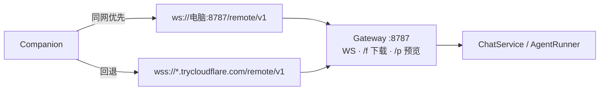
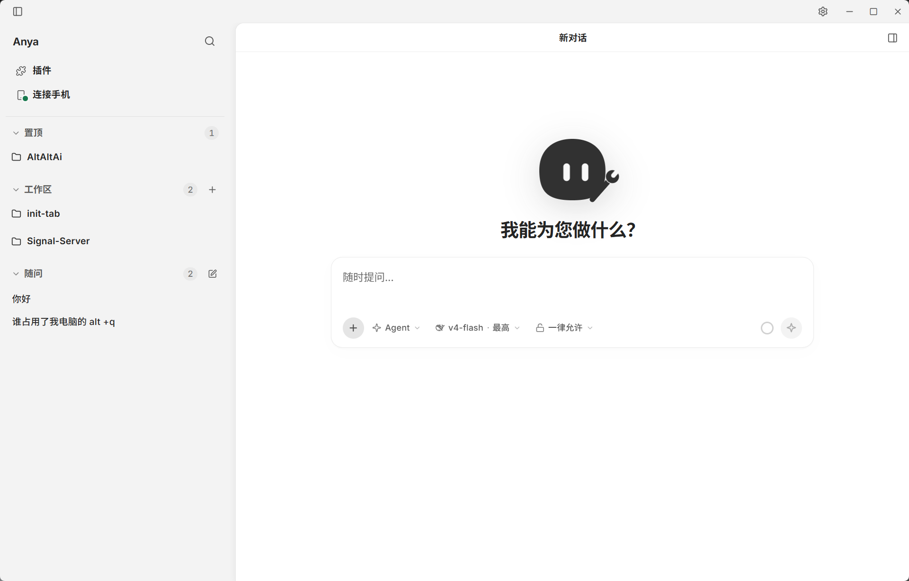
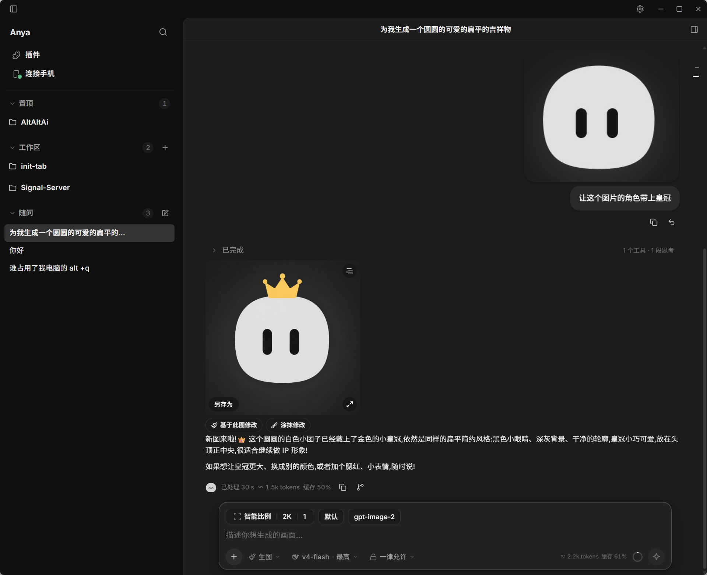
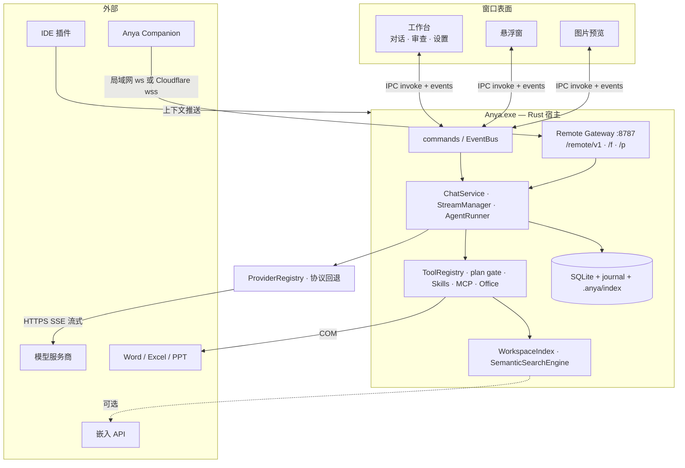

# Anya

<p align="center">
  
</p>

<h1 align="center">Anya</h1>

<p align="center"><strong>将你的工作&疑问随手交给Anya</strong></p>

<p align="center">
  按下快捷键，Anya 就会出现——文档润色、代码疑难、日常事务，她都能帮你。<br />
  支持 DeepSeek、OpenAI 兼容、Responses 与 Anthropic Messages 服务商。
</p>

<p align="center">
  <a href="./README.md">English</a>
  &nbsp;·&nbsp;
  <a href="./README.zh-CN.md">简体中文</a>
</p>

<p align="center">
  
  
  
  
</p>

<p align="center">
  本仓库
  &nbsp;·&nbsp;
  手机端：<a href="https://github.com/rururunu/AnyaAndroid">rururunu/AnyaAndroid</a>
</p>

---

## 一览

|               |                                                                                                |
| ------------- | ---------------------------------------------------------------------------------------------- |
| **悬浮窗**    | 任意应用中双击 <kbd>Alt</kbd>，随时提问、附带上下文。                                          |
| **工作台**    | 完整桌面界面：置顶会话、项目工作区、归档 / 恢复、变更审查与内嵌设置。                          |
| **Agent**     | Ask / Agent / Plan / Image；工具、Skills、MCP、Office；复杂任务可自动进入带写操作门禁的计划。  |
| **Companion** | [安卓远程](https://github.com/rururunu/AnyaAndroid) — 扫码后即可在手机上对话、审批、收发文件。 |
| **RAG**       | 可选语义工作区检索（API 或本地嵌入）。启用前不下载模型、不发请求。                             |
| **本地优先**  | 密钥、历史与设置默认保存在本机。                                                               |

**文档：** [架构](./docs/architecture-overview.zh-CN.md) · [发布](./docs/release.zh-CN.md) · [索引](./docs/README.zh-CN.md)

---

## 悬浮窗 — 随时提问

双击 <kbd>Alt</kbd> 显示或隐藏悬浮窗。直接提问、追问，并在输入栏下方切换 Agent / 模型 / 审批策略。

<p align="center">
  
</p>

Anya 会尝试读取当前文本选区或资源管理器选中项；也可将图片与文件粘贴或拖入输入框。

<p align="center">
  
</p>

<p align="center">
  
</p>

在 IDE 外唤出时，会话作为**快速提问**：不绑定工作区，避免写入旧项目。只有你在浮窗中主动选择工作区（或使用 `/work`），或在真正处于前台的 IDE 里触发时，才会绑定项目。

需要更大空间时，点击悬浮窗上的 **在工作区中打开对话**，即可把同一会话转到工作台——进度、工具调用与历史都会在那里继续。

### IDE 上下文插件

安装配套插件后，VS Code / IntelliJ 可将当前文件、工作区、语言与选区推送到本机 Anya（尽力而为；Anya 未运行时不影响编辑器）。

- [Visual Studio Code](https://marketplace.visualstudio.com/items?itemName=Anya.anya-ide-context)
- [IntelliJ Platform](https://plugins.jetbrains.com/plugin/33163-anya-ide-context)

---

## Companion — 手机远程

[Anya Companion](https://github.com/rururunu/AnyaAndroid) 是本桌面应用的安卓控制台。Agent 仍在电脑上跑；手机是遥控台——对话、工具审批、工作区文件，以及文件传输（上限 500MB）。

1. 在 Anya 中打开 **连接手机**，等到二维码出现局域网地址（若已开启公网隧道，还会有公网主机名）。
2. 安装 Companion 后扫码（或填写主机 / 令牌）。深度链接：`anya://pair`。
3. 同一 Wi-Fi 走 `ws://电脑:8787/remote/v1`；外出走 Cloudflare Quick Tunnel `wss://`。
4. 手机 → 桌面走分片上传。桌面 → 手机：点卡片后经 HTTP `/f/{id}` Range 拉取（可断点）。手机 FAB 新建会话保持未绑定——不会继承桌面当前工作区。



文档：[Companion README](https://github.com/rururunu/AnyaAndroid) · [Companion 架构](https://github.com/rururunu/AnyaAndroid/blob/main/docs/ARCHITECTURE.zh-CN.md)

---

## 工作台 — 统一管理会话

工作台是完整的桌面界面。悬浮窗里的快速提问会出现在这里，与置顶会话、项目工作区放在一起。

<p align="center">
  <picture>
    <source media="(prefers-color-scheme: dark)" srcset="./docs/image/dark_home.png" />
    
  </picture>
</p>

| 区域         | 用途                                                                                               |
| ------------ | -------------------------------------------------------------------------------------------------- |
| **置顶**     | 重要会话固定在上方。                                                                               |
| **工作区**   | 将会话绑定到项目目录，并支持置顶、排序、折叠、归档、恢复和直接打开目录。                           |
| **快速提问** | 与悬浮窗发起的临时会话同一批记录；可在此继续、新建，或把长对话留在工作台，同时仍可在别处唤出浮窗。 |

### 审查变更

Agent 修改文件后，Anya 会给出按文件汇总，并提供 Diff 视图。

<p align="center">
  
</p>

- 任务列表与验证结果仍留在对话时间线中。
- 打开 **审查** 可查看并排或统一 Diff。
- 当前会话内由 Anya 应用的变更支持撤销（检查点）。

### 设置

在工作台内嵌设置页配置模型、服务商、Agent 行为、生图、RAG 检索与扩展（没有独立设置窗口）。可选毛玻璃顶栏与侧栏。

<p align="center">
  
</p>

常用项包括：服务商与模型协议、禁用模型、按模型族配置思考力度、视觉 / 多模态回退、语言、工具审批模式、Agent 展示密度、上下文窗口预算、**生图**提供商与模型，以及 **RAG 检索**（API 或本地嵌入；默认关闭）。

思考控制会跟随当前模型声明的能力。DeepSeek 提供 disabled / low / high / max；GPT、Grok、Claude、Qwen、Kimi 等兼容模型使用服务端支持的档位。发送请求前会自动限制不支持的值。

---

## 能力

### Ask / Agent / Plan / Image

| 模式      | 意图                       | 典型工具 / 约束                                                    |
| --------- | -------------------------- | ------------------------------------------------------------------ |
| **Ask**   | 只读调研                   | 读文件、搜索、LSP 等只读工具                                       |
| **Agent** | 默认；在可控前提下改动环境 | 文件、PowerShell、Git、Skills、MCP、子 Agent；复杂任务可自动进计划 |
| **Plan**  | 先定步骤再执行             | 写工具锁定；`update_tasks` + 消息末尾批准卡                        |
| **Image** | 每轮真正出图               | 仅 `generate_image`；走设置 → 生图提供商（不用聊天提供商）         |

Ask 不开放写文件 / Shell / Git；Agent 在审批策略下开放；Plan（手动或自动）经计划门禁拦截写操作，直到用户在回答末尾批准；Image 模式钉死 Images API 工具与提示词，确保每轮产出真实图片。四种模式共用同一套 `AgentRunner`——约束落在工具暴露、审批与 plan/image 门禁，而不是第二套编排器。

<p align="center">
  
</p>

### 时间线

助手回合按发生顺序交错展示 **思考**、**回复正文** 与 **工具活动**（实时流式与历史回看均如此）。长思考不再把中途执行的命令与改动挤到看不见的位置。

### 集成

| 集成                 | 作用                                                                                       |
| -------------------- | ------------------------------------------------------------------------------------------ |
| **Microsoft Office** | Word / Excel / PowerPoint 运行时可采集上下文，并使用 `word_*` / `excel_*` / `ppt_*`（COM） |
| **Skills**           | 内置与厂商技能（docx、pandoc、research、review 等），可按子 Agent 执行                     |
| **MCP**              | 连接 stdio / 远程 MCP 服务                                                                 |
| **LSP**              | 配置后提供语言服务诊断                                                                     |
| **贴图角标**         | 可选为 PixPin / Snipaste 贴图启用角标，带着图片开聊                                        |
| **子 Agent**         | 复杂任务可拆给子 Agent，进度仍汇总在主对话                                                 |
| **记忆**             | 本地记忆工具；可选 mem0 云同步                                                             |
| **网页搜索**         | 配置 Serper 或 Tavily API Key 后可用                                                       |
| **RAG 检索**         | 可选：对 `search_codebase` 做语义重排（OpenAI 兼容 `/embeddings` 或本地 ONNX）             |
| **Companion**        | [安卓远程](https://github.com/rururunu/AnyaAndroid)，局域网或 Cloudflare 隧道              |

### 模型服务商

| 服务商             | 接入方式                                                               |
| ------------------ | ---------------------------------------------------------------------- |
| **DeepSeek**       | API Key；原生支持思考和缓存用量                                        |
| **Gemini**         | Google 账号登录（Antigravity OAuth）                                   |
| **OpenAI 兼容**    | Base URL + Key；支持 Chat Completions 或 Responses 协议                |
| **Anthropic 兼容** | Base URL + Key；支持 Anthropic Messages 协议                           |
| **自定义**         | 预设含 MiMo、智谱 GLM、火山方舟、MiniMax、Kimi，也可接入其他兼容服务商 |

主模型不支持图片时，请配置视觉模型或启用多模态分拆分析。输入栏会显示会话级 token 估算、缓存用量与上下文用量；可切换模型与思考档位，并查看工具执行过程。自定义服务商无法声明协议时，请在设置中手动选择协议。

---

## 安装与开始使用

1. 从 [Releases](../../releases) 下载并安装 MSI。
2. 从系统托盘打开 **设置**，配置模型服务商。
3. 双击 <kbd>Alt</kbd> 提问；需要完整界面时，一键转到工作台继续。

| 快捷键                                              | 作用                         |
| --------------------------------------------------- | ---------------------------- |
| 双击 <kbd>Alt</kbd>                                 | 显示或隐藏悬浮窗             |
| <kbd>Ctrl</kbd> + <kbd>Alt</kbd> + <kbd>Space</kbd> | 备用唤出快捷键               |
| <kbd>Enter</kbd>                                    | 发送消息                     |
| <kbd>/</kbd>                                        | 斜杠命令                     |
| <kbd>Esc</kbd>                                      | 清空输入；部分场景下关闭窗口 |

---

## 数据与隐私

API Key、OAuth 令牌、设置与聊天记录默认保存在本机。选区与文件采集也在本地完成；只有发送消息后，消息及其附带上下文才会发往你配置的模型服务商。

配对 [Companion](https://github.com/rururunu/AnyaAndroid) 后，对话事件与你分享的文件还会经局域网或 Cloudflare 隧道到达该手机。

启用网页搜索、MCP、mem0 云同步或可选的 **RAG API** 后端时，相关内容还会发给对应第三方服务，请按其隐私政策决定是否开启。本地 RAG 模型首次下载后离线可用。

崩溃恢复使用本地 SQLite journal：下次启动会结算中断的流式回合，避免界面卡在「执行中」。

---

## 技术架构（摘要）

Anya 为单进程 **Tauri 2** 应用：WebView2（Vue 3 + Pinia）负责呈现；Rust 宿主负责 OS 集成、聊天领域逻辑、模型 I/O 与工具执行。



主路径：

```text
invoke("chat")
  → ChatService::send
  → StreamManager / AgentRuntime
  → AgentRunner::run
  → AIProvider::stream + ToolRegistry
  → EventBus → UI
  → ConversationManager 持久化消息（含 work_timeline）
```

`AgentRunner` 负责 model↔tools 主循环；`AgentRuntime` 负责 run 生命周期（取消、soft-inject、debug）。Ask / Agent / Plan / Image 共用该循环；Plan 经 `plan_mode` 门禁拦截写操作，直到回答末尾批准；Image 模式经 `image_mode` 仅暴露 `generate_image`。不要在 `AgentRunner` 之外平行再造一套对话循环。

完整视图：[技术架构总览](./docs/architecture-overview.zh-CN.md)

---

## 从源码运行

需要 Node.js 18+、pnpm、Rust stable、VS C++ Build Tools 与 WebView2。

```bash
pnpm install
pnpm tauri:dev
```

```bash
pnpm check          # typecheck + lint + 前端测试
cd src-tauri && cargo test --lib
pnpm tauri:build
```

安装包输出为 `src-tauri/target/release/bundle/msi/Anya_0.2.18_x64.msi`。

发布与应用内更新见 [发布与远程更新](./docs/release.zh-CN.md)。

---

## 许可证

本项目采用 [Unlicense](./LICENSE)，相当于公共领域，几乎无限制使用、修改与分发。
