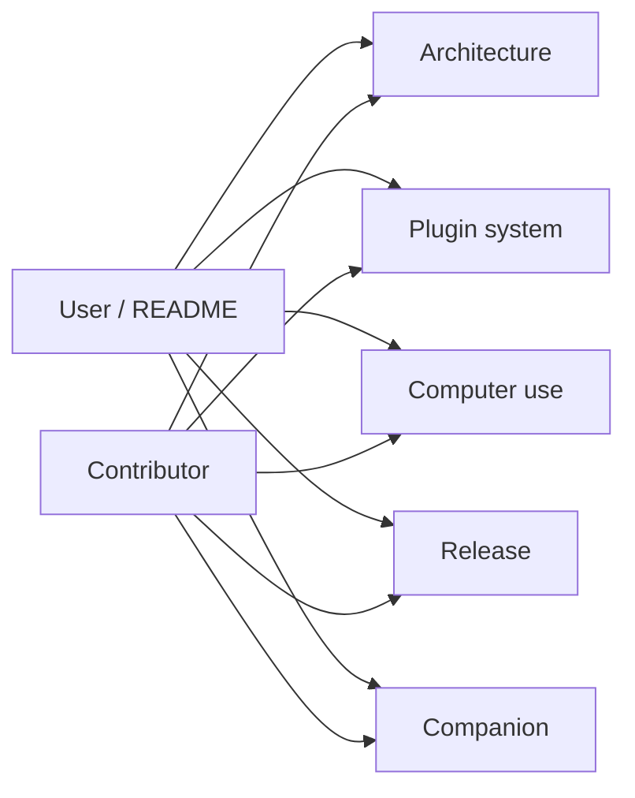

# Anya documentation

  <a href="./README.md">English</a>
  &nbsp;·&nbsp;
  <a href="./README.zh-CN.md">简体中文</a>

Product home: [../README.md](../README.md)

These pages are the maintainer map — start at the root README for the product story, then open the guide that matches your task.

| Document                                                       | Audience                      | When to open it                                                                                                                    |
| -------------------------------------------------------------- | ----------------------------- | ---------------------------------------------------------------------------------------------------------------------------------- |
| [Architecture overview](./architecture-overview.md)            | Contributors                  | Layers, process topology, Ask/Agent/Plan/Image, Companion gateway + file HTTP, RAG, timeline, persistence, module map              |
| [Plugin system](./plugin-system.md)                            | Plugin authors / contributors | Tech choices, motivation, architecture, runtime flow, contract primitives, dev tutorial, API reference                             |
| [Computer use](./computer-use.md)                              | Contributors / agent authors  | Official `computer-use` plugin: launch → keyboard → UIA → pixels, screenshot+tree, Windows playbook                                |
| [Releases & remote updates](./release.md)                      | Release managers              | Signing, `latest.json`, GitHub Releases, CI                                                                                        |
| [Companion (Android)](https://github.com/rururunu/AnyaAndroid) | Users / mobile                | Phone remote: pair, chat, approvals, files. [Architecture](https://github.com/rururunu/AnyaAndroid/blob/main/docs/ARCHITECTURE.md) |
| Screenshots (`image/`)                                         | Users / README                | Assets linked from the root README                                                                                                 |

When behavior changes, update the matching document and keep its Chinese twin (`*.zh-CN.md`) in sync.
