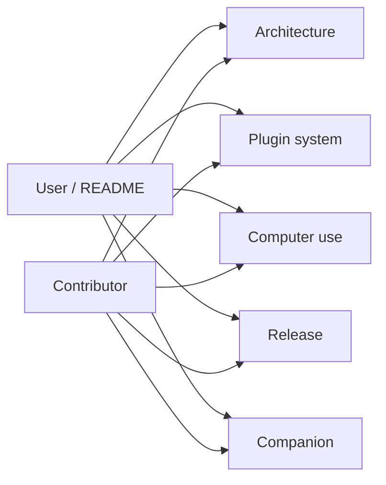

# Anya documentation

  <a href="./README.md">English</a>
  &nbsp;·&nbsp;
  <a href="./README.zh-CN.md">简体中文</a>

Product home: [../README.md](../README.md)

These pages are the maintainer map — start at the root README for the product story, then open the guide that matches your task.

| Document                                                       | Audience                      | When to open it                                                                                                                            |
| -------------------------------------------------------------- | ----------------------------- | ------------------------------------------------------------------------------------------------------------------------------------------ |
| [Architecture overview](./architecture-overview.md)            | Contributors                  | Layers, process topology, chat composer and overlay, theme image storage, updates, desktop pet, Companion gateway, persistence, module map |
| [Plugin system](./plugin-system.md)                            | Plugin authors / contributors | Tech choices, motivation, architecture, runtime flow, contract primitives, dev tutorial, API reference                                     |
| [Computer use](./computer-use.md)                              | Contributors / agent authors  | Official `computer-use` plugin: launch → keyboard → UIA → pixels, screenshot+tree, Windows playbook                                        |
| [Office workflows](./office.md)                                | Users / contributors          | Saved-file skills, bundled JavaScript runtime, packaging and validation limits                                                             |
| [Native DeepSeek tools](./deepseek-harness.md)                 | Users / contributors          | dsh contracts, model isolation, Rust execution, request diagnostics and port boundaries                                                    |
| [File delivery cards](./file-delivery.md)                      | Users / contributors          | Explicit delivery, history restoration, opening, preview, colored icons and licensing                                                      |
| [Browser Selection Bridge](../browser-extension/README.md)     | Users / contributors          | Optional Chrome / Edge selection capture, setup, local data flow and limitations                                                           |
| [OpenCLI](./opencli.md)                                        | Contributors / agent authors  | Official `opencli` plugin: site adapters + logged-in Chrome Browser Bridge (complements Computer Use)                                      |
| [Releases & remote updates](./release.md)                      | Release managers              | Signing, `latest.json`, GitHub Releases, in-app update flow, CI                                                                            |
| [Companion (Android)](https://github.com/rururunu/AnyaAndroid) | Users / mobile                | Phone remote: pair, chat, approvals, files. [Architecture](https://github.com/rururunu/AnyaAndroid/blob/main/docs/ARCHITECTURE.md)         |
| [Permissions and code preview](./permissions-and-preview.md)   | Users / contributors          | Permission scopes, approval recovery across windows, code cards and read-range previews                                                    |

```mermaid
flowchart LR
  User[User / README] --> Arch[Architecture]
  User --> Plug[Plugin system]
  User --> CU[Computer use]
  User --> Rel[Release]
  User --> Comp[Companion]
  Dev[Contributor] --> Arch
  Dev --> Plug
  Dev --> CU
  Dev --> Rel
  Dev --> Comp
```

When behavior changes, update the matching document and keep its Chinese twin (`*.zh-CN.md`) in sync.
