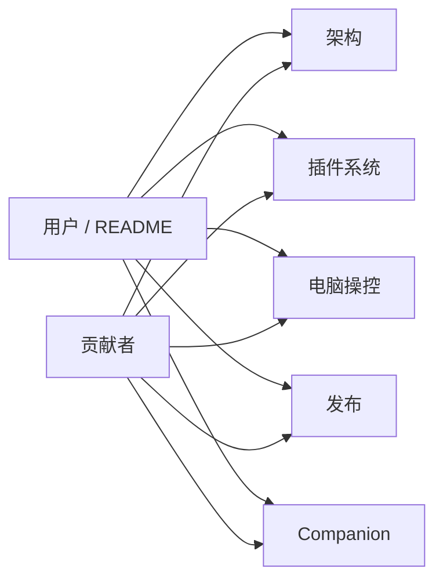

# Anya 文档索引

  <a href="./README.md">English</a>
  &nbsp;·&nbsp;
  <a href="./README.zh-CN.md">简体中文</a>

产品主页：[../README.zh-CN.md](../README.zh-CN.md)

这里是文档地图——产品介绍请看根目录 README；按任务打开对应指南即可。

| 文档                                                         | 读者                | 适用场景                                                                                                               |
| ------------------------------------------------------------ | ------------------- | ---------------------------------------------------------------------------------------------------------------------- |
| [技术架构总览](./architecture-overview.zh-CN.md)             | 贡献者              | 分层、进程拓扑、Ask/Agent/Plan/Image、Companion 网关与文件 HTTP、RAG、时间线、持久化、模块地图                         |
| [插件系统](./plugin-system.zh-CN.md)                         | 插件作者 / 贡献者   | 技术选型、初衷、架构关系、运行流程、契约原语、开发教学、API 参考                                                       |
| [电脑操控](./computer-use.zh-CN.md)                          | 贡献者 / Agent 作者 | 官方 `computer-use`：launch → 快捷键 → UIA → 像素、截图+控件树、Windows playbook                                       |
| [发布与远程更新](./release.zh-CN.md)                         | 发版负责人          | 签名、`latest.json`、GitHub Releases、CI                                                                               |
| [Companion（安卓）](https://github.com/rururunu/AnyaAndroid) | 用户 / 手机         | 手机远程：配对、对话、审批、文件。[架构](https://github.com/rururunu/AnyaAndroid/blob/main/docs/ARCHITECTURE.zh-CN.md) |
| 截图资源（`image/`）                                         | 用户 / README       | 根目录 README 引用的截图                                                                                               |

行为变更时，请更新上表对应文档，并保持中英文姊妹篇（`*.zh-CN.md`）结构同步。
