# Anya Architecture Overview

This document describes the logical structure, dependency rules, control flow,
persistence, and orchestration of Anya. It is intended for contributors who need
to locate code paths and reason about change impact.

<p>
  <a href="./architecture-overview.md">English</a> ·
  <a href="./architecture-overview.zh-CN.md">简体中文</a>
</p>

|             |                                                    |
| ----------- | -------------------------------------------------- |
| **Product** | Anya — Hand your work & questions to Anya anytime. |
| **Version** | v0.2.13                                            |
| **Runtime** | Tauri 2 (WebView2 + Rust)                          |
| **UI**      | Vue 3 · Vite · Pinia · TypeScript                  |
| **Domain**  | Rust (`src-tauri/src`)                             |

**Related:** [Release](./release.md) · [Docs index](./README.md) · [Companion (Android)](https://github.com/rururunu/AnyaAndroid/blob/main/docs/ARCHITECTURE.md)

---

## 1. Scope

**In scope**

- Process / window topology
- Layered module boundaries and allowed dependencies
- Primary chat request path (UI → domain → provider → tools → UI events)
- Agent turn orchestration and policy hooks (Ask / Agent / Plan / Image gates)
- Persistence (SQLite, journal, work timeline)
- Frontend stream projection and session model
- Extension points (providers, tools, skills, MCP, RAG embeddings)
- Companion / Remote Gateway (pairing, LAN vs tunnel, wire protocol, file HTTP)

**Out of scope**

- Provider-specific HTTP schemas
- Individual tool argument contracts
- UI visual design tokens

---

## 2. System context

Anya runs as a **single native process** hosting multiple WebView windows. The
Rust host owns OS integration; WebViews own presentation and local UI state.

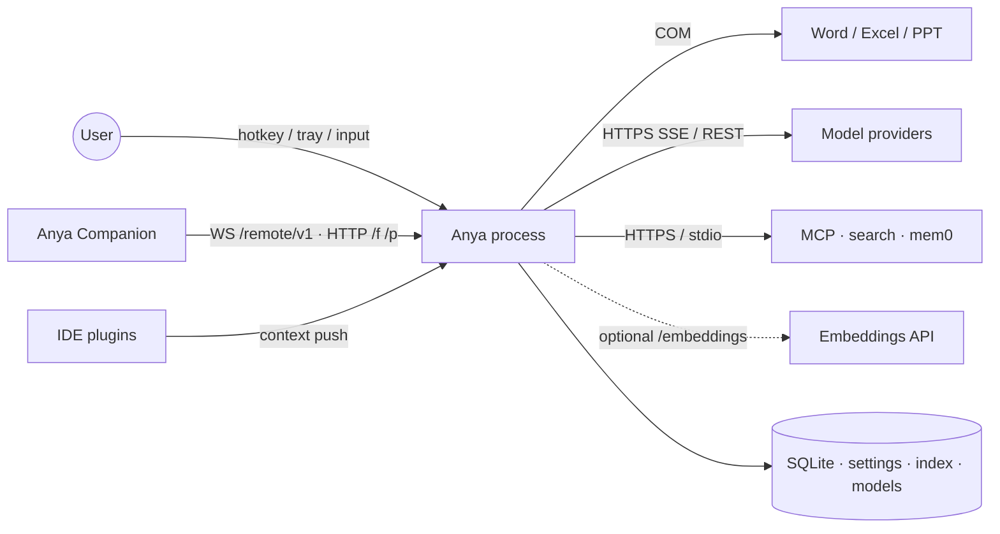

| Actor / system      | Interaction                                                                    |
| ------------------- | ------------------------------------------------------------------------------ |
| User                | Global hotkey, tray, composer, review UI, embedded settings                    |
| Anya Companion      | Android remote; LAN `ws` or Cloudflare `wss`; files over HTTP Range `/f/`      |
| IDE plugins         | Best-effort local context push (file, workspace, selection)                    |
| Microsoft Office    | COM for document context and `word_*` / `excel_*` / `ppt_*` tools              |
| Model providers     | Authenticated HTTPS SSE; Chat Completions, Responses, or Anthropic Messages    |
| Embeddings          | Optional RAG: OpenAI-compatible `/embeddings` or local ONNX (`fastembed`)      |
| MCP / search / mem0 | Optional; enabled explicitly in settings                                       |
| Local disk          | Chat DB, settings, `.anya/index`, embedding cache, updater pubkey, checkpoints |

---

## 3. Logical architecture

### 3.1 Layers

Dependencies point **downward only**. Cross-layer calls that skip a boundary
(e.g. Vue store → raw Tauri API, `commands/` → provider HTTP) are treated as bugs.

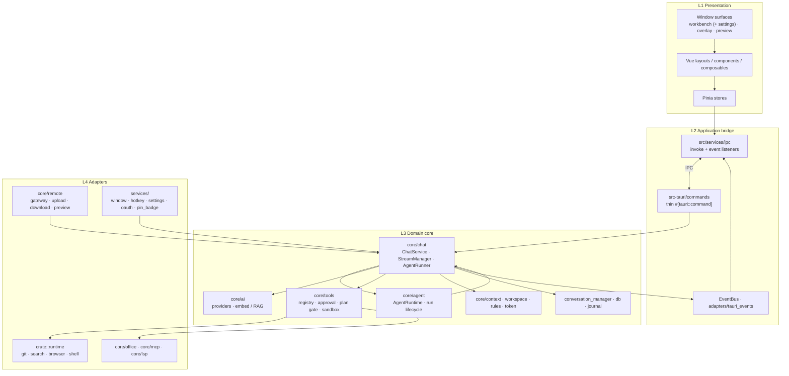

| Layer           | Location                                                | Responsibility                                            | Must not                        |
| --------------- | ------------------------------------------------------- | --------------------------------------------------------- | ------------------------------- |
| L1 Presentation | `src/{layouts,components,composables,stores,pages}`     | Render, local UX state, RAF-batched stream merge          | Call providers or execute tools |
| L2 Bridge       | `src/services/ipc`, `commands/`, `adapters/`            | Serialize IPC DTOs; map `BusEvent` → Tauri emits          | Own business policy             |
| L3 Domain       | `core/{chat,ai,tools,agent,context,…}`                  | Chat lifecycle, agent loop, tools, prompts, persistence   | Depend on Vue / DOM             |
| L4 Adapters     | `runtime/`, `services/`, `core/{office,mcp,lsp,remote}` | OS, COM, HTTP clients, MCP transport, Companion WS / HTTP | Drive the agent loop            |

### 3.2 Frontend dependency rule

```text
UI → composables → stores → services → services/ipc → Tauri
                 ↘ services ↗
```

`stores` and `services` must not import `components` / `layouts` / `pages`.
Chat image helpers (`saveChatImage`, `localImageSrc`, `imageGenMode`, …) live under
`services/chat/` for that reason — UI cards only consume them.

### 3.3 Backend dependency rule

```text
lib / main
  → commands (IPC façade)
  → core::* (domain)
  → runtime / office / mcp (adapters)
services (window, hotkey, settings) → core where needed
```

`commands/*` validate input and delegate; orchestration lives in `ChatService`
and `AgentRuntime`, not in command handlers.

---

## 4. Deployment / process view

One OS process, multiple WebView labels. Domain state is shared in-process.

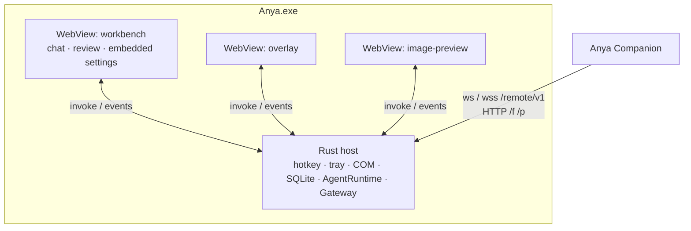

| Surface   | Label               | Role                                                                  |
| --------- | ------------------- | --------------------------------------------------------------------- |
| Workbench | `workbench`         | Sessions, review, **embedded settings** (no separate settings window) |
| Overlay   | `overlay*`          | Floating composer; Quick Ask or workspace-bound                       |
| Preview   | `overlay-preview-*` | Image preview windows                                                 |

Tray **Settings** shows the workbench and emits `open-workbench-settings`. Optional
**frosted-glass chrome** (`services/workbench_glass.rs`) uses the DWM backdrop on
the titlebar and sidebars; the conversation pane stays opaque. Maximized /
fullscreen skips native blur.

Session identity (`session_id`) is owned by the Rust conversation store. Overlay
and Workbench may attach to the **same** session concurrently. Companion attaches
over the gateway and projects the same store — it does not own a second Agent.

### 4.1 Remote Gateway & Companion

Phone app: [AnyaAndroid](https://github.com/rururunu/AnyaAndroid). Desktop code:
`src-tauri/src/core/remote/`. Companion is a **projection + RPC client**; this
process still owns tools, SQLite, and model keys.

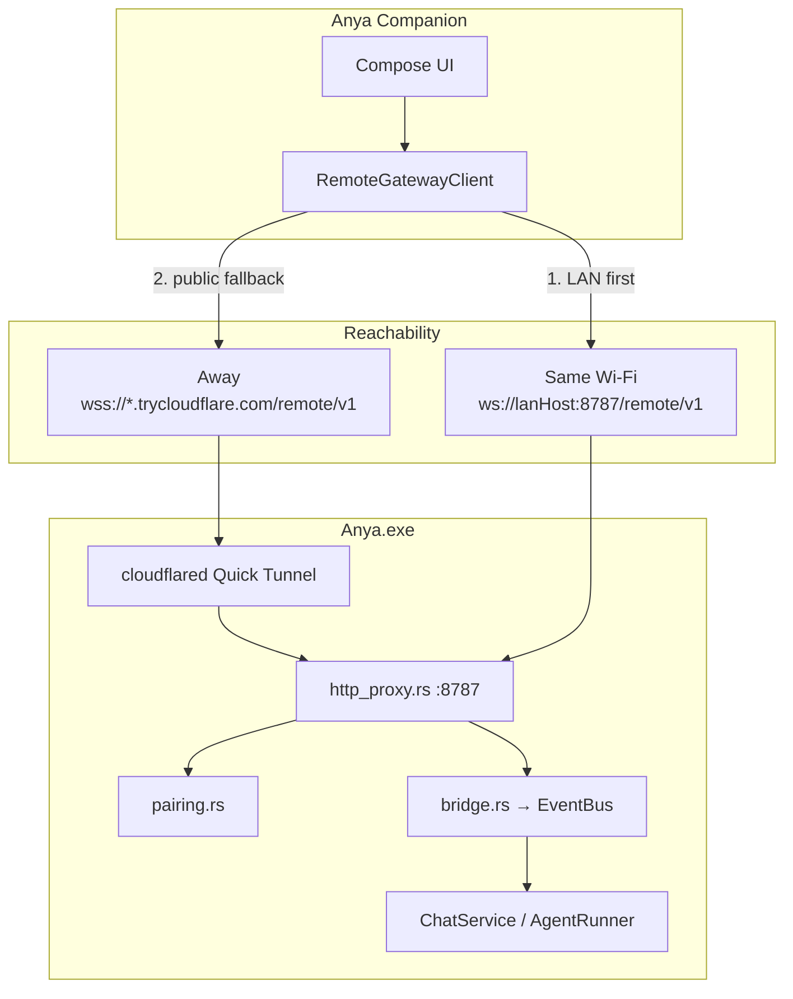

Same port **8787** splits three HTTP surfaces:

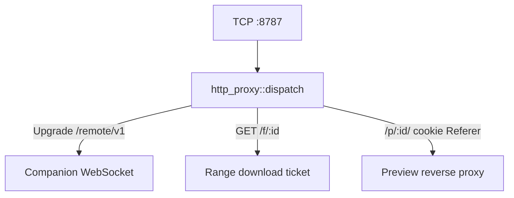

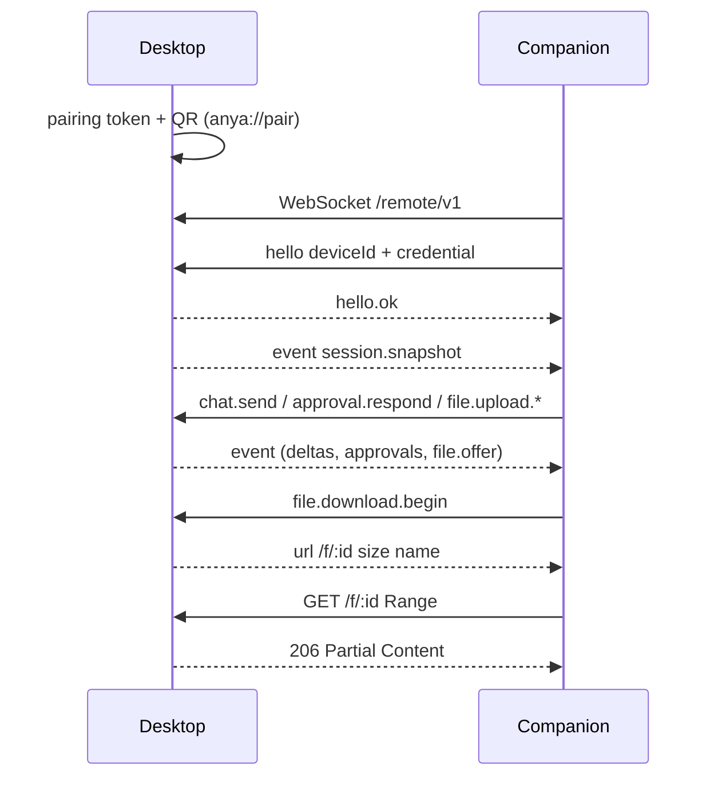

| Topic           | Contract                                                                                                                              |
| --------------- | ------------------------------------------------------------------------------------------------------------------------------------- |
| Path / port     | `/remote/v1` on **8787** (LAN `ws`, tunnel `wss`)                                                                                     |
| Auth            | Short-lived QR token, then stored device credential                                                                                   |
| Keep-alive      | Application `ping` / `pong` (proxies drop native WS pings)                                                                            |
| Phone → desktop | Chunked `file.upload.*` (JSON+b64 **or** binary WS frames), out-of-order, 512KB, **500MB** cap                                        |
| Desktop → phone | Offer card → `file.download.begin` → HTTP `/f/{id}` with `Range` (10 min ticket). Legacy: `workspace.readFile` `mode=download` slices |
| Previews        | HTTP `/p/{id}/` reverse proxy on the same gateway (cookie / Referer fallback)                                                         |
| Unbound phone   | FAB / `chat.send` without `workspaceId` is Quick Ask — **never** inherit the desktop workspace                                        |

Phone-side diagrams: [Companion architecture](https://github.com/rururunu/AnyaAndroid/blob/main/docs/ARCHITECTURE.md).

### 4.2 Companion file transfer

Workspace chats land under `{workspace}/.anya/uploads/{sessionId}/`. Unbound Ask
chats land in `{config}/companion-inbox/{sessionId}/`.

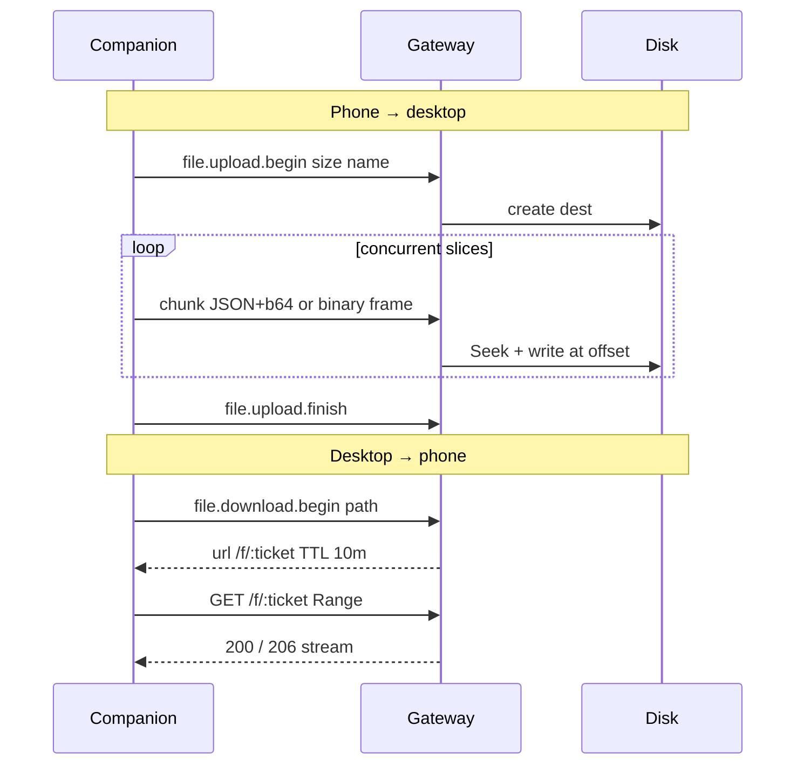

---

## 5. Module map

### 5.1 Rust domain (`src-tauri/src/core`)

| Module              | Path                                       | Role                                                                                          |
| ------------------- | ------------------------------------------ | --------------------------------------------------------------------------------------------- |
| Chat service        | `core/chat/service.rs`                     | Entry: persist messages, resolve context/model, start or soft-inject                          |
| Stream manager      | `core/chat/stream.rs`                      | Background task, cancel, stream aggregation, UI events, timeline text                         |
| Agent runner        | `core/chat/agent.rs`                       | **Primary** model↔tools loop                                                                  |
| Agent loop policies | `core/chat/agent_loop/`                    | stream_turn, tools, challenge, compact, post_edit_verify, soft_inject, failure                |
| Conversation store  | `core/chat/conversation_manager/`          | Façade + `messages` / `activity` / `session` / `branch` / `helpers`; SQLite + work timeline   |
| DB / journal        | `core/chat/db.rs`, `core/chat/journal.rs`  | Schema, save/load, crash recovery                                                             |
| Prompts (markdown)  | `core/chat/prompts/`, `prompts/*.md`       | System / tools / policies / skills markdown (`include_str!`)                                  |
| Prompt builder      | `core/chat/prompt/`                        | Slot assembly (`PromptBuilder` + `slots`) for KV-cache-stable prefixes                        |
| Agent runtime       | `core/agent/runtime/`                      | Run state machine, cancel, soft-inject queue, debug                                           |
| AI providers        | `core/ai/`                                 | Chat provider registry, DeepSeek/Gemini, multimodal; **Images API** is separate (`image_gen`) |
| Images API          | `core/ai/image_gen.rs`                     | `POST /v1/images/generations` / `edits` via Settings → Image (`image_providers`)              |
| Image markdown      | `core/ai/image_markdown.rs`                | Extract / strip `![edit-region]` refs shared by chat, vision, and Images                      |
| Embeddings / RAG    | `core/ai/embed.rs`, `commands/semantic.rs` | Optional retrieve-then-rerank; API or local ONNX                                              |
| Tools               | `core/tools/`                              | Registry, approval, plan/image mode gates, files, shell, skills, agent tools                  |
| Workspace index     | `core/tools/workspace_index.rs`            | Chunked keyword index under `.anya/index` (incremental JSONL); skips `.anya` via `fs_skip`    |
| Plan mode           | `core/tools/plan_mode.rs`                  | Session write gate; Agent auto-enter heuristic for complex tasks                              |
| Image mode          | `core/tools/image_mode.rs`                 | Per-session toolbar options for `generate_image`; tool whitelist + challenge                  |
| Context             | `core/context/`                            | IDE, selection, clipboard, environment, Office hints                                          |
| Checkpoint          | `core/checkpoint/`                         | Undo / review of applied file changes                                                         |
| Token               | `core/token/`                              | Accounting (incl. cache-read / reasoning tokens), usage persistence                           |
| MCP / LSP / Office  | `core/mcp`, `core/lsp`, `core/office`      | External protocol adapters                                                                    |
| Protocol types      | `core/runtime/`                            | `ChatMessage`, `StreamEvent`, `WorkTimelineItem`                                              |
| Event bus           | `core/event/`                              | Domain events                                                                                 |
| Remote gateway      | `core/remote/`                             | WS `/remote/v1`, pairing, tunnel, upload, **download `/f/`**, preview `/p/`                   |

### 5.2 Naming: three “runtime” modules

| Path                  | Meaning                                                           |
| --------------------- | ----------------------------------------------------------------- |
| `core/runtime/`       | Chat protocol types (`ChatMessage`, `StreamEvent`, `ChatRequest`) |
| `crate::runtime/`     | Pluggable tool adapters (git, search, browser, …)                 |
| `core/agent/runtime/` | Agent **run lifecycle** shell                                     |

### 5.3 Frontend (`src/`)

| Area                        | Path                                                              | Role                                                                                     |
| --------------------------- | ----------------------------------------------------------------- | ---------------------------------------------------------------------------------------- |
| Overlay / Workbench layouts | `layouts/Overlay.vue`, `layouts/Main.vue`                         | Window shells; workbench embeds SettingsPage                                             |
| Chat UI                     | `components/chat/*`                                               | Message list, timeline, tool cards, plan approval, composer (`ChatInputBar` + `input/*`) |
| Chat composables            | `composables/chat/`                                               | `wireChatIpc`, context usage, attachments, ask-user flow, generated-image paint          |
| Chat store                  | `stores/chat.ts` (+ `chatCompose` / `chatHistory` / `chatStream`) | Pinia façade; compose cache / history merge / stream helpers in sibling modules          |
| Other stores                | `stores/setting.ts`, `chatModel.ts`                               | Settings, model catalog                                                                  |
| Chat services               | `services/chat/`                                                  | Image gen mode, local image src, save image, composer segments, token estimate           |
| IPC                         | `services/ipc/`                                                   | Typed invoke + event subscription                                                        |
| Stream batching             | `services/chat/rafBatch.ts`, `composables/chat/wireChatIpc.ts`    | RAF coalesce; chat IPC wiring extracted from `main.ts`                                   |
| Settings pages              | `pages/Settings/`                                                 | Provider / agent / MCP / skills / **RAG Search** / **Image** providers                   |

---

## 6. Control flow — chat send

### 6.1 Happy path

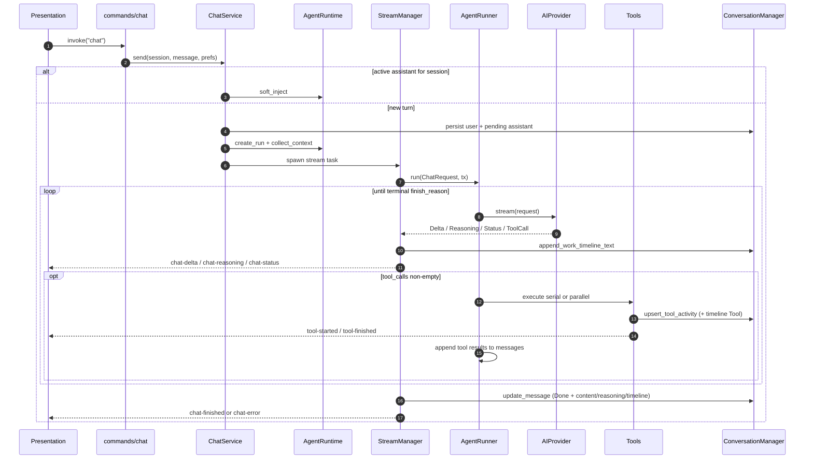

Mid-turn follow-up takes the `soft_inject` branch and does not create a new assistant bubble.

### 6.2 Frontend projection

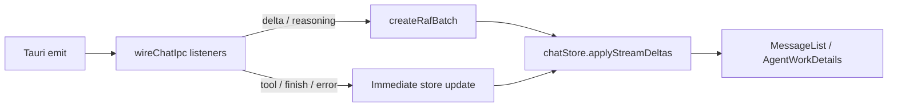

Transport errors that are retried inside the provider emit `chat-status` with
`kind = stream_retry:{attempt}:{max}` before a new attempt. The store clears
partial assistant content for that message so tokens are not duplicated. The
backend also resets `work_timeline` on retry.

### 6.3 Call stack (reference)

```text
commands/chat.rs::chat
  → ChatService::send
      → AgentRuntime::{create_run, collect_context} | soft_inject
      → StreamManager::spawn
          → AgentRunner::run
              → agent_loop::collect_stream_turn
              → AIProvider::stream
              → agent_loop::tools::{execute_serial, execute_parallel}
              → agent_loop::{challenge, mid_turn_compact, post_edit_verify, soft_inject, failure}
```

---

## 7. Orchestration — AgentRunner loop

`AgentRunner::run` is the single orchestration spine for chat, eval, and
sub-agents. Policy modules in `agent_loop/` plug into that spine.

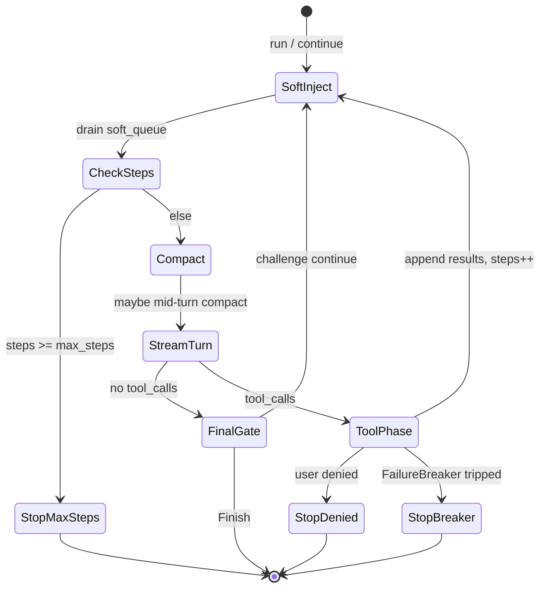

| Module             | Concern                                                                                               |
| ------------------ | ----------------------------------------------------------------------------------------------------- |
| `stream_turn`      | Fold one provider stream into content / reasoning / tool_calls; forward UI events                     |
| `tools`            | Serial vs parallel dispatch; tool activity events                                                     |
| `challenge`        | Empty-completion / verification gate before accepting a final answer                                  |
| `mid_turn_compact` | Context-window pressure compaction                                                                    |
| `post_edit_verify` | After a successful file mutation, run a light check; feed result as **system text** (not `role=tool`) |
| `soft_inject`      | Merge queued user follow-ups at a safe boundary                                                       |
| `failure`          | Consecutive / identical tool-error circuit breaker                                                    |

### Ask / Agent / Plan / Image

Enforced at **tool schema exposure**, **approval policy**, the **plan gate**, and
**image-mode** session options — not by a separate runner.

| Mode      | Behavior                                                                                             |
| --------- | ---------------------------------------------------------------------------------------------------- |
| **Ask**   | Withholds write / shell / git                                                                        |
| **Agent** | Enables writes under approval; complex requests may **auto-enter** the plan gate                     |
| **Plan**  | User-selected or Agent auto-entered; write tools blocked until the user approves                     |
| **Image** | Only `generate_image` is exposed; toolbar size/quality/style pinned; challenge requires a real image |

### Plan gate

Plan state lives in-process in `core/tools/plan_mode.rs` (`PlanModeStore` keyed by
`session_id`). It is orthogonal to compose `ChatMode`: while the gate is on,
writes are denied even if the composer still shows Agent.

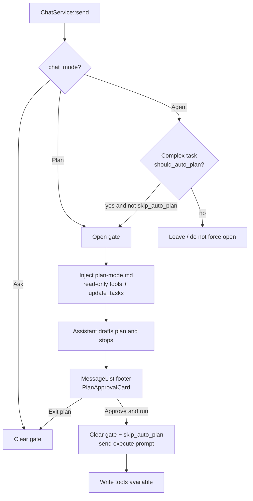

| Piece                | Location                                                                                                          |
| -------------------- | ----------------------------------------------------------------------------------------------------------------- |
| Auto-enter heuristic | `plan_mode::should_auto_plan` (Agent + complexity)                                                                |
| Gate authorize       | `PlanModeStore::authorize` (deny non-read-only writes)                                                            |
| Prompt               | `prompts/plan-mode.md`                                                                                            |
| Plan steps           | tools `update_tasks` / `todo_write` → `task-list-updated` / message `toolActivities`                              |
| Approval UI          | `PlanApprovalCard.vue` at the **end of the last completed assistant message** (same tier as `CodeChangesSummary`) |
| Approve action       | clear gate → compose back to Agent → `send(..., skipAutoPlan: true)`                                              |

The approval card is **not** an input-bar banner (avoids pushing the composer);
steps sit alongside the code-changes summary.

### Image mode

Image mode is a dedicated `chat_mode` (composer chip), not a chat-provider model
switch. Credentials and base URL come from **Settings → Image** (`image_providers`);
chat `custom_providers` are never used for `generate_image`.

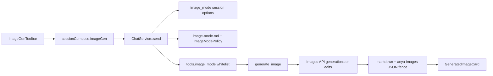

| Piece             | Location                                                                  |
| ----------------- | ------------------------------------------------------------------------- |
| Toolbar / payload | `services/chat/imageGenMode.ts` (UI `resolution` ≠ Images API `quality`)  |
| Session options   | `core/tools/image_mode.rs`                                                |
| Prompt            | `prompts/image-mode.md` + `prompt/slots`                                  |
| Tool              | `core/tools/builtin/image_gen.rs`                                         |
| HTTP adapter      | `core/ai/image_gen.rs` (blocking + `run_isolated`)                        |
| Markdown helpers  | `core/ai/image_markdown.rs`                                               |
| Challenge         | `agent_loop/challenge.rs` `require_image`                                 |
| Result parsing    | `services/chat/localImageSrc.ts` (`anya-images` fence, markdown fallback) |
| Preview / save    | `services/chat/saveChatImage.ts`, `GeneratedImageCard.vue`                |

Defense in depth: `ChatService` selects `tools.image_mode()`, and
`ToolManager::schemas_for_request` re-checks `is_image_mode(session_id)`.

### AgentRunner vs AgentRuntime

|                | AgentRunner                                 | AgentRuntime                                                        |
| -------------- | ------------------------------------------- | ------------------------------------------------------------------- |
| Question       | “What does the model do next?”              | “Is this run active / cancelled / injectible?”                      |
| Owns           | Stream turns, tool batches, completion gate | Run id, epoch, soft-inject queue, event bridge                      |
| Call direction | Invoked by `StreamManager`                  | Creates run; delegates streaming to `StreamManager` → `AgentRunner` |

Planner / executor under `core/agent/` support run-level plan steps and a tool
façade. They are **not** a second chat agent loop.

---

## 8. Work timeline (interleaved UI)

Narration and tool cards must appear in the order they actually happened.

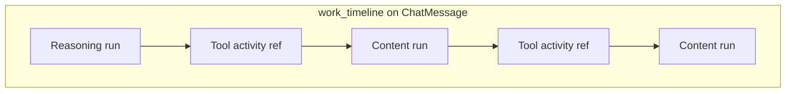

| Kind        | Produced when                          | Persistence                                             |
| ----------- | -------------------------------------- | ------------------------------------------------------- |
| `reasoning` | Stream reasoning chunks                | Merged into trailing same-kind item; saved with message |
| `content`   | Stream content deltas                  | Same merge rules                                        |
| `tool`      | First `upsert_tool_activity` for an id | Anchored at start time; status updates do not duplicate |

Frontend `AgentWorkDetails` renders the timeline and reconciles trailing text if
history predates the feature or a lump reply arrives without incremental deltas.

---

## 9. Persistence & crash recovery

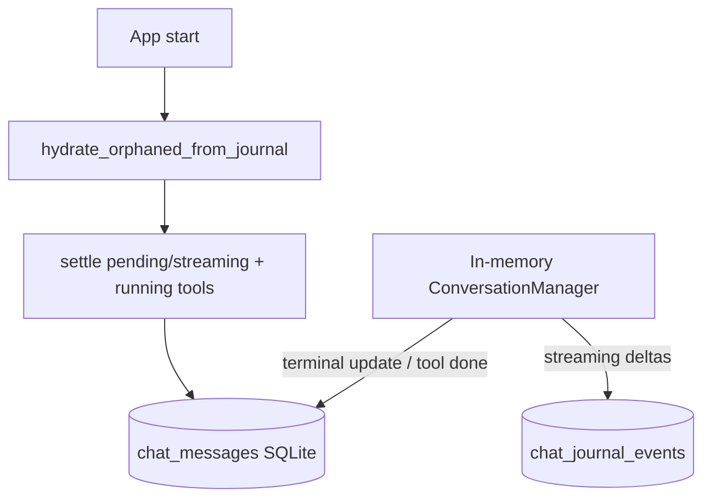

| Store                 | Contents                                                                                     |
| --------------------- | -------------------------------------------------------------------------------------------- |
| `chat_messages`       | Messages: content, reasoning, tool_activities, **work_timeline**, tool_calls, status, tokens |
| `chat_journal_events` | Compacted delta snapshots for in-flight recovery                                             |
| Session metadata      | Titles, workspace bindings                                                                   |
| Token usage records   | Per-run accounting when providers report usage; DeepSeek cache-read / reasoning tokens       |

On boot, orphaned `pending` / `streaming` messages are hydrated from the journal
and settled to a terminal state so the UI cannot stick on “executing”.

---

## 10. Context assembly

Before a turn streams, the prompt stack is assembled (system → rules/memories →
context block → history → current user):

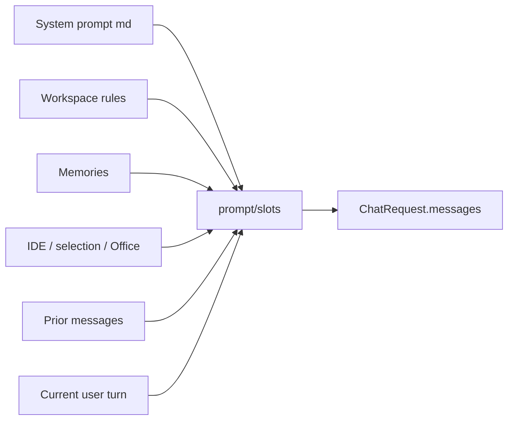

Resolution precedence lives in `prompts/context.md` and `core/context` providers
(explicit user path beats inferred active file, etc.).

---

## 11. Tools, approval, and skills

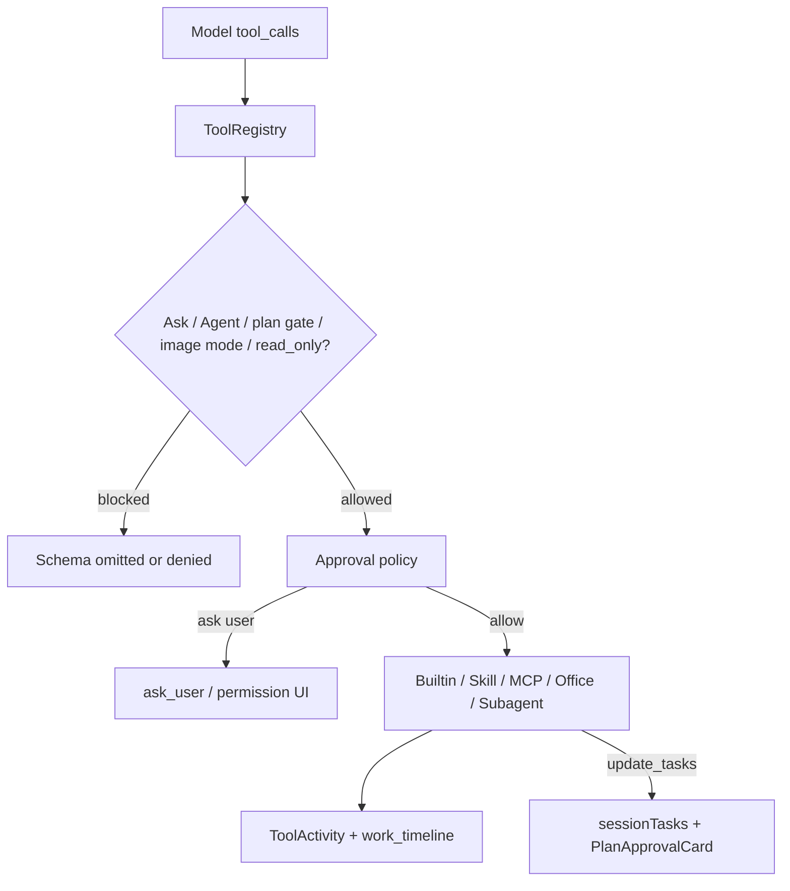

While the plan gate is on, non-read-only write tools are denied at registry /
authorize; `update_tasks` (and read-only exploration) stay available so the
assistant can emit an approvable step list.

Skills are markdown playbooks under `src-tauri/prompts/skills/` (plus vendor
assets). Invoking a skill typically injects the playbook and may run a subagent
with optional `read_only`. The former built-in `bid_tech` Python package is no
longer shipped; document-generation skills use the external skill flow.

### 11.1 Provider protocol and reasoning resolution

The provider boundary keeps model selection, capability metadata, protocol
selection, and wire parsing together while leaving `ChatService` provider-neutral.

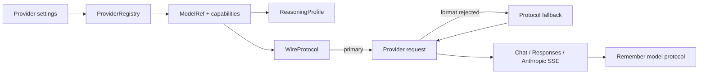

`reasoningProfiles` maps model families to supported levels. `reasoningControl`
uses advertised capabilities first and provider/model inference second. The
request layer clamps unsupported values and emits the provider-specific fields:
`thinking`, `enable_thinking`, or `reasoning.effort` / `reasoning_effort`.

Custom providers may select Chat Completions, Responses, or Anthropic Messages.
When a format rejection is recognizable, the registry tries the remaining wire
protocols and remembers the successful protocol per provider and model. Disabled
models are rejected before any network request.

### 11.2 Workspace index & RAG

`search_codebase` always hits the keyword index. Semantic re-rank is **off by
default** (Settings → RAG Search). Nothing is downloaded or requested until enabled.

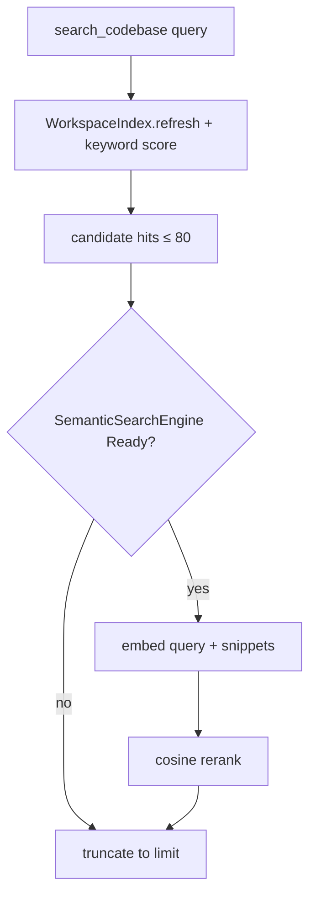

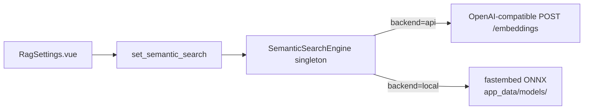

| Piece          | Location                                                                                                             |
| -------------- | -------------------------------------------------------------------------------------------------------------------- |
| Keyword index  | `core/tools/workspace_index.rs` — overlapping chunks + symbols / paths / ADR; JSONL under `{workspace}/.anya/index/` |
| Search tool    | `search_codebase` in `core/tools/builtin/misc.rs` — retrieve then rerank                                             |
| Engine         | `core/ai/embed.rs` — API (`reqwest::blocking`) or local `fastembed`                                                  |
| IPC / settings | `commands/semantic.rs`, Settings category **RAG Search**                                                             |
| Local models   | E5-Small (~120MB, default), BGE-Small zh/en, Jina code (~500MB), BGE-M3 (~2.3GB)                                     |

The API path sends **query + candidate snippets** to the configured embeddings
host. The local path stays on disk after the first download.

---

## 12. Event contract (domain → UI)

Events are defined in `core/event::BusEvent` and projected by
`adapters/tauri_events.rs`.

| BusEvent          | Tauri event                      | Consumer effect                                    |
| ----------------- | -------------------------------- | -------------------------------------------------- |
| `ChatStarted`     | `chat-started`                   | Insert user + pending assistant                    |
| `ChatDelta`       | `chat-delta`                     | Append content (RAF-batched)                       |
| `ChatReasoning`   | `chat-reasoning`                 | Append reasoning                                   |
| `ChatStatus`      | `chat-status`                    | Activity label / `stream_retry` reset              |
| `ChatFinished`    | `chat-finished`                  | Replace content, mark done                         |
| `ChatError`       | `chat-error`                     | Mark error, surface message                        |
| Tool activity     | `tool-started` / `tool-finished` | Upsert tool cards                                  |
| `PlanModeChanged` | `plan-mode-changed`              | Sync gate; may switch compose to Plan              |
| `TaskListUpdated` | `task-list-updated`              | Update `sessionTasks` (steps for PlanApprovalCard) |

Command results (`ChatSendResponse`) return ids only; streaming content is
event-driven.

---

## 13. Session / workspace model

| Kind                           | Binding       | Typical entry                                                        |
| ------------------------------ | ------------- | -------------------------------------------------------------------- |
| Quick Ask                      | No workspace  | Overlay outside IDE                                                  |
| Workspace session              | Bound folder  | IDE foreground, `/work`, picker                                      |
| Pinned                         | User pin flag | Workbench sidebar                                                    |
| Archived workspace             | Bound folder  | Workbench archive / restore                                          |
| Companion FAB (no workspaceId) | No workspace  | Phone new chat — **must not** inherit the desktop selected workspace |

Overlay and workbench share the conversation store; “open in workbench” reuses
the same `session_id`. Workspace ordering, pinning, collapsed state, and archive
status are persisted separately from chat messages. Companion projects the same
store over the gateway.

---

## 14. Update / release data flow

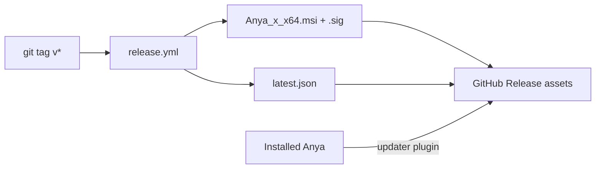

Details: [release.md](./release.md).

---

## 15. Extension points

| Intent                  | Preferred hook                                          |
| ----------------------- | ------------------------------------------------------- |
| New model vendor        | `core/ai` `AIProvider` impl + settings wiring           |
| New built-in tool       | `core/tools` registry + optional `runtime/` adapter     |
| New turn policy         | `core/chat/agent_loop` module called from `AgentRunner` |
| New window surface      | Tauri window label + `src/main.ts` bootstrap branch     |
| External context source | `core/context` provider                                 |
| New skill               | `src-tauri/prompts/skills/*.md` (+ assets if needed)    |
| Companion RPC / event   | `core/remote/protocol.rs` + phone client in AnyaAndroid |
| RAG embedding backend   | `core/ai/embed.rs` + Settings RAG page                  |

Avoid introducing a parallel agent loop beside `AgentRunner`.
Companion must not grow a second Agent runtime.

---

## 16. Related source entry points

| Concern                          | Start here                                                                       |
| -------------------------------- | -------------------------------------------------------------------------------- |
| App bootstrap / tray / hotkey    | `src-tauri/src/lib.rs`                                                           |
| Chat IPC                         | `commands/chat.rs`                                                               |
| Send + context / plan gate       | `core/chat/service.rs`, `core/tools/plan_mode.rs`                                |
| Stream lifecycle + timeline text | `core/chat/stream.rs`                                                            |
| Work timeline persistence        | `core/chat/conversation_manager/`, `core/chat/db.rs`                             |
| Agent loop                       | `core/chat/agent.rs`, `core/chat/agent_loop/`                                    |
| Run shell                        | `core/agent/runtime/`                                                            |
| Image mode / Images API          | `core/tools/image_mode.rs`, `core/ai/image_gen.rs`, `prompts/image-mode.md`      |
| Frontend IPC + stream batch      | `src/services/ipc/`, `src/composables/chat/wireChatIpc.ts`, `src/stores/chat.ts` |
| Chat store helpers               | `src/stores/chatCompose.ts`, `chatHistory.ts`, `chatStream.ts`                   |
| Composer extraction              | `src/composables/chat/use{ContextUsage,ComposerAttachments,AskUserFlow}.ts`      |
| Timeline UI                      | `src/components/chat/AgentWorkDetails.vue`                                       |
| Plan approval card               | `src/components/chat/PlanApprovalCard.vue`, `MessageList.vue`                    |
| Generated image UI               | `src/components/chat/GeneratedImageCard.vue`, `ImagePreviewSidebar.vue`          |
| Embedded settings / RAG          | `pages/Settings/`, `components/settings/RagSettings.vue`                         |
| Workbench glass                  | `services/workbench_glass.rs`, `overlay/appearance.ts`                           |
| Remote gateway / pairing         | `core/remote/gateway.rs`, `pairing.rs`, `tunnel.rs`                              |
| Gateway HTTP split               | `core/remote/http_proxy.rs` (`/remote/v1`, `/f/`, `/p/`)                         |
| Companion file transfer          | `core/remote/upload.rs`, `download.rs`                                           |
| Workspace index / RAG            | `core/tools/workspace_index.rs`, `core/ai/embed.rs`                              |
| Phone app                        | [AnyaAndroid](https://github.com/rururunu/AnyaAndroid)                           |
