# Anya Architecture Overview

This document describes the logical structure, dependency rules, control flow,
persistence, and orchestration of Anya. It is intended for contributors who need
to locate code paths and reason about change impact.

<p>
  <a href="./architecture-overview.md">English</a> ·
  <a href="./architecture-overview.zh-CN.md">简体中文</a>
</p>

|             |                                                    |
| ----------- | -------------------------------------------------- |
| **Product** | Anya — Hand your work & questions to Anya anytime. |
| **Version** | v0.2.8                                             |
| **Runtime** | Tauri 2 (WebView2 + Rust)                          |
| **UI**      | Vue 3 · Vite · Pinia · TypeScript                  |
| **Domain**  | Rust (`src-tauri/src`)                             |

**Related:** [Release](./release.md) · [Docs index](./README.md)

---

## 1. Scope

**In scope**

- Process / window topology
- Layered module boundaries and allowed dependencies
- Primary chat request path (UI → domain → provider → tools → UI events)
- Agent turn orchestration and policy hooks (Ask / Agent / Plan gate)
- Persistence (SQLite, journal, work timeline)
- Frontend stream projection and session model
- Extension points (providers, tools, skills, MCP)

**Out of scope**

- Provider-specific HTTP schemas
- Individual tool argument contracts
- UI visual design tokens

---

## 2. System context

Anya runs as a **single native process** hosting multiple WebView windows. The
Rust host owns OS integration; WebViews own presentation and local UI state.

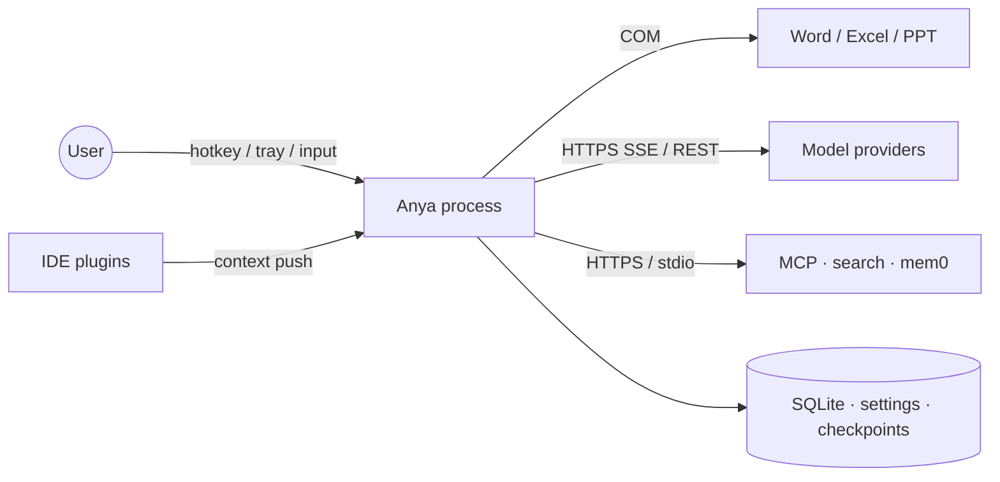

| Actor / system      | Interaction                                                       |
| ------------------- | ----------------------------------------------------------------- |
| User                | Global hotkey, tray, composer, review UI                          |
| IDE plugins         | Best-effort local context push (file, workspace, selection)       |
| Microsoft Office    | COM for document context and `word_*` / `excel_*` / `ppt_*` tools |
| Model providers     | Authenticated HTTPS; streaming where supported                    |
| MCP / search / mem0 | Optional; enabled explicitly in settings                          |
| Local disk          | Chat DB, settings store, updater pubkey, checkpoint undo data     |

---

## 3. Logical architecture

### 3.1 Layers

Dependencies point **downward only**. Cross-layer calls that skip a boundary
(e.g. Vue store → raw Tauri API, `commands/` → provider HTTP) are treated as bugs.

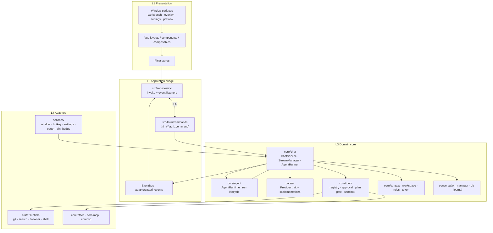

| Layer           | Location                                            | Responsibility                                          | Must not                        |
| --------------- | --------------------------------------------------- | ------------------------------------------------------- | ------------------------------- |
| L1 Presentation | `src/{layouts,components,composables,stores,pages}` | Render, local UX state, RAF-batched stream merge        | Call providers or execute tools |
| L2 Bridge       | `src/services/ipc`, `commands/`, `adapters/`        | Serialize IPC DTOs; map `BusEvent` → Tauri emits        | Own business policy             |
| L3 Domain       | `core/{chat,ai,tools,agent,context,…}`              | Chat lifecycle, agent loop, tools, prompts, persistence | Depend on Vue / DOM             |
| L4 Adapters     | `runtime/`, `services/`, `core/{office,mcp,lsp}`    | OS, COM, HTTP clients, MCP transport                    | Drive the agent loop            |

### 3.2 Frontend dependency rule

```text
UI → composables → stores → services → services/ipc → Tauri
                 ↘ services ↗
```

`stores` and `services` must not import `components` / `layouts` / `pages`.

### 3.3 Backend dependency rule

```text
lib / main
  → commands (IPC façade)
  → core::* (domain)
  → runtime / office / mcp (adapters)
services (window, hotkey, settings) → core where needed
```

`commands/*` validate input and delegate; orchestration lives in `ChatService`
and `AgentRuntime`, not in command handlers.

---

## 4. Deployment / process view

One OS process, multiple WebView labels. Domain state is shared in-process.

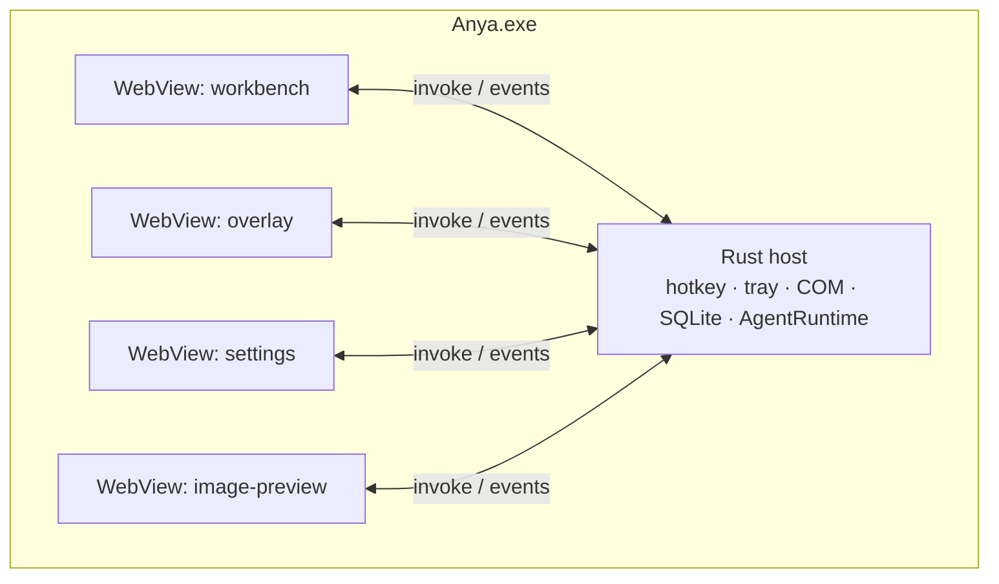

| Surface   | Label               | Role                                            |
| --------- | ------------------- | ----------------------------------------------- |
| Workbench | `workbench`         | Full session management, review, settings embed |
| Overlay   | `overlay*`          | Floating composer; Quick Ask or workspace-bound |
| Settings  | `settings`          | Provider / agent / extension configuration      |
| Preview   | `overlay-preview-*` | Image preview windows                           |

Session identity (`session_id`) is owned by the Rust conversation store. Overlay
and Workbench may attach to the **same** session concurrently.

---

## 5. Module map

### 5.1 Rust domain (`src-tauri/src/core`)

| Module              | Path                                      | Role                                                                  |
| ------------------- | ----------------------------------------- | --------------------------------------------------------------------- |
| Chat service        | `core/chat/service.rs`                    | Entry: persist messages, resolve context/model, start or soft-inject  |
| Stream manager      | `core/chat/stream.rs`                     | Background task, cancel, stream aggregation, UI events, timeline text |
| Agent runner        | `core/chat/agent.rs`                      | **Primary** model↔tools loop                                          |
| Agent loop policies | `core/chat/agent_loop/`                   | stream_turn, tools, challenge, compact, soft_inject, failure          |
| Conversation store  | `core/chat/conversation_manager.rs`       | In-memory sessions + async SQLite; work timeline                      |
| DB / journal        | `core/chat/db.rs`, `core/chat/journal.rs` | Schema, save/load, crash recovery                                     |
| Prompts             | `core/chat/prompts/`, `prompts/*.md`      | System / tools / policies / skills markdown                           |
| Agent runtime       | `core/agent/runtime/`                     | Run state machine, cancel, soft-inject queue, debug                   |
| AI providers        | `core/ai/`                                | DeepSeek, Gemini/Antigravity, multimodal helpers                      |
| Tools               | `core/tools/`                             | Registry, approval, plan gate, files, shell, skills, agent tools      |
| Plan mode           | `core/tools/plan_mode.rs`                 | Session write gate; Agent auto-enter heuristic for complex tasks      |
| Context             | `core/context/`                           | IDE, selection, clipboard, environment, Office hints                  |
| Checkpoint          | `core/checkpoint/`                        | Undo / review of applied file changes                                 |
| Token               | `core/token/`                             | Accounting, usage persistence                                         |
| MCP / LSP / Office  | `core/mcp`, `core/lsp`, `core/office`     | External protocol adapters                                            |
| Protocol types      | `core/runtime/`                           | `ChatMessage`, `StreamEvent`, `WorkTimelineItem`                      |
| Event bus           | `core/event/`                             | Domain events                                                         |

### 5.2 Naming: three “runtime” modules

| Path                  | Meaning                                                           |
| --------------------- | ----------------------------------------------------------------- |
| `core/runtime/`       | Chat protocol types (`ChatMessage`, `StreamEvent`, `ChatRequest`) |
| `crate::runtime/`     | Pluggable tool adapters (git, search, browser, …)                 |
| `core/agent/runtime/` | Agent **run lifecycle** shell                                     |

### 5.3 Frontend (`src/`)

| Area                        | Path                                           | Role                                                        |
| --------------------------- | ---------------------------------------------- | ----------------------------------------------------------- |
| Overlay / Workbench layouts | `layouts/Overlay.vue`, `layouts/Main.vue`      | Window shells                                               |
| Chat UI                     | `components/chat/*`                            | Message list, timeline, tool cards, plan approval, composer |
| Stores                      | `stores/chat.ts`, `setting.ts`, `chatModel.ts` | Session messages, plan gate, tasks, settings, models        |
| IPC                         | `services/ipc/`                                | Typed invoke + event subscription                           |
| Stream batching             | `services/chat/rafBatch.ts`, `main.ts`         | RAF coalesce for deltas                                     |
| Settings pages              | `pages/Settings/`                              | Provider / agent / MCP / skills UI                          |

---

## 6. Control flow — chat send

### 6.1 Happy path

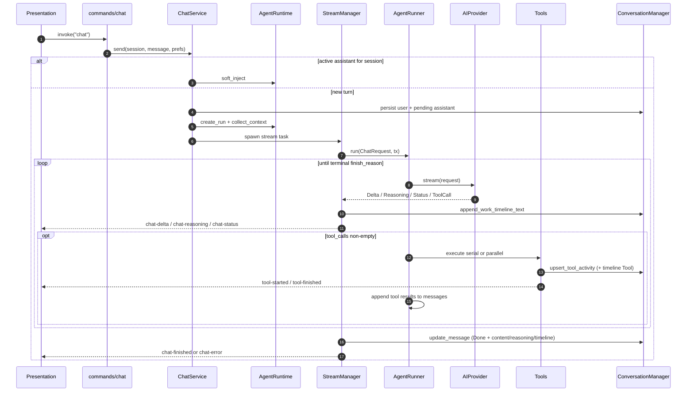

Mid-turn follow-up takes the `soft_inject` branch and does not create a new assistant bubble.

### 6.2 Frontend projection

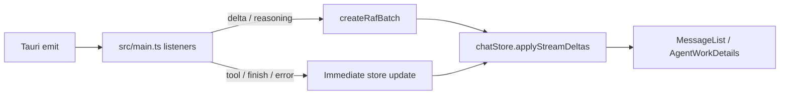

Transport errors that are retried inside the provider emit `chat-status` with
`kind = stream_retry:{attempt}:{max}` before a new attempt. The store clears
partial assistant content for that message so tokens are not duplicated. The
backend also resets `work_timeline` on retry.

### 6.3 Call stack (reference)

```text
commands/chat.rs::chat
  → ChatService::send
      → AgentRuntime::{create_run, collect_context} | soft_inject
      → StreamManager::spawn
          → AgentRunner::run
              → agent_loop::collect_stream_turn
              → AIProvider::stream
              → agent_loop::tools::{execute_serial, execute_parallel}
              → agent_loop::{challenge, mid_turn_compact, soft_inject, failure}
```

---

## 7. Orchestration — AgentRunner loop

`AgentRunner::run` is the single orchestration spine for chat, eval, and
sub-agents. Policy modules in `agent_loop/` plug into that spine.

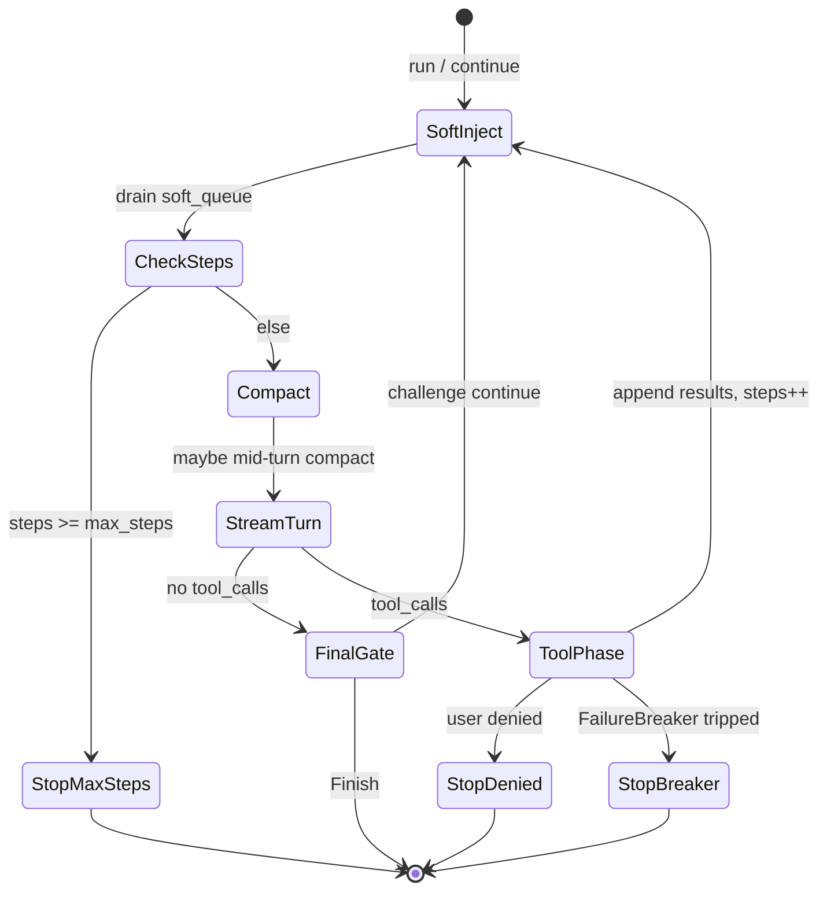

| Module             | Concern                                                                           |
| ------------------ | --------------------------------------------------------------------------------- |
| `stream_turn`      | Fold one provider stream into content / reasoning / tool_calls; forward UI events |
| `tools`            | Serial vs parallel dispatch; tool activity events                                 |
| `challenge`        | Empty-completion / verification gate before accepting a final answer              |
| `mid_turn_compact` | Context-window pressure compaction                                                |
| `soft_inject`      | Merge queued user follow-ups at a safe boundary                                   |
| `failure`          | Consecutive / identical tool-error circuit breaker                                |

### Ask / Agent / Plan

Enforced at **tool schema exposure**, **approval policy**, and the **plan gate** —
not by a separate runner.

| Mode      | Behavior                                                                         |
| --------- | -------------------------------------------------------------------------------- |
| **Ask**   | Withholds write / shell / git                                                    |
| **Agent** | Enables writes under approval; complex requests may **auto-enter** the plan gate |
| **Plan**  | User-selected or Agent auto-entered; write tools blocked until the user approves |

### Plan gate

Plan state lives in-process in `core/tools/plan_mode.rs` (`PlanModeStore` keyed by
`session_id`). It is orthogonal to compose `ChatMode`: while the gate is on,
writes are denied even if the composer still shows Agent.

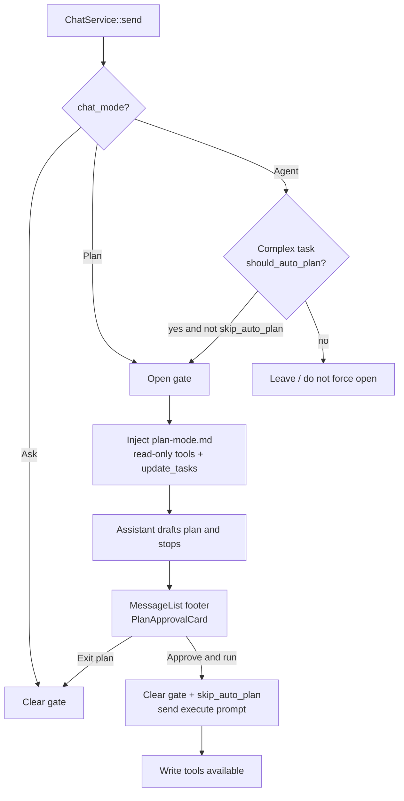

| Piece                | Location                                                                                                          |
| -------------------- | ----------------------------------------------------------------------------------------------------------------- |
| Auto-enter heuristic | `plan_mode::should_auto_plan` (Agent + complexity)                                                                |
| Gate authorize       | `PlanModeStore::authorize` (deny non-read-only writes)                                                            |
| Prompt               | `prompts/plan-mode.md`                                                                                            |
| Plan steps           | tools `update_tasks` / `todo_write` → `task-list-updated` / message `toolActivities`                              |
| Approval UI          | `PlanApprovalCard.vue` at the **end of the last completed assistant message** (same tier as `CodeChangesSummary`) |
| Approve action       | clear gate → compose back to Agent → `send(..., skipAutoPlan: true)`                                              |

The approval card is **not** an input-bar banner (avoids pushing the composer);
steps sit alongside the code-changes summary.

### AgentRunner vs AgentRuntime

|                | AgentRunner                                 | AgentRuntime                                                        |
| -------------- | ------------------------------------------- | ------------------------------------------------------------------- |
| Question       | “What does the model do next?”              | “Is this run active / cancelled / injectible?”                      |
| Owns           | Stream turns, tool batches, completion gate | Run id, epoch, soft-inject queue, event bridge                      |
| Call direction | Invoked by `StreamManager`                  | Creates run; delegates streaming to `StreamManager` → `AgentRunner` |

Planner / executor under `core/agent/` support run-level plan steps and a tool
façade. They are **not** a second chat agent loop.

---

## 8. Work timeline (interleaved UI)

Narration and tool cards must appear in the order they actually happened.

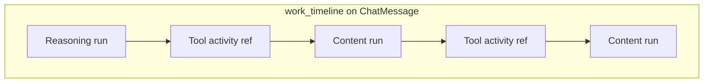

| Kind        | Produced when                          | Persistence                                             |
| ----------- | -------------------------------------- | ------------------------------------------------------- |
| `reasoning` | Stream reasoning chunks                | Merged into trailing same-kind item; saved with message |
| `content`   | Stream content deltas                  | Same merge rules                                        |
| `tool`      | First `upsert_tool_activity` for an id | Anchored at start time; status updates do not duplicate |

Frontend `AgentWorkDetails` renders the timeline and reconciles trailing text if
history predates the feature or a lump reply arrives without incremental deltas.

---

## 9. Persistence & crash recovery

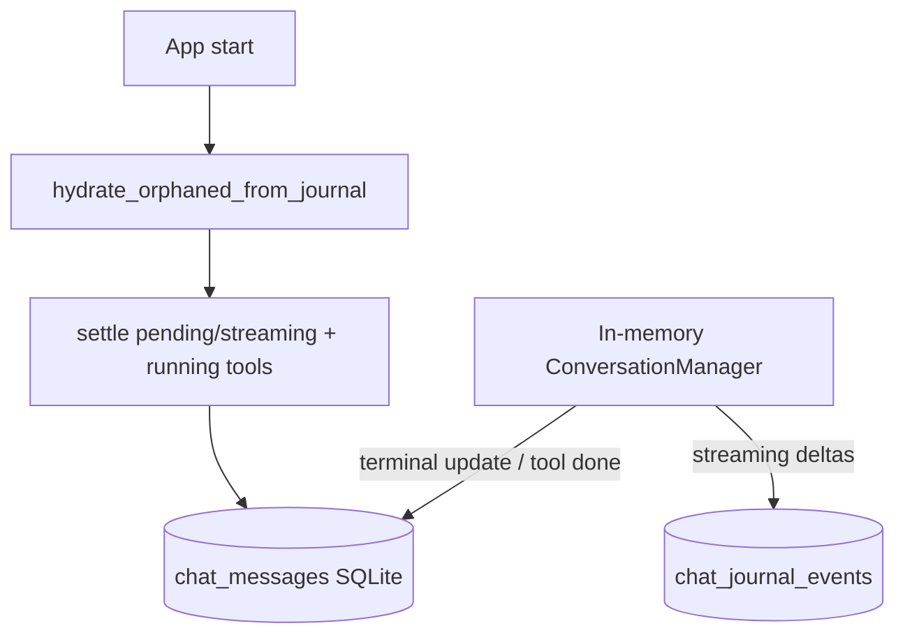

| Store                 | Contents                                                                                     |
| --------------------- | -------------------------------------------------------------------------------------------- |
| `chat_messages`       | Messages: content, reasoning, tool_activities, **work_timeline**, tool_calls, status, tokens |
| `chat_journal_events` | Compacted delta snapshots for in-flight recovery                                             |
| Session metadata      | Titles, workspace bindings                                                                   |
| Token usage records   | Per-run accounting when providers report usage                                               |

On boot, orphaned `pending` / `streaming` messages are hydrated from the journal
and settled to a terminal state so the UI cannot stick on “executing”.

---

## 10. Context assembly

Before a turn streams, the prompt stack is assembled (system → rules/memories →
context block → history → current user):

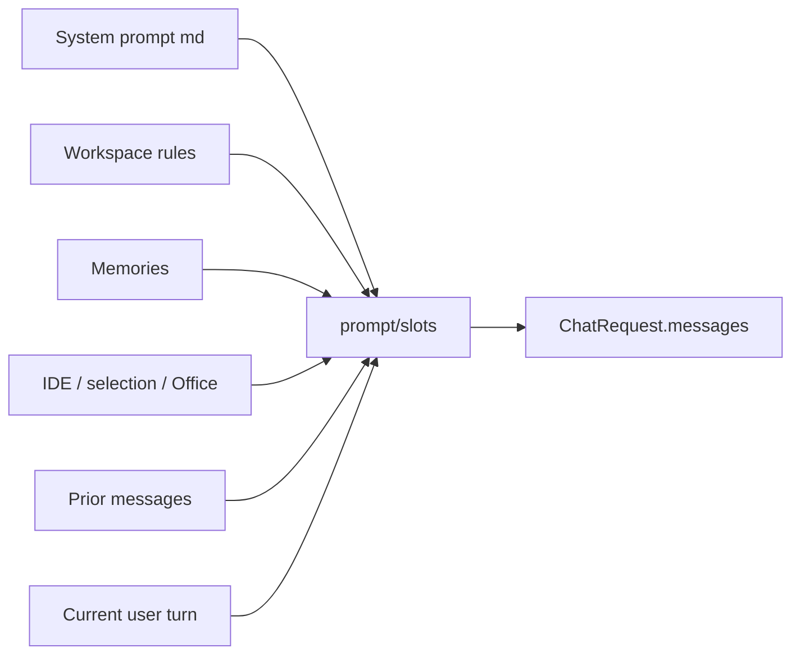

Resolution precedence lives in `prompts/context.md` and `core/context` providers
(explicit user path beats inferred active file, etc.).

---

## 11. Tools, approval, and skills


While the plan gate is on, non-read-only write tools are denied at registry /
authorize; `update_tasks` (and read-only exploration) stay available so the
assistant can emit an approvable step list.

Skills are markdown playbooks under `src-tauri/prompts/skills/` (plus vendor
assets). Invoking a skill typically injects the playbook and may run a subagent
with optional `read_only`.

---

## 12. Event contract (domain → UI)

Events are defined in `core/event::BusEvent` and projected by
`adapters/tauri_events.rs`.

| BusEvent          | Tauri event                      | Consumer effect                                    |
| ----------------- | -------------------------------- | -------------------------------------------------- |
| `ChatStarted`     | `chat-started`                   | Insert user + pending assistant                    |
| `ChatDelta`       | `chat-delta`                     | Append content (RAF-batched)                       |
| `ChatReasoning`   | `chat-reasoning`                 | Append reasoning                                   |
| `ChatStatus`      | `chat-status`                    | Activity label / `stream_retry` reset              |
| `ChatFinished`    | `chat-finished`                  | Replace content, mark done                         |
| `ChatError`       | `chat-error`                     | Mark error, surface message                        |
| Tool activity     | `tool-started` / `tool-finished` | Upsert tool cards                                  |
| `PlanModeChanged` | `plan-mode-changed`              | Sync gate; may switch compose to Plan              |
| `TaskListUpdated` | `task-list-updated`              | Update `sessionTasks` (steps for PlanApprovalCard) |

Command results (`ChatSendResponse`) return ids only; streaming content is
event-driven.

---

## 13. Session / workspace model

| Kind              | Binding       | Typical entry                   |
| ----------------- | ------------- | ------------------------------- |
| Quick Ask         | No workspace  | Overlay outside IDE             |
| Workspace session | Bound folder  | IDE foreground, `/work`, picker |
| Pinned            | User pin flag | Workbench sidebar               |

Overlay and workbench share the conversation store; “open in workbench” reuses
the same `session_id`.

---

## 14. Update / release data flow

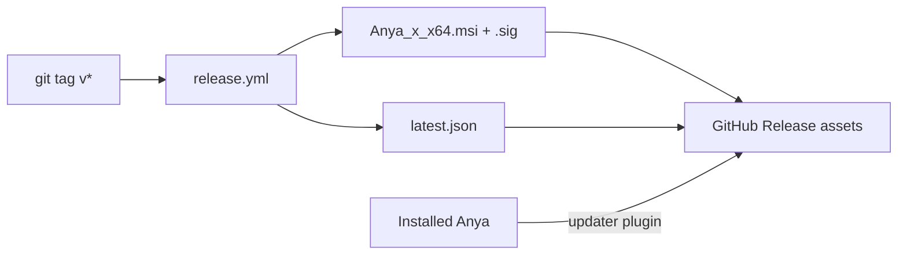

Details: [release.md](./release.md).

---

## 15. Extension points

| Intent                  | Preferred hook                                          |
| ----------------------- | ------------------------------------------------------- |
| New model vendor        | `core/ai` `AIProvider` impl + settings wiring           |
| New built-in tool       | `core/tools` registry + optional `runtime/` adapter     |
| New turn policy         | `core/chat/agent_loop` module called from `AgentRunner` |
| New window surface      | Tauri window label + `src/main.ts` bootstrap branch     |
| External context source | `core/context` provider                                 |
| New skill               | `src-tauri/prompts/skills/*.md` (+ assets if needed)    |

Avoid introducing a parallel agent loop beside `AgentRunner`.

---

## 16. Related source entry points

| Concern                          | Start here                                                    |
| -------------------------------- | ------------------------------------------------------------- |
| App bootstrap / tray / hotkey    | `src-tauri/src/lib.rs`                                        |
| Chat IPC                         | `commands/chat.rs`                                            |
| Send + context / plan gate       | `core/chat/service.rs`, `core/tools/plan_mode.rs`             |
| Stream lifecycle + timeline text | `core/chat/stream.rs`                                         |
| Work timeline persistence        | `core/chat/conversation_manager.rs`, `core/chat/db.rs`        |
| Agent loop                       | `core/chat/agent.rs`, `core/chat/agent_loop/`                 |
| Run shell                        | `core/agent/runtime/`                                         |
| Frontend IPC + stream batch      | `src/services/ipc/`, `src/main.ts`, `src/stores/chat.ts`      |
| Timeline UI                      | `src/components/chat/AgentWorkDetails.vue`                    |
| Plan approval card               | `src/components/chat/PlanApprovalCard.vue`, `MessageList.vue` |
