# Anya 技术架构总览

本文描述 Anya 的逻辑结构、依赖约束、控制流、持久化与编排，面向需要定位代码路径、评估变更影响的贡献者。

<p>
  <a href="./architecture-overview.md">English</a> ·
  <a href="./architecture-overview.zh-CN.md">简体中文</a>
</p>

|            |                                    |
| ---------- | ---------------------------------- |
| **产品**   | Anya — 将你的工作&疑问随手交给Anya |
| **版本**   | v0.2.9                             |
| **运行时** | Tauri 2（WebView2 + Rust）         |
| **界面**   | Vue 3 · Vite · Pinia · TypeScript  |
| **领域**   | Rust（`src-tauri/src`）            |

**相关文档：** [发布](./release.zh-CN.md) · [文档索引](./README.zh-CN.md) · [Companion（安卓）](https://github.com/rururunu/AnyaAndroid/blob/main/docs/ARCHITECTURE.zh-CN.md)

---

## 1. 范围

**范围内**

- 进程 / 窗口拓扑
- 分层边界与允许的依赖方向
- 主聊天请求路径（UI → 领域 → Provider → 工具 → UI 事件）
- Agent 回合编排与策略钩子（Ask / Agent / 计划门禁）
- 持久化（SQLite、journal、work timeline）
- 前端流式投影与会话模型
- 扩展点（Provider、工具、Skills、MCP）
- Companion / Remote Gateway（配对、局域网 vs 隧道、线路协议）

**范围外**

- 各 Provider 的 HTTP 协议细节
- 单个工具的参数契约
- UI 视觉设计细节

---

## 2. 系统上下文

Anya 以**单个原生进程**托管多个 WebView 窗口。Rust 宿主负责 OS 集成；WebView 负责呈现与本地 UI 状态。

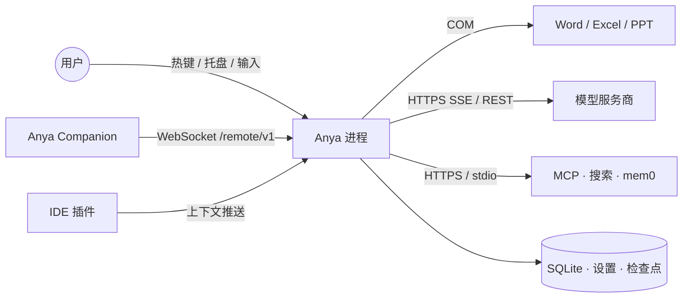

| 参与方            | 交互方式                                               |
| ----------------- | ------------------------------------------------------ |
| 用户              | 全局热键、托盘、输入栏、Diff 审查                      |
| Anya Companion    | 安卓远程控制台；局域网 `ws` 或 Cloudflare `wss` 连网关 |
| IDE 插件          | 尽力而为的本地上下文推送（文件、工作区、选区）         |
| Microsoft Office  | COM：文档上下文与 `word_*` / `excel_*` / `ppt_*` 工具  |
| 模型服务商        | 鉴权 HTTPS；支持处使用流式                             |
| MCP / 搜索 / mem0 | 可选；在设置中显式启用                                 |
| 本地磁盘          | 聊天库、设置、更新公钥、检查点撤销数据                 |

---

## 3. 逻辑架构

### 3.1 分层

依赖**只允许向下**。跨层越界调用（例如 Vue store 直连 Tauri API、`commands/` 直接发 Provider HTTP）视为缺陷。

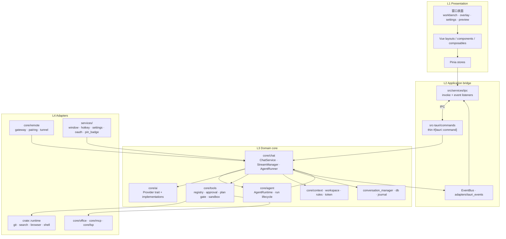

| 层              | 位置                                                    | 职责                                            | 禁止                     |
| --------------- | ------------------------------------------------------- | ----------------------------------------------- | ------------------------ |
| L1 Presentation | `src/{layouts,components,composables,stores,pages}`     | 渲染、本地 UX 状态、RAF 合并流式增量            | 调用 Provider 或执行工具 |
| L2 Bridge       | `src/services/ipc`、`commands/`、`adapters/`            | 序列化 IPC DTO；将 `BusEvent` 投影为 Tauri emit | 承载业务策略             |
| L3 Domain       | `core/{chat,ai,tools,agent,context,…}`                  | 聊天生命周期、Agent 循环、工具、提示词、持久化  | 依赖 Vue / DOM           |
| L4 Adapters     | `runtime/`、`services/`、`core/{office,mcp,lsp,remote}` | OS、COM、HTTP 客户端、MCP 传输、Companion WS    | 驱动 Agent 主循环        |

### 3.2 前端依赖规则

```text
UI → composables → stores → services → services/ipc → Tauri
                 ↘ services ↗
```

`stores` 与 `services` 不得 import `components` / `layouts` / `pages`。

### 3.3 后端依赖规则

```text
lib / main
  → commands（IPC 门面）
  → core::*（领域）
  → runtime / office / mcp（适配）
services（window、hotkey、settings）→ 按需依赖 core
```

`commands/*` 只做入参校验与转发；编排归属 `ChatService` 与 `AgentRuntime`。

---

## 4. 部署 / 进程视图

一个 OS 进程，多个 WebView label。领域状态在进程内共享。

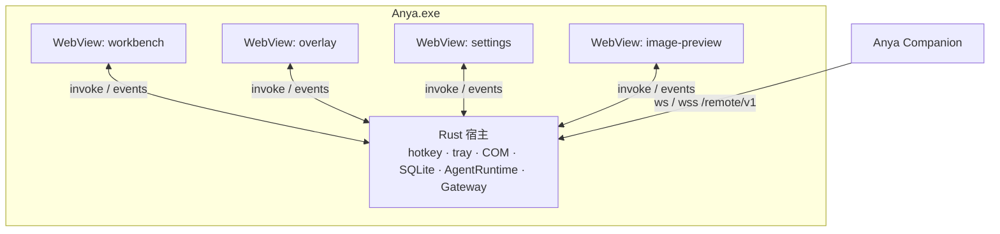

| 表面      | Label               | 职责                               |
| --------- | ------------------- | ---------------------------------- |
| Workbench | `workbench`         | 完整会话管理、审查、内嵌设置       |
| Overlay   | `overlay*`          | 悬浮输入；临时快速提问或绑定工作区 |
| Settings  | `settings`          | 服务商 / Agent / 扩展配置          |
| Preview   | `overlay-preview-*` | 图片预览窗口                       |

会话标识（`session_id`）由 Rust 会话存储拥有。Overlay 与 Workbench 可同时附着到**同一**会话。Companion 经网关附着并投影同一存储——它不拥有第二套 Agent。

### 4.1 Remote Gateway 与 Companion

手机应用：[AnyaAndroid](https://github.com/rururunu/AnyaAndroid)。桌面代码：`src-tauri/src/core/remote/`。Companion 是 **投影 + RPC 客户端**；工具、SQLite 与模型密钥仍在本进程。

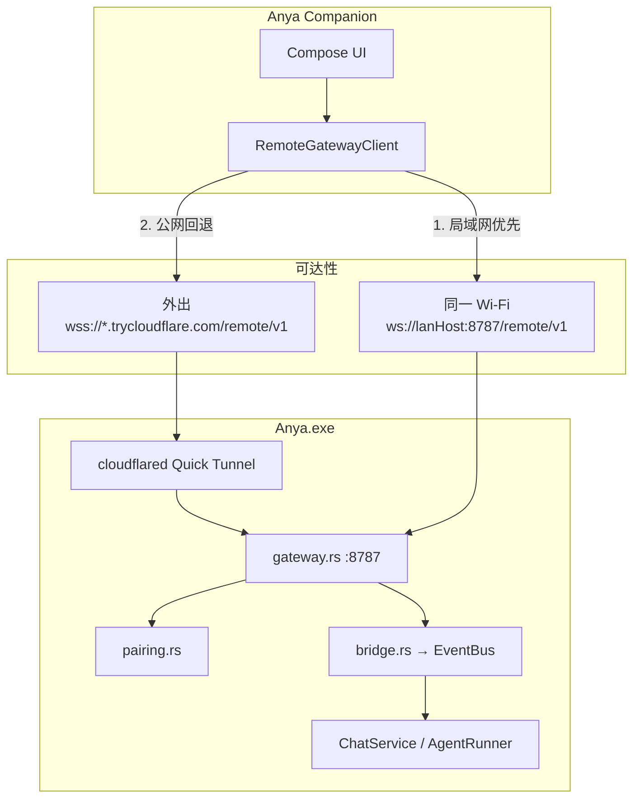

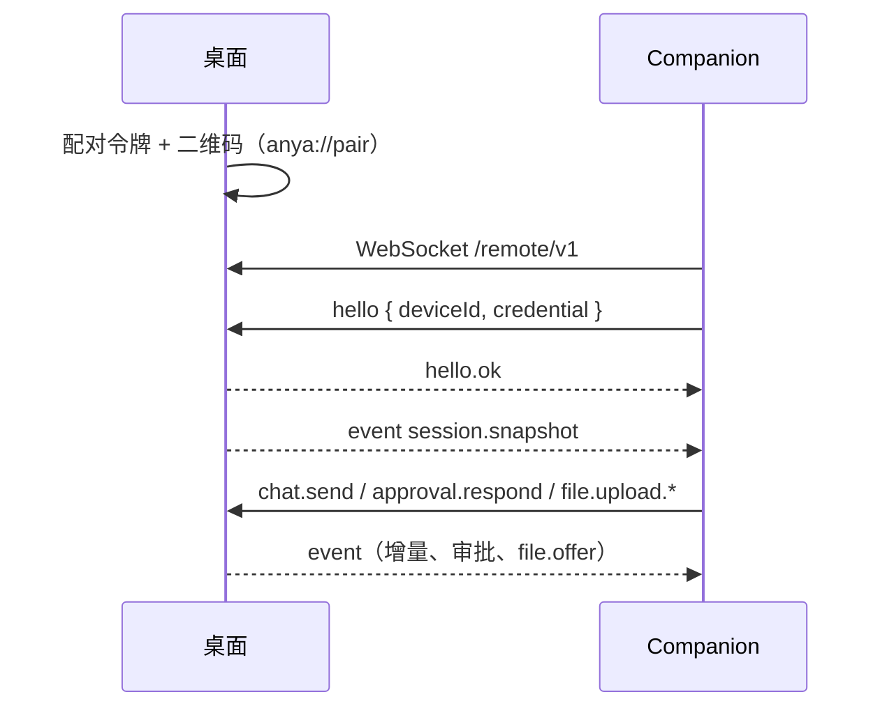

| 主题        | 约定                                                                  |
| ----------- | --------------------------------------------------------------------- |
| 路径 / 端口 | `/remote/v1`，端口 **8787**（局域网 `ws`，隧道 `wss`）                |
| 鉴权        | 短时二维码令牌，随后存储设备凭证                                      |
| 保活        | 应用层 `ping` / `pong`（代理常丢原生 WS ping）                        |
| 手机 → 桌面 | 分片 `file.upload.*`，512KB，上限 **500MB**                           |
| 桌面 → 手机 | `share_to_companion` 卡片 + `workspace.readFile` `mode=download` 分片 |
| 预览        | 同一网关上的 HTTP `/p/{id}/` 反向代理                                 |

手机侧图示：[Companion 架构](https://github.com/rururunu/AnyaAndroid/blob/main/docs/ARCHITECTURE.zh-CN.md)。

---

## 5. 模块地图

### 5.1 Rust 领域（`src-tauri/src/core`）

| 模块               | 路径                                      | 职责                                                         |
| ------------------ | ----------------------------------------- | ------------------------------------------------------------ |
| Chat service       | `core/chat/service.rs`                    | 入口：落库、解析上下文/模型、启动或 soft-inject              |
| Stream manager     | `core/chat/stream.rs`                     | 后台任务、取消、流式聚合、UI 事件、时间线文本                |
| Agent runner       | `core/chat/agent.rs`                      | **主** model↔tools 循环                                      |
| Agent loop 策略    | `core/chat/agent_loop/`                   | stream_turn、tools、challenge、compact、soft_inject、failure |
| 会话存储           | `core/chat/conversation_manager.rs`       | 内存会话 + 异步 SQLite；work timeline                        |
| DB / journal       | `core/chat/db.rs`、`core/chat/journal.rs` | Schema、存取、崩溃恢复                                       |
| 提示词             | `core/chat/prompts/`、`prompts/*.md`      | system / tools / policies / skills                           |
| Agent runtime      | `core/agent/runtime/`                     | Run 状态机、取消、soft-inject、debug                         |
| AI providers       | `core/ai/`                                | DeepSeek、Gemini/Antigravity、多模态                         |
| Tools              | `core/tools/`                             | 注册表、审批、计划门禁、文件、shell、skills、子 Agent        |
| Plan mode          | `core/tools/plan_mode.rs`                 | 会话级写操作门禁；Agent 复杂任务自动进入启发式               |
| Context            | `core/context/`                           | IDE、选区、剪贴板、环境、Office 提示                         |
| Checkpoint         | `core/checkpoint/`                        | 已应用文件变更的撤销 / 审查                                  |
| Token              | `core/token/`                             | 用量记账与持久化                                             |
| MCP / LSP / Office | `core/mcp`、`core/lsp`、`core/office`     | 外部协议适配                                                 |
| 协议类型           | `core/runtime/`                           | `ChatMessage`、`StreamEvent`、`WorkTimelineItem`             |
| Event bus          | `core/event/`                             | 领域事件                                                     |
| Remote gateway     | `core/remote/`                            | Companion WS `/remote/v1`、配对、隧道、上传、预览代理        |

### 5.2 命名：三处 “runtime”

| 路径                  | 含义                                      |
| --------------------- | ----------------------------------------- |
| `core/runtime/`       | 聊天协议类型                              |
| `crate::runtime/`     | 可插拔工具适配（git、search、browser 等） |
| `core/agent/runtime/` | Agent **run 生命周期**壳                  |

### 5.3 前端（`src/`）

| 区域                | 路径                                      | 职责                                           |
| ------------------- | ----------------------------------------- | ---------------------------------------------- |
| Overlay / Workbench | `layouts/Overlay.vue`、`layouts/Main.vue` | 窗口壳                                         |
| 聊天 UI             | `components/chat/*`                       | 消息列表、时间线、工具卡片、计划批准卡、输入栏 |
| Stores              | `stores/chat.ts` 等                       | 会话消息、计划门禁、任务列表、设置、模型选择   |
| IPC                 | `services/ipc/`                           | 类型化 invoke 与事件订阅                       |
| 流式批处理          | `services/chat/rafBatch.ts`、`main.ts`    | delta RAF 合并                                 |
| 设置页              | `pages/Settings/`                         | 服务商 / Agent / MCP / skills                  |

---

## 6. 控制流 — 发送消息

### 6.1 主路径

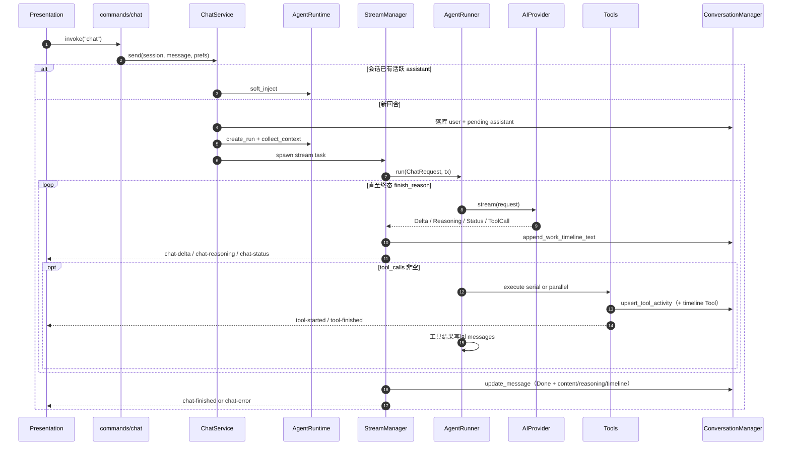

回合中追问走 `soft_inject`，不会新建 assistant 气泡。

### 6.2 前端投影

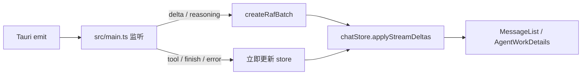

Provider 内可重试的传输错误会在再次尝试前发出 `chat-status`，
`kind = stream_retry:{attempt}:{max}`。Store 清空该消息半截内容；后端同时
`reset_work_timeline`，避免重复拼接。

### 6.3 调用栈（检索用）

```text
commands/chat.rs::chat
  → ChatService::send
      → AgentRuntime::{create_run, collect_context} | soft_inject
      → StreamManager::spawn
          → AgentRunner::run
              → agent_loop::collect_stream_turn
              → AIProvider::stream
              → agent_loop::tools::{execute_serial, execute_parallel}
              → agent_loop::{challenge, mid_turn_compact, soft_inject, failure}
```

---

## 7. 编排 — AgentRunner 循环

`AgentRunner::run` 是聊天、eval 与子 Agent 的**唯一**编排主轴。

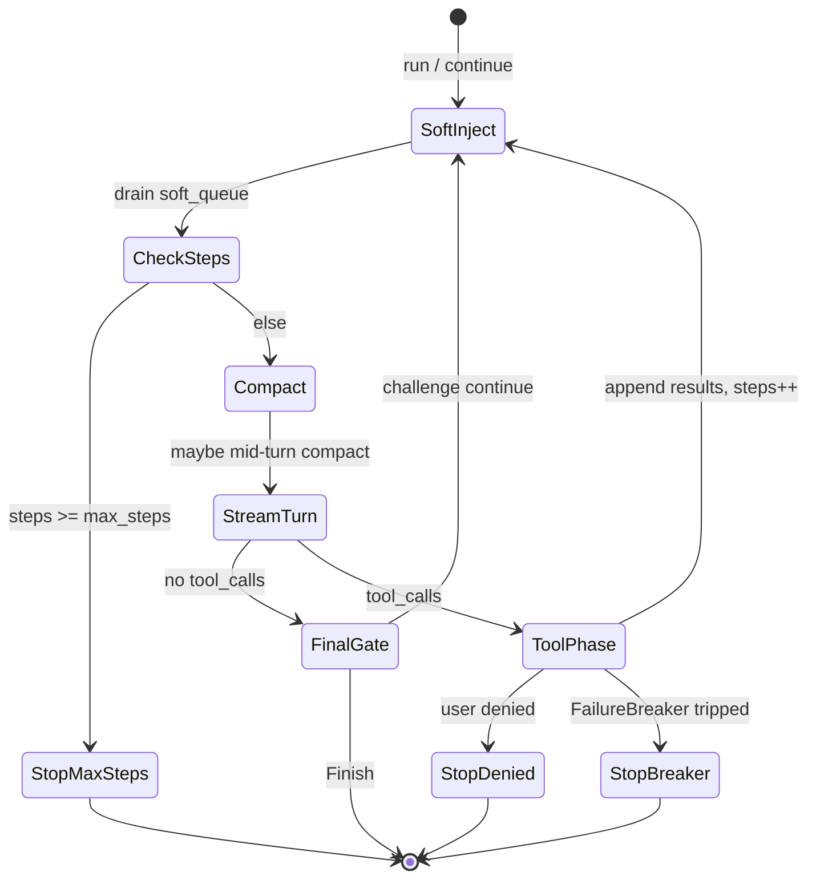

| 模块               | 关注点                                                    |
| ------------------ | --------------------------------------------------------- |
| `stream_turn`      | 将一轮 Provider 流折叠为 content / reasoning / tool_calls |
| `tools`            | 串行 / 并行调度；工具 activity 事件                       |
| `challenge`        | 空完成 / 校验门禁                                         |
| `mid_turn_compact` | 上下文窗口压力下的压缩                                    |
| `soft_inject`      | 在安全边界合并排队中的用户追问                            |
| `failure`          | 连续失败 / 同错重复的熔断                                 |

### Ask / Agent / Plan

通过**工具 Schema 暴露**、**审批策略**与**计划门禁**约束，而不是单独的 Runner。

| 模式      | 行为                                                        |
| --------- | ----------------------------------------------------------- |
| **Ask**   | 不开放写文件 / Shell / Git 等写操作                         |
| **Agent** | 按审批模式开放写操作；复杂请求可**自动进入**计划门禁        |
| **Plan**  | 用户显式选择，或 Agent 自动进入；写工具被拦截，直到用户批准 |

### 计划门禁（Plan gate）

计划状态由 `core/tools/plan_mode.rs` 的进程内 `PlanModeStore` 按 `session_id` 持有（与 ChatMode 正交：门禁开着时即使 compose 仍显示 Agent，写工具也会被拒）。

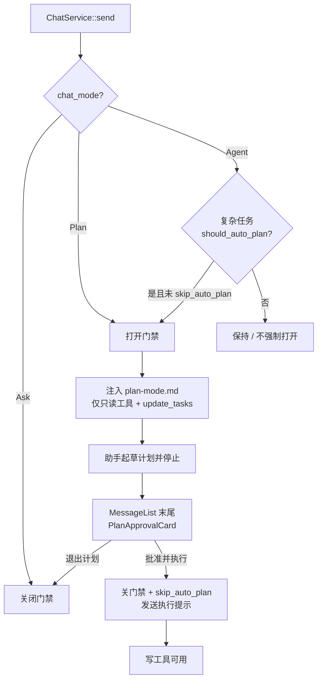

| 环节         | 位置                                                                                   |
| ------------ | -------------------------------------------------------------------------------------- |
| 自动进入判定 | `plan_mode::should_auto_plan`（Agent + 复杂度启发式）                                  |
| 门禁授权     | `PlanModeStore::authorize`（拒绝非只读写工具）                                         |
| 提示词       | `prompts/plan-mode.md`                                                                 |
| 计划列表     | 工具 `update_tasks` / `todo_write` → `task-list-updated` / 消息 `toolActivities`       |
| 批准 UI      | `PlanApprovalCard.vue` 挂在**最后一条已完成助手消息末尾**（类似 `CodeChangesSummary`） |
| 批准动作     | 关门禁 → compose 回到 Agent → `send(..., skipAutoPlan: true)`                          |

批准卡片**不**再使用输入栏上方横幅，避免挤占输入区；步骤列表与 Diff 摘要同级展示。

### AgentRunner 与 AgentRuntime

|            | AgentRunner                  | AgentRuntime                                         |
| ---------- | ---------------------------- | ---------------------------------------------------- |
| 回答的问题 | 「模型下一步做什么？」       | 「本轮 run 是否活跃 / 已取消 / 可注入？」            |
| 拥有       | 流式回合、工具批次、完成门禁 | Run id、epoch、soft-inject 队列、事件桥              |
| 调用方向   | 由 `StreamManager` 调用      | 创建 run；流式委托给 `StreamManager` → `AgentRunner` |

`core/agent/` 下的 Planner / Executor **不是**第二套对话 Agent 循环。

---

## 8. 工作时间线（交错 UI）

叙述与工具卡片必须按真实发生顺序展示。

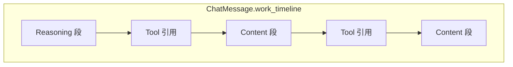

| 类型        | 产生时机                       | 持久化                             |
| ----------- | ------------------------------ | ---------------------------------- |
| `reasoning` | 流式思考增量                   | 同类型合并到末尾项；随消息落盘     |
| `content`   | 流式正文增量                   | 同上                               |
| `tool`      | 某 activity id **首次** upsert | 锚定在开始时刻；状态更新不重复插入 |

前端 `AgentWorkDetails` 渲染时间线；对旧历史或缺增量的整块回复做 trailing reconcile。

---

## 9. 持久化与崩溃恢复

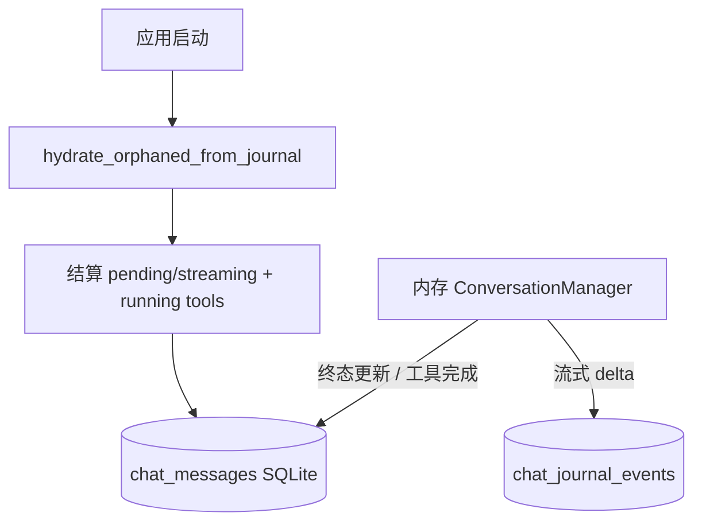

| 存储                  | 内容                                                                               |
| --------------------- | ---------------------------------------------------------------------------------- |
| `chat_messages`       | content、reasoning、tool_activities、**work_timeline**、tool_calls、status、tokens |
| `chat_journal_events` | 进行中回合的压缩 delta 快照                                                        |
| 会话元数据            | 标题、工作区绑定                                                                   |
| Token 用量记录        | Provider 上报时的按 run 记账                                                       |

启动时对孤儿 `pending` / `streaming` 消息做 journal 回填并结算到终态，避免 UI 卡在「执行中」。

---

## 10. 上下文组装

回合流式开始前组装提示词栈（system → rules/memories → context → history → 当前用户）：

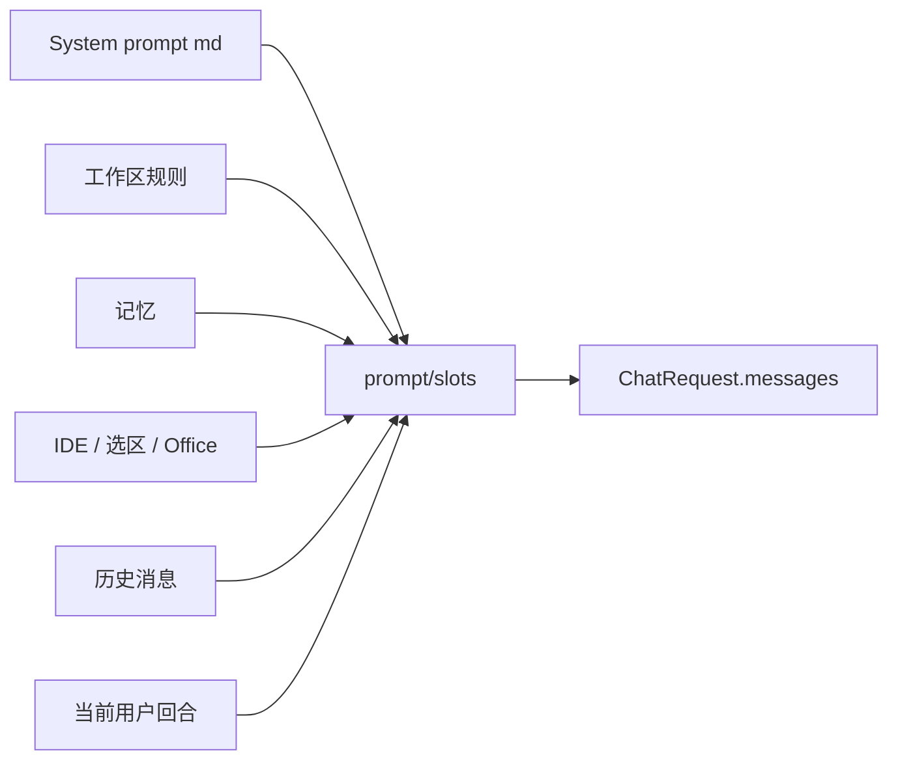

解析优先级见 `prompts/context.md` 与 `core/context` providers。

---

## 11. 工具、审批与 Skills

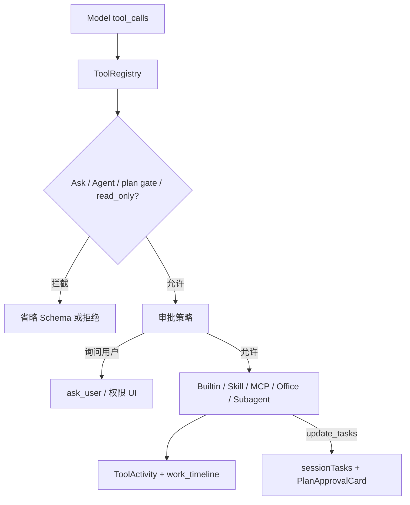

计划门禁开启时，非只读写工具在注册表 / authorize 层被拒绝；`update_tasks`（与只读探索）仍可用，供助手输出可批准的步骤列表。

Skills 位于 `src-tauri/prompts/skills/`（含厂商资源）。调用时常注入 playbook，并可按子 Agent 执行（可选 `read_only`）。

---

## 12. 事件契约（领域 → UI）

| BusEvent          | Tauri 事件                       | 消费效果                              |
| ----------------- | -------------------------------- | ------------------------------------- |
| `ChatStarted`     | `chat-started`                   | 插入 user + pending assistant         |
| `ChatDelta`       | `chat-delta`                     | 追加正文（RAF 批处理）                |
| `ChatReasoning`   | `chat-reasoning`                 | 追加思考                              |
| `ChatStatus`      | `chat-status`                    | 活动标签 / `stream_retry` 重置        |
| `ChatFinished`    | `chat-finished`                  | 用最终内容替换，标记完成              |
| `ChatError`       | `chat-error`                     | 标记错误并展示文案                    |
| 工具活动          | `tool-started` / `tool-finished` | Upsert 工具卡片                       |
| `PlanModeChanged` | `plan-mode-changed`              | 同步门禁；必要时把 compose 切到 Plan  |
| `TaskListUpdated` | `task-list-updated`              | 更新 `sessionTasks`（批准卡步骤来源） |

`ChatSendResponse` 仅返回 id；流式正文走事件通道。

---

## 13. 会话 / 工作区模型

| 类型       | 绑定         | 典型入口                  |
| ---------- | ------------ | ------------------------- |
| 快速提问   | 无工作区     | IDE 外悬浮窗              |
| 工作区会话 | 绑定文件夹   | IDE 前台、`/work`、选择器 |
| 置顶       | 用户置顶标记 | 工作台侧栏                |

悬浮窗与工作台共享会话存储；「在工作台打开」复用同一 `session_id`。

---

## 14. 更新 / 发布数据流

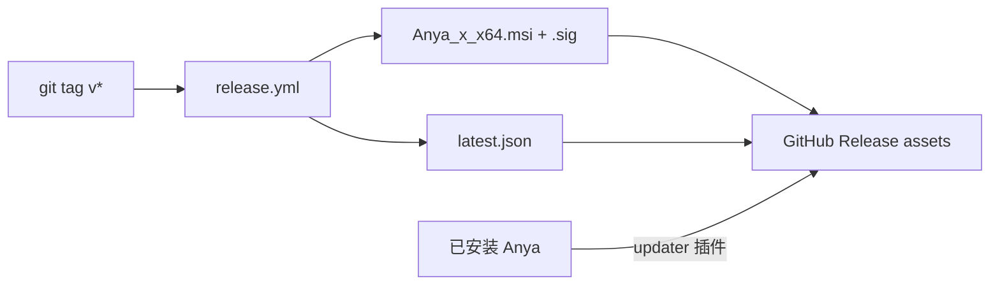

细节见 [release.zh-CN.md](./release.zh-CN.md)。

---

## 15. 扩展点

| 目标                 | 首选挂接点                                         |
| -------------------- | -------------------------------------------------- |
| 新模型厂商           | `core/ai` 实现 `AIProvider` + 设置接线             |
| 新内置工具           | `core/tools` 注册表 + 可选 `runtime/` 适配         |
| 新回合策略           | `core/chat/agent_loop` 模块，由 `AgentRunner` 调用 |
| 新窗口表面           | Tauri window label + `src/main.ts` 启动分支        |
| 外部上下文源         | `core/context` provider                            |
| 新 Skill             | `src-tauri/prompts/skills/*.md`（按需加资源）      |
| Companion RPC / 事件 | `core/remote/protocol.rs` + AnyaAndroid 手机客户端 |

避免在 `AgentRunner` 之外平行再造一套 Agent 循环。
Companion 不得再长出第二套 Agent 运行时。

---

## 16. 相关源码入口

| 关注点                      | 从此处开始                                                    |
| --------------------------- | ------------------------------------------------------------- |
| 应用启动 / 托盘 / 热键      | `src-tauri/src/lib.rs`                                        |
| 聊天 IPC                    | `commands/chat.rs`                                            |
| 发送与上下文组装 / 计划门禁 | `core/chat/service.rs`、`core/tools/plan_mode.rs`             |
| 流式生命周期 + 时间线文本   | `core/chat/stream.rs`                                         |
| 时间线持久化                | `core/chat/conversation_manager.rs`、`core/chat/db.rs`        |
| Agent 循环                  | `core/chat/agent.rs`、`core/chat/agent_loop/`                 |
| Run 壳                      | `core/agent/runtime/`                                         |
| 前端 IPC 与流式批处理       | `src/services/ipc/`、`src/main.ts`、`src/stores/chat.ts`      |
| 时间线 UI                   | `src/components/chat/AgentWorkDetails.vue`                    |
| 计划批准卡                  | `src/components/chat/PlanApprovalCard.vue`、`MessageList.vue` |
| Remote gateway / 配对       | `core/remote/gateway.rs`、`pairing.rs`、`tunnel.rs`           |
| Companion 文件传输          | `core/remote/upload.rs`、`workspace.readFile` download 模式   |
| 手机应用                    | [AnyaAndroid](https://github.com/rururunu/AnyaAndroid)        |
