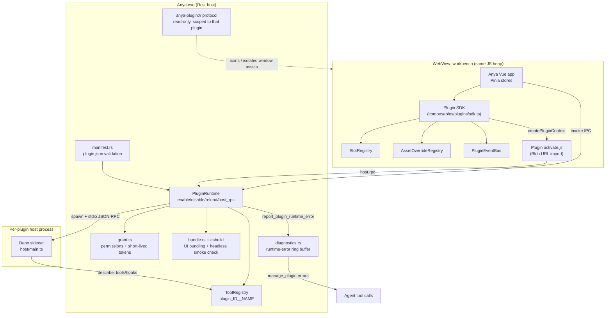
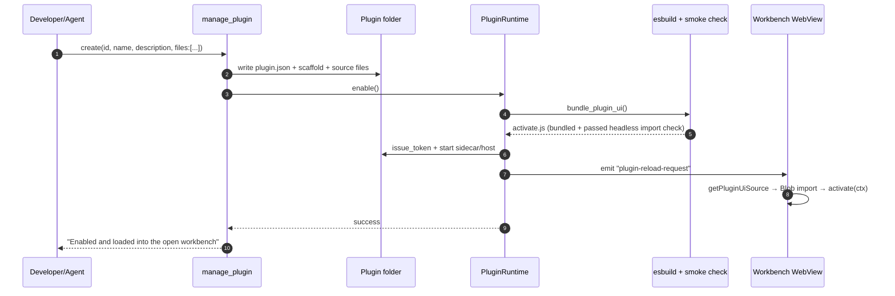
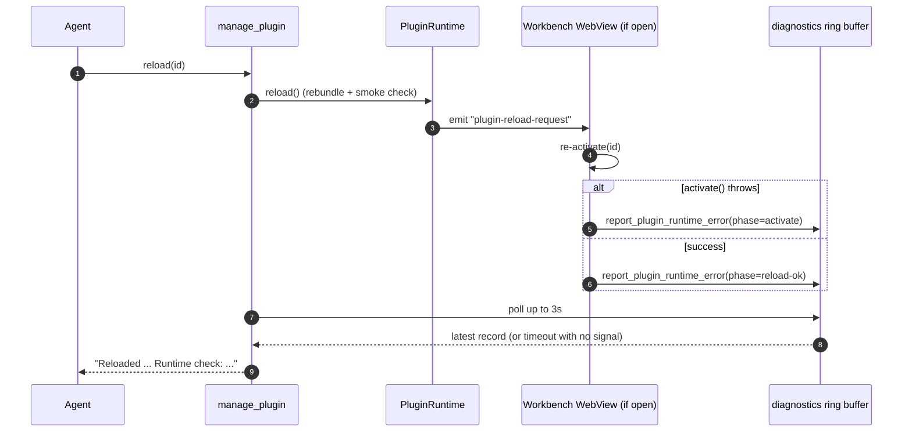

# Anya plugin system

<p>
  <a href="./plugin-system.md">English</a> ·
  <a href="./plugin-system.zh-CN.md">简体中文</a>
</p>

This document is for two audiences: developers/agents writing plugins (tutorial +
API reference), and contributors who need to understand the plugin subsystem's
internals (tech choices, architecture, runtime flow).

**Related:** [Architecture overview](./architecture-overview.md) · [Plugin contract
design plan](../.cursor/plans/plugin_skin_contract_28d3e6af.plan.md) · agent-facing
usage notes live in [`src-tauri/prompts/skills/plugin_creator.md`](../src-tauri/prompts/skills/plugin_creator.md)

---

## 1. Motivation

Anya wants users/agents to add capabilities themselves (terminals, sidebar
widgets, composer decorations, custom tools…) **without editing Anya's own
Vue/Rust source**. Every idea implemented as a core-code change means a code
review and a release cycle, and a user who breaks their own build can't recover.
The goals are:

- **Capabilities can be outsourced**: four generic contracts (UI mount anchors,
  asset overrides, capability permissions, an event bus) let plugin authors
  compose whatever they want inside the contract, instead of Anya building
  "cat ears" / "video background" / "terminal" one at a time as bespoke features.
- **The core can never be bypassed**: approval policy, the plan gate, sandboxing,
  and the tool allowlist are owned by Anya. Plugins only reach them through
  declarative contracts — never by touching the DOM directly, opening sockets
  directly, or reading the filesystem directly.
- **A bad plugin can't take down the whole app**: a crash, an unsupported
  contract version, or an infinite loop in one plugin must not affect Anya's
  main process or other plugins. Failures must be visible and recoverable
  (safe mode, per-plugin reload/disable).
- **An agent can run this whole loop unattended**: the `manage_plugin` tool lets
  an agent create, iterate, enable, and debug plugins without a human in the
  loop; the contract itself is agent-discoverable (`describe_contract`).

**Success criterion:** the next bid-writer-level plugin is only AppData
`activate.js` — **zero** edits to `src/` / `src-tauri/`. Authors fill listed
anchors / asset keys / `ctx.agent`. If a hole is missing, compose columns
inside `workbench.main`; do not add host anchors.

---

## 2. Technology choices

| Choice                                                      | What it is                                                                                                                                                              | Why                                                                                                                                                                                                                    |
| ----------------------------------------------------------- | ----------------------------------------------------------------------------------------------------------------------------------------------------------------------- | ---------------------------------------------------------------------------------------------------------------------------------------------------------------------------------------------------------------------- |
| **Deno as the plugin host runtime**                         | A plugin's `host/main.ts` (tools/hooks logic) runs in a bundled Deno sidecar, not Node                                                                                  | Single executable, TS with no build step, deny-by-default permissions (`--allow-net`/`--allow-run`/`--allow-read` granted precisely), no `npm install`/`node_modules` needed — a much smaller attack surface than Node |
| **esbuild for workbench UI bundling**                       | On `enable`/`reload`, esbuild bundles `ui/src/activate.js` into a single browser ESM at `ui/.anya/activate.js`                                                          | Lets plugin authors `import _ from "lodash"` style pure-JS npm packages without shipping `node_modules`; the output is a single file, simple to load and validate                                                      |
| **The `anya-plugin://` custom URI scheme**                  | An app-wide registered protocol; `anya-plugin://localhost/<id>/<relative path>` can only read files inside that plugin's own folder                                     | A uniform, path-isolated way to address isolated plugin windows, plugin icons, and plugin-shipped assets — directory traversal is rejected by construction                                                             |
| **Dynamic `import()` of a Blob URL for workbench UI**       | The bundled ESM text is fetched via `getPluginUiSource`, wrapped in `new Blob([source])`, and `import()`-ed from the resulting object URL                               | No need to add a `<script src>` or touch the Vite config per plugin; load/unload happens at runtime, and `URL.revokeObjectURL` cleans up                                                                               |
| **Two UI mounting modes: same JS heap vs. isolated window** | `ui.workbench`-permissioned plugins share Anya's own JS runtime (can read Pinia stores); `contributes.window` plugins get an isolated WebView                           | Small widgets (sidebar tabs, composer decorations) don't need cross-process overhead; complex/untrusted UI (games, chat rooms) can be fully isolated with no shared state                                              |
| **Newline-delimited stdio JSON-RPC**                        | The Deno host and Rust `PluginRuntime` talk one JSON message per line (`{id, method, params}` / `{id, result/error}`), with a sidecar and an in-process fallback engine | Simple, dependency-free protocol in the spirit of LSP; `hello`/`describe`/`tool`/`hook`/`pty.*` all share one channel                                                                                                  |
| **Short-lived tokens validated by the sidecar**             | `issue_token`/`validate_token`: enable issues a token bound to the host PID, expiring after an hour                                                                     | Prevents one plugin's sidecar from impersonating another plugin's host RPC calls; a token is only valid inside its own process                                                                                         |
| **ConPTY (`portable_pty`) for terminals**                   | The terminal plugin uses `pty.open/write/resize/kill` plus frontend xterm.js (vendored inside the plugin, not an Anya dependency)                                       | A native pseudo-terminal on Windows; xterm rendering lives entirely inside the plugin so Anya doesn't need an xterm dependency just for one terminal plugin                                                            |

---

## 3. Relationship with the main program



**Boundary rule**: the Vue side never edits Anya's own component tree directly —
it only registers into `SlotRegistry`/`AssetOverrideRegistry`/`PluginEventBus`,
and Anya decides how to render it. The Rust side never lets a plugin bypass
`ToolRegistry`/approval/the plan gate — tool names are force-prefixed with
`plugin_<id>__`, and hooks can only deny a tool call, never skip Anya's gates.

---

## 4. Plugin runtime flow

### 4.1 Create → enable (lifecycle)



### 4.2 The `reload` live-check loop



This is the key design point: esbuild only catches syntax errors. Whether the
logic inside `activate()` actually works is only knowable once it runs — so
`reload` always attempts to get one real runtime signal back instead of treating
"bundled successfully" as "works".

### 4.3 Tool call chain (agent side)

```
model tool_calls (plugin_<id>__<name>)
  → ToolRegistry (can't override builtin tools; still goes through approval/sandbox)
  → PluginRuntime::host_rpc(id, "tool", {name, args})
  → Deno host / in-process HostEngine
  → host/main.ts handleTool()
  → result fed back to the model
```

---

## 5. Contract model (the four primitives plugins use)

| Primitive               | Location                                      | Purpose                                                                                                                                                                                                                                            |
| ----------------------- | --------------------------------------------- | -------------------------------------------------------------------------------------------------------------------------------------------------------------------------------------------------------------------------------------------------- |
| `SlotRegistry`          | `src/composables/plugins/slotRegistry.ts`     | Named anchors (`sidebar.tabs`/`composer.accessory` stackable, `workbench.main` exclusive). The shell renders them with `PluginSlotOutlet` — no per-anchor Vue component. `sidebar.tabs` chrome (`nav`/`header`/`views`) is launcher location only. |
| `ctx.agent`             | `src/composables/plugins/conversationSend.ts` | Frozen agent service (`run` / `mount` / `send` / `sessionId`). `ctx.conversation.*` are aliases.                                                                                                                                                   |
| `AssetOverrideRegistry` | `src/composables/plugins/assetRegistry.ts`    | Resource keys (`mascot.idle`/`tray.icon`/`workbench.backdrop`/`pet.stage.skin`) with an allowed-kind whitelist (image/video/lottie)                                                                                                                |
| `CapabilityFramework`   | `src-tauri/src/core/plugins/capability.rs`    | Structured, scoped capability declarations (e.g. `net.listen` restricted to loopback + a port range) — finer-grained than an enum permission                                                                                                       |
| `PluginEventBus`        | `src/composables/plugins/eventBus.ts`         | Namespaced publish/subscribe; 200-subscription cap per plugin; a subscriber's error can't break others                                                                                                                                             |

Contract version: `plugin.json`'s `apiVersion` (currently `"1.0"` is supported).
An unsupported version does **not** block loading — it's flagged in the plugin
list instead, so shipping a new contract version doesn't instantly break every
existing plugin.

---

## 6. Developer tutorial

### 6.1 Writing a plugin via an agent (recommended path)

When a user asks "build me an X plugin", the agent should:

1. Call `manage_plugin describe_contract` once if it needs real anchor/asset/
   capability ids — cheaper than guessing wrong and redoing `put_file`.
2. Call `manage_plugin create` once with `files:[{path,contents}]` covering
   every source file it already knows it needs (`plugin.json` if non-default
   permissions/capabilities/icon are needed, `ui/src/activate.js`, optionally
   `host/main.ts`) — one tool call. `create` enables and loads the live workbench;
   do not ask the user to click Enable or restart Anya.
3. After later edits, `put_file` reloads when the plugin is already enabled.
   Call `enable`/`reload` yourself if the tool says it is not enabled. Only call
   `errors` if the live-load signal reported a fault.

### 6.2 Writing a plugin by hand (to understand the internals)

Plugin folder layout (`{Anya user data dir}/plugins/<id>/`):

```
plugin.json          # manifest
ui/
  src/activate.js    # workbench UI source (bundled to ui/.anya/activate.js on Enable)
  index.html          # isolated window (used when contributes.window is set)
  icon.svg            # optional, shown in the plugins list
host/
  main.ts             # optional Deno host: tools/hooks
```

Minimal `plugin.json`:

```json
{
  "id": "my-plugin",
  "name": "My Plugin",
  "version": "0.1.0",
  "apiVersion": "1.0",
  "description": "One-line purpose",
  "ui": { "entry": "ui/src/activate.js" },
  "contributes": { "composer": true },
  "permissions": ["ui.workbench"]
}
```

Minimal `ui/src/activate.js`:

```js
export async function activate(ctx) {
  ctx.slots.mount("composer.accessory", {
    id: "hello",
    mount(el) {
      el.textContent = ctx.i18n.t("hello", "Hello", { "zh-CN": "你好" });
      return () => {
        el.textContent = "";
      }; // teardown, optional
    },
  });
}

export function deactivate() {}
```

Local iteration loop: agent `put_file` (hot-reloads when enabled) or
`manage_plugin reload` → read the tool result / `manage_plugin errors`. Do not
ask the user to click Reload or restart Anya.

### 6.2a Official plugins (in this repo)

User plugins live in AppData. Official ones are **also** checked into
[`src-tauri/plugins/`](../src-tauri/plugins/README.md) and copied into AppData on
launch:

| Id             | Source                           | Role                                                                                                                                                                                             |
| -------------- | -------------------------------- | ------------------------------------------------------------------------------------------------------------------------------------------------------------------------------------------------ |
| `terminal`     | `src-tauri/plugins/terminal`     | In-app ConPTY + xterm                                                                                                                                                                            |
| `computer-use` | `src-tauri/plugins/computer-use` | **Agent** plugin: `launch` → keyboard → UIA → pixels. Screenshot includes a control tree. Bundled Windows playbook. No UI. **Off until Enable.** Windows. See [Computer use](./computer-use.md). |

The in-app terminal prepends every plugin `bin/` to `PATH`.

### 6.2b Plugin roles

A plugin is one of three things (`plugin.json` `"role"`; inferred if omitted):

| role      | Meaning                                                                    | Example              |
| --------- | -------------------------------------------------------------------------- | -------------------- |
| `ui`      | Workbench chrome (sidebar, header, window, composer)                       | `terminal`           |
| `service` | Host / OS capability (CLI, daemon). UI optional.                           | custom loopback host |
| `agent`   | Tools for the **chat agent** only. No workbench UI. Enable, then ask Anya. | `computer-use`       |

Agent plugins skip `activate.js` / `ui.workbench`. After Enable, their tools are in the chat schema and a system note tells the agent to call them instead of saying Anya cannot. Type `#plugin:<id>` in the composer (same as `#skill:` / `#mcp:`) to prefer that plugin's tools for the turn. The `#` picker lists only enabled plugins with agent tools.

### 6.2c Computer-use runtime

Official `computer-use` is implemented in Rust (`core/plugins/computer/`), not Deno. The Deno host only declares tool schemas. Prefer:

1. `launch` (ShellExecute)
2. `key`
3. `click_control` / `set_value` (UIA Invoke / ValuePattern; screenshot returns the control list)
4. Pixel `click` / `drag` only for canvas or unnamed regions

JPEG click coordinates are image pixels mapped by capture scale + window origin (physical, DPI reported). Details: [Computer use](./computer-use.md).

### 6.3 Common plugin shapes at a glance

| You want                                               | Use                                                                                                                                                                                     |
| ------------------------------------------------------ | --------------------------------------------------------------------------------------------------------------------------------------------------------------------------------------- |
| A sidebar widget (like the terminal)                   | `contributes.sidebar` + `ctx.sidebar.addTab`                                                                                                                                            |
| A workbench main view                                  | `contributes.view` + `ctx.workbench.setView` (exclusive anchor — only one plugin can hold it at a time)                                                                                 |
| A composer decoration/widget                           | `contributes.composer` + `ctx.composer.addAccessory` or `ctx.slots.mount("composer.accessory", ...)`                                                                                    |
| A header action (icon, no pane)                        | `surfaces: ["header"]` + `onClick` (no `nav`/`views`). `ctx.workspace.openInTerminal()` opens the OS terminal.                                                                          |
| Plugin-owned settings (parameters the user configures) | `ctx.home.setSettingsView(mount)` — renders on the plugin's own home page, no chrome launcher needed                                                                                    |
| A static description of what the plugin does           | `about` in `plugin.json` (`.md`/`.html`) — renders on the plugin's home page "详情/About" tab                                                                                           |
| A standalone mini-app/complex animation                | `contributes.window` + `ui/index.html`, a fully isolated WebView                                                                                                                        |
| A tool the model can call                              | `contributes.agent.tools: true` + `host/main.ts`'s `describe()` returning `tools`                                                                                                       |
| Intercepting/denying tool calls                        | `contributes.agent.hooks` + `host/main.ts`'s `handleHook` (can deny, never bypasses approval)                                                                                           |
| Swapping the mascot/tray icon/backdrop                 | `ctx.assets.register(key, {kind, source})`                                                                                                                                              |
| Let the user pick a local file                         | `fs.pick` + `ctx.fs.pick` (workbench) or `AnyaPlugin.pick` (isolated window)                                                                                                            |
| Plugin-to-plugin or multi-agent messaging              | `ctx.bus.publish/subscribe`                                                                                                                                                             |
| A loopback port (e.g. bridging an external program)    | `capabilities: [{id:"net.listen", scope:{host,portRange}}]` in `plugin.json`                                                                                                            |
| A CLI / daemon while Anya is running                   | `role: service` + `host/main.ts`; optional `bin/` on PATH in the in-app terminal                                                                                                        |
| See the screen and click/type                          | Official `computer-use` (`role: agent`, disabled by default). Hybrid pipeline in [Computer use](./computer-use.md). Permission `computer`. Enable, then `#plugin:computer-use` in chat. |

---

## 7. API reference

### 7.1 `plugin.json` fields

| Field                                         | Type                       | Notes                                                                                                                                                 |
| --------------------------------------------- | -------------------------- | ----------------------------------------------------------------------------------------------------------------------------------------------------- |
| `id`                                          | string                     | kebab-case; must match the folder name                                                                                                                |
| `name`                                        | string                     | Display name                                                                                                                                          |
| `version`                                     | string                     | Plugin's own version, defaults to `"0.1.0"`                                                                                                           |
| `apiVersion`                                  | string                     | Contract version, defaults to `"1.0"`; unsupported versions only warn                                                                                 |
| `description`                                 | string                     | One-line summary                                                                                                                                      |
| `icon`                                        | string (optional)          | Relative path inside the plugin (svg/png/jpg/webp/gif), shown in the plugins list                                                                     |
| `about`                                       | string (optional)          | Relative path inside the plugin to a `.md`/`.html` file, rendered on the plugin's home page "详情/About" tab; falls back to `description` when absent |
| `entry`                                       | string                     | Isolated-window HTML, defaults to `"ui/index.html"`                                                                                                   |
| `ui.entry`                                    | string                     | Workbench UI source, defaults to `"ui/activate.js"` (prefer `ui/src/activate.js`)                                                                     |
| `host.entry`                                  | string (optional)          | Deno host entry, e.g. `"host/main.ts"`                                                                                                                |
| `role`                                        | string (optional)          | `ui` / `service` / `agent`. Omit to infer from `contributes`. Agent plugins need no UI.                                                               |
| `contributes.sidebar/view/composer/window`    | bool                       | Which mount points this plugin uses                                                                                                                   |
| `contributes.agent.tools/hooks/prompt/skills` | bool/array/string/string[] | Tools, hooks, extra system prompt, and markdown files appended to that prompt                                                                         |
| `permissions`                                 | string[]                   | See table below; the user must grant these on enable                                                                                                  |
| `capabilities`                                | `{id, scope}[]`            | Structured sub-capabilities, see §7.4                                                                                                                 |
| `window.width/height`                         | number                     | Isolated window size, defaults to 960×720                                                                                                             |

### 7.2 Permissions (`permissions`)

| id             | Meaning                                                                                                                                        |
| -------------- | ---------------------------------------------------------------------------------------------------------------------------------------------- |
| `storage`      | Store small key-value data inside the plugin's own folder                                                                                      |
| `ask_anya`     | Call Anya's agent (`ctx.agent.run` on a plugin session, or `send` into the current chat)                                                       |
| `pty`          | Open a real terminal (ConPTY)                                                                                                                  |
| `run`          | `--allow-run` in the Deno host                                                                                                                 |
| `fs.workspace` | Read/write the current workspace from `host/main.ts` (`Deno.readTextFile` / `writeTextFile`) — not a `ctx` method                              |
| `fs.pick`      | Native file dialog via `ctx.fs.pick` / `AnyaPlugin.pick`                                                                                       |
| `net`          | `--allow-net` in the Deno host                                                                                                                 |
| `agent.tools`  | Register tools the model can call                                                                                                              |
| `agent.hooks`  | Run hooks during an agent turn                                                                                                                 |
| `agent.prompt` | Append to the agent system prompt                                                                                                              |
| `ui.workbench` | Load into the workbench's own page (can read stores/settings)                                                                                  |
| `computer`     | Screenshot, UIA, keyboard, and `launch` on Windows. Official plugin: `computer-use` (off until Enable). See [Computer use](./computer-use.md). |

### 7.3 Workbench SDK (`ctx` inside `activate(ctx)`)

```ts
ctx.sidebar.addTab({ id, title, icon, mount(el)?, onClick?, surfaces?, content? }) / removeTab(id)
ctx.workbench.setView({ id, title, mount(el) } | null)
ctx.composer.addAccessory({ id, mount(el) }) / removeAccessory(id)

ctx.agent.run(prompt, { sessionId?, cwd? }) / mount(el) / unmount() / send(text) / sessionId()
ctx.conversation.*  // aliases of agent; addMaterials is compat-only
ctx.workspace.openInTerminal(id?)  // OS terminal; omit id = current conversation workspace

// Plugin home page's "设置/Settings" tab — no chrome launcher, not an anchor
ctx.home.setSettingsView(mount(el)) / clearSettingsView()

// Generic primitives (sidebar/workbench/composer above are thin wrappers over these)
ctx.slots.list(): AnchorDescriptor[]
ctx.slots.mount(anchorId, { id, title?, icon?, mount }): boolean   // false if an exclusive anchor is already taken
ctx.slots.unmount(anchorId, id)

ctx.assets.list(): string[]
ctx.assets.register(key, { kind: "image"|"video"|"lottie", source }): boolean  // false if another plugin already owns the key
ctx.assets.unregister(key)

ctx.bus.publish(topic, payload)
ctx.bus.subscribe(topic, fn): () => void   // returns an unsubscribe function

ctx.i18n.t(key, fallback, dict?)   // dict: { "zh-CN": "...", en: "..." }

ctx.stores.chat / ctx.stores.setting   // Pinia stores (needs ui.workbench)

ctx.host.rpc(method, params?): Promise<unknown>   // forwarded to host/main.ts, or builtin pty.* / computer.*
ctx.host.on(event, fn): () => void

ctx.fs.pick({ multiple?, directory?, filters?: [{ name, extensions }] }): Promise<{ path, name, url }[] | null>
// needs `fs.pick`; cancel → null. Isolated window: AnyaPlugin.pick(same options).
// use `url` as /<video>/assets.register source; `path` is the original location.

ctx.onDeactivate(fn)   // registers a cleanup callback run on deactivate
```

`icon` can be a known glyph id (`"terminal"`) or any image URL
(`anya-plugin://localhost/<id>/<path>`, `data:`, `http(s):`).

`sidebar.tabs`/`composer.accessory` are `stack` (multiple plugins can coexist);
`workbench.main` is `exclusive` (only one plugin can hold it — the second one is
rejected). Asset keys are exclusive the same way. Diagnostics can disable the
owner and reload the rejected plugin.

`surfaces` on `addTab` chooses **where the button is**. The pane is a separate
rule:

| `surfaces`                       | Button                                    | Pane                                                                                                                                                                                                              |
| -------------------------------- | ----------------------------------------- | ----------------------------------------------------------------------------------------------------------------------------------------------------------------------------------------------------------------- |
| `views` (default / omitted)      | Review-strip tab                          | Right review pane (工作区视图). Conversation stays.                                                                                                                                                               |
| `nav` without `views`            | Left nav, next to Plugins / Connect phone | **Center** (主视图) — same region as Plugins. Draw your own UI. Call `ctx.agent.run` to use the agent pipeline without Anya's chat chrome. `ctx.agent.mount(el)` only if you want to embed the live conversation. |
| `nav` + `views`                  | Left nav **and** review-strip tab         | Still the **right** review pane. Nav is only a shortcut, not 主视图.                                                                                                                                              |
| `header` only (no `nav`/`views`) | Conversation header icon                  | **None** — chrome action. Click runs `onClick`.                                                                                                                                                                   |
| `header` with `nav`/`views`      | Conversation header icon                  | Same pane as those launchers (review, or 主视图 if nav-without-views).                                                                                                                                            |
| `[]`                             | None                                      | No launcher (backdrop/mascot).                                                                                                                                                                                    |

`ctx.workbench.setView({ id, title, mount })` also occupies the center
exclusively (on Enable, no extra click). `content` still overrides `mount` per
**launcher** surface; missing keys fall back to `mount`.

The shell only renders frozen holes via `PluginSlotOutlet`. Extra product UI
(资料区 / 成品区) belongs **inside** the plugin's `workbench.main` page.

**Own page + agent service:**

| Call                                          | Where                                                                                                                                                                |
| --------------------------------------------- | -------------------------------------------------------------------------------------------------------------------------------------------------------------------- |
| `ctx.agent.run(prompt, { sessionId?, cwd? })` | Same Rust agent loop on a plugin-owned session (`plugin:<id>:…`). Does not write the open workbench chat. Hidden from the sidebar. `cwd` binds tools to that folder. |
| `ctx.agent.mount(el)`                         | Embed Anya's live agent conversation into the plugin's own page                                                                                                      |
| `ctx.agent.send(text)`                        | Inject into the current workbench conversation (same path as the composer)                                                                                           |
| `ctx.agent.sessionId()`                       | Current workbench session id (for `mount`/`send`, not `run`)                                                                                                         |
| `ctx.conversation.*`                          | Aliases of `agent` (`addMaterials` is compat-only)                                                                                                                   |

### 7.3a Plugin home page

Every installed plugin has a home page, opened by clicking its card in the
installed-plugins list (not from Anya's chrome). Anya owns the frame: an icon/
name/enable-toggle header, plus two fixed tabs — "详情/About" and
"设置/Settings". Each tab's _content_ is the plugin's:

- **详情/About** renders the manifest's `about` file (Markdown or sanitized
  HTML), falling back to `description` when `about` is absent. No SDK call —
  it's a static file, always readable even while the plugin is disabled.
- **设置/Settings** renders whatever `ctx.home.setSettingsView(mount)`
  mounted, via the same `PluginHostPane` (and the same empty-mount crash/
  diagnostic isolation) used for chrome surfaces. Only available while the
  plugin is enabled (`mount` only runs after `activate`).

This replaces the plugin needing a `settings` chrome surface entirely —
plugins like a video backdrop configure themselves on their own home page
without opening any launcher in Anya's UI.

### 7.4 Structured capabilities (`capabilities`)

| Category id   | `scope` fields                  | Constraints                                                        |
| ------------- | ------------------------------- | ------------------------------------------------------------------ |
| `net.listen`  | `{ host, portRange: [lo, hi] }` | `host` must be `127.0.0.1`/`localhost`; port must be in 1024–65535 |
| `net.connect` | same                            | same                                                               |
| `fs.scope`    | `{ root }`                      | non-empty relative path                                            |

### 7.5 Deno host protocol (`host/main.ts`)

One JSON object per line over stdin/stdout:

| method                                                                                                       | Purpose                                                                                                                                                                              |
| ------------------------------------------------------------------------------------------------------------ | ------------------------------------------------------------------------------------------------------------------------------------------------------------------------------------ |
| `hello`                                                                                                      | Handshake, carries `pluginId`/`token`/`hostPid`                                                                                                                                      |
| `describe`                                                                                                   | Returns `{ tools: [{name,description,parameters}], hooks: string[] }`                                                                                                                |
| `tool`                                                                                                       | `{name, args}` → tool execution result                                                                                                                                               |
| `hook`                                                                                                       | `{hook, payload}` → processed payload (`allow:false` denies the tool call)                                                                                                           |
| `pty.open/write/resize/kill`                                                                                 | Forwarded by Anya when `pty` is granted; the host doesn't implement it itself                                                                                                        |
| `computer.screenshot/screenInfo/listWindows/focusWindow/findControl/clickControl/click/move/scroll/type/key` | Anya-owned (Windows). Needs `computer`. Screenshot defaults to the foreground window. Click x/y are pixels in the last screenshot; prefer `findControl`/`clickControl` for named UI. |

### 7.6 `manage_plugin` tool actions (for agents)

| action               | Purpose                                                                                                                                                                                                                                                                         |
| -------------------- | ------------------------------------------------------------------------------------------------------------------------------------------------------------------------------------------------------------------------------------------------------------------------------- |
| `create`             | Scaffold a plugin; accepts `files:[{path,contents}]`. Enables and loads the live workbench.                                                                                                                                                                                     |
| `put_file`           | Write/edit a file; also accepts `files:[...]` for batching. Reloads live UI when the plugin is already enabled.                                                                                                                                                                 |
| `list`               | List all user plugins and their status                                                                                                                                                                                                                                          |
| `describe_contract`  | Returns the anchor table / asset key table / capability catalog / permission catalog / supported apiVersions / the home-page `about` field + `ctx.home.setSettingsView` primitive / the file API (`files.workbench` = `ctx.fs.pick`)                                            |
| `enable` / `disable` | Bundle + start / stop, and notify the open workbench to activate/deactivate                                                                                                                                                                                                     |
| `reload`             | Rebundle, then get an open workbench webview to re-activate and report back                                                                                                                                                                                                     |
| `errors`             | Recent runtime faults (`activate`/`deactivate`/`mount`/`reload-ok`) — includes a `mount` entry whenever a surface's `mount`/`content[surface]` returns without rendering anything; `PluginHostPane` also shows the user a "this view rendered nothing" placeholder in that case |
| `open` / `delete`    | Open the isolated window / uninstall a **user** plugin (deletes the folder). Official plugins cannot be deleted.                                                                                                                                                                |
| `import`             | Install a zip or folder with `plugin.json` (`path`, optional `overwrite`). Does **not** enable. Cannot overwrite official ids.                                                                                                                                                  |
| `export`             | Pack sources to a `.zip` (`id`, optional `path` dest; defaults to the workspace). Skips `ui/.anya`, `data/`, `bin/`.                                                                                                                                                            |

---

## 8. Security boundaries

- A plugin can't reach arbitrary files: `manage_plugin` paths stay inside the
  plugin folder; `fs.pick` only sees files the user selects in a dialog (copied
  into `data/picked/`); `fs.workspace` is Deno-host read/write of the current
  workspace.
- `manage_plugin enable`/`create` grants declared permissions because the user
  asked the agent to ship the plugin; the Plugins panel still lets a human pick
  grants. Tokens are bound to the host PID and expire after an hour.
- Tool names are force-prefixed `plugin_<id>__` and can't override builtin
  tools; hooks can only deny, never bypass approval/sandbox/the plan gate.
- Screenshot / click / type stay in Anya (`computer`, Windows). Plugins call
  them; packs cannot ship `exe`/`dll` for input. Agent computer tools go
  through the existing approval picker.
- A runtime crash in one plugin only affects that plugin (`try`/`catch` +
  the `diagnostics` ring buffer) — it doesn't take down Anya or other plugins.
- Global **safe mode**: if plugins fail hard at startup, Anya skips all plugins
  instead of hanging, with a one-click way to exit safe mode from the panel.

---

## 9. Source entry points

| Concern                                       | Location                                                                                |
| --------------------------------------------- | --------------------------------------------------------------------------------------- |
| Manifest / validation                         | `src-tauri/src/core/plugins/manifest.rs`                                                |
| Lifecycle (enable/disable/reload)             | `src-tauri/src/core/plugins/runtime.rs`                                                 |
| UI bundling + headless smoke check            | `src-tauri/src/core/plugins/bundle.rs`, `bundle_ui.ts`                                  |
| Permissions / capabilities                    | `permissions.rs`, `capability.rs`                                                       |
| Computer use (screenshot / input)             | `computer/`                                                                             |
| Tokens / grant persistence                    | `grant.rs`                                                                              |
| Runtime-error bridge                          | `diagnostics.rs`                                                                        |
| `anya-plugin://` protocol                     | `protocol.rs`                                                                           |
| Agent-facing tool                             | `src-tauri/src/core/tools/builtin/plugin.rs`                                            |
| Frontend SDK                                  | `src/composables/plugins/sdk.ts`                                                        |
| The four contract primitives                  | `src/composables/plugins/{slotRegistry,assetRegistry,eventBus,pluginI18n}.ts`           |
| Pinia store                                   | `src/stores/plugins.ts`                                                                 |
| UI mount consumers                            | `src/layouts/Main.vue`, `src/components/chat/PeekPanel.vue`, `src/components/plugins/*` |
| Agent usage notes                             | `src-tauri/prompts/skills/plugin_creator.md`                                            |
| Reference plugins (terminal + primitive demo) | `src-tauri/plugins/terminal/`, `src-tauri/plugins/examples/slot-badge-demo/`            |
