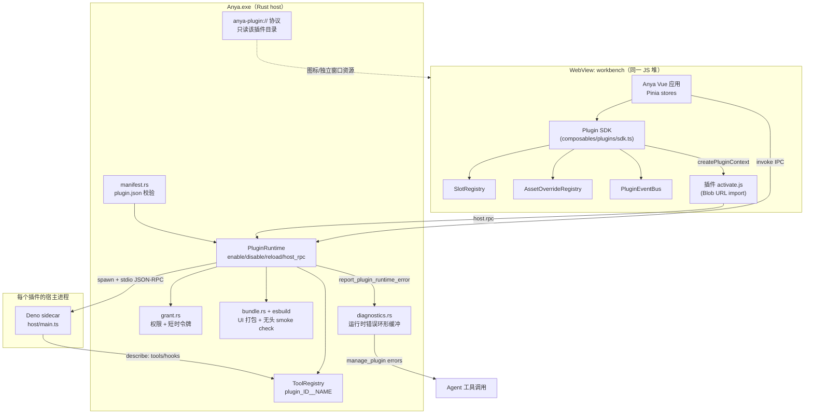
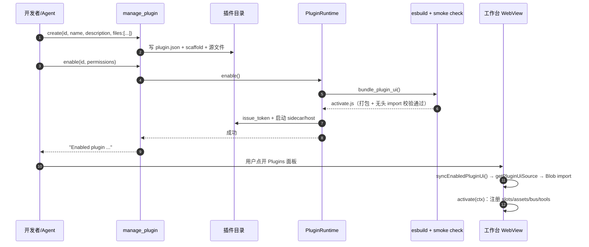
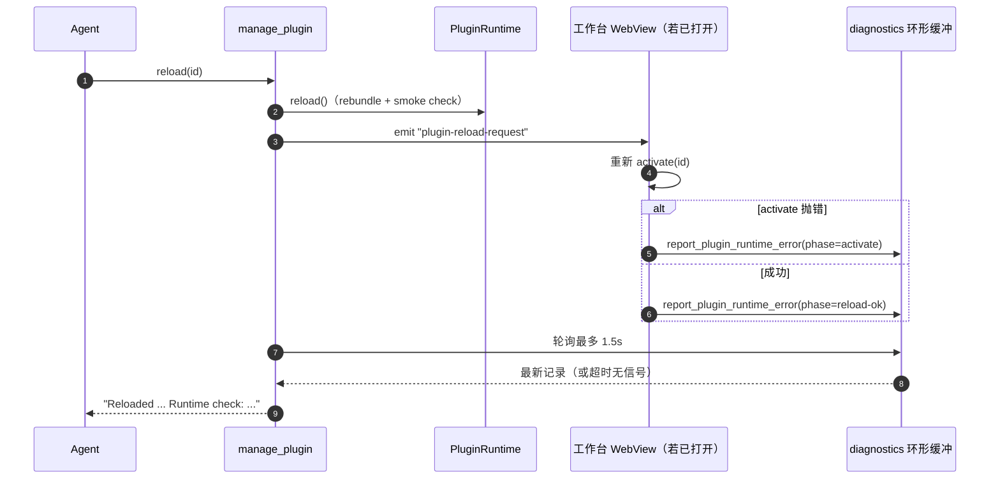

# Anya 插件系统

<p>
  <a href="./plugin-system.md">English</a> ·
  <a href="./plugin-system.zh-CN.md">简体中文</a>
</p>

本文档面向：想给 Anya 写插件的开发者/agent（教学 + API 参考），以及想理解插件子系统内部结构的贡献者（技术选型、架构关系、运行流程）。

**相关**：[技术架构总览](./architecture-overview.zh-CN.md) · [插件契约设计计划](../.cursor/plans/plugin_skin_contract_28d3e6af.plan.md) · agent 侧使用说明见 [`src-tauri/prompts/skills/plugin_creator.md`](../src-tauri/prompts/skills/plugin_creator.md)

---

## 1. 初衷

Anya 想让用户/agent 能自己给产品加能力（终端、侧栏小工具、输入框装饰、自定义工具……），但**不能靠改 Anya 自己的 Vue/Rust 源码**来实现——那样每个想法都要走一次代码评审、发版，而且用户改坏了没法回滚。目标是：

- **能力可以外包**：UI 挂载点、资源覆盖、能力权限、消息总线四类通用契约，插件作者在契约范围内自由拼装，不用 Anya 逐个实现"猫耳朵""视频背景""终端"这样的具体功能。
- **核心永远不被绕过**：审批策略、Plan 门、沙箱、工具白名单是 Anya 拥有的，插件只能通过声明式契约触达，不能直接改 DOM / 直接开 socket / 直接读文件系统。
- **坏插件不能拖垮整机**：单个插件崩溃、契约版本不兼容、写了死循环，都不应该让 Anya 主进程或其他插件受影响；出问题要能看见、能自救（safe mode、单插件重载/停用）。
- **agent 自己就能把这套跑起来**：`manage_plugin` 工具让 agent 不用人工介入就能创建、迭代、启用、调试插件，契约文档本身也是 agent 的参考资料（`describe_contract` 动作）。

**成功标准：** 下一个标书级插件只写 AppData 里的 `activate.js`——**零改** `src/` / `src-tauri/`。作者只填已列出的锚点 / 资源键 / `ctx.agent`。孔不够就在 `workbench.main` 里自己拼栏，不要给宿主加新锚点。

---

## 2. 技术选型

| 选型                                       | 是什么                                                                                                                                                 | 为什么                                                                                                                                                           |
| ------------------------------------------ | ------------------------------------------------------------------------------------------------------------------------------------------------------ | ---------------------------------------------------------------------------------------------------------------------------------------------------------------- |
| **Deno 作为插件宿主运行时**                | 插件的 `host/main.ts`（工具/钩子逻辑）由内置 Deno sidecar 执行，不是 Node                                                                              | 单文件可执行、TS 原生免编译、默认无权限（`--allow-net`/`--allow-run`/`--allow-read` 按需精确授予），不需要 `npm install` 或 `node_modules`，攻击面比 Node 小很多 |
| **esbuild 打包工作台 UI**                  | `enable`/`reload` 时用 esbuild 把 `ui/src/activate.js` 打成一份浏览器 ESM，写到 `ui/.anya/activate.js`                                                 | 让插件作者能 `import _ from "lodash"` 这类纯 JS npm 包而不用把 `node_modules` 塞进插件目录；产物是单文件，加载/校验都简单                                        |
| **`anya-plugin://` 自定义 URI scheme**     | Tauri 应用级注册的协议，`anya-plugin://localhost/<id>/<相对路径>` 只能读该插件自己目录下的文件                                                         | 给独立插件窗口、插件图标、插件资源文件一个统一、路径隔离的寻址方式，天然防目录穿越                                                                               |
| **Blob URL 动态 `import()` 加载工作台 UI** | 打包好的 ESM 文本通过 `getPluginUiSource` 取回，前端 `new Blob([source]).createObjectURL()` 后 `import()`                                              | 不用为每个插件单独开一个 `<script src>` 或改 Vite 配置，运行时按需加载/卸载，`URL.revokeObjectURL` 清理                                                          |
| **同 JS 堆 vs 独立窗口两种 UI 挂载**       | `ui.workbench` 权限的插件和 Anya 主页面共享同一个 JS 运行时（可读 Pinia store）；`contributes.window` 的插件开一个隔离的 WebView 窗口                  | 简单小工具（侧栏 tab、输入框装饰）不需要跨进程通信的开销；复杂/不受信的 UI（游戏、群聊）可以完全隔离，不共享状态                                                 |
| **stdio 换行分隔 JSON-RPC**                | Deno host 和 Rust `PluginRuntime` 之间用一行一个 JSON 消息通信（`{id, method, params}` / `{id, result/error}`），有 sidecar 和 in-process 兜底两种实现 | 协议简单、无依赖，和 LSP 的思路一致；`hello`/`describe`/`tool`/`hook`/`pty.*` 都走同一条通道                                                                     |
| **短时令牌 + sidecar 校验**                | `issue_token`/`validate_token`：启用时发一个和 host_pid 绑定、1 小时过期的令牌                                                                         | 防止一个插件的 sidecar 冒充另一个插件调用 host RPC；令牌只在自己进程内有效                                                                                       |
| **ConPTY（`portable_pty`）做终端**         | 终端插件走 `pty.open/write/resize/kill` + 前端 xterm.js（插件自带 vendor 文件，不依赖 Anya）                                                           | Windows 上原生伪终端；xterm 渲染完全在插件里，Anya 不需要为了一个终端插件引入 xterm 依赖                                                                         |

---

## 3. 与主程序的关系



**边界**：Vue 侧永远不直接改 Anya 自己的组件树——只往 `SlotRegistry`/`AssetOverrideRegistry`/`PluginEventBus` 里注册，由 Anya 决定怎么渲染。Rust 侧永远不让插件绕过 `ToolRegistry`/审批/Plan 门——工具名强制加 `plugin_<id>__` 前缀，钩子只能否决工具调用，不能跳过 Anya 的门。

---

## 4. 插件运行流程

### 4.1 创建 → 启用（生命周期）



### 4.2 reload 的实时校验闭环



这是关键设计：esbuild 只能抓语法错误，`activate()` 内部真正跑起来才知道逻辑对不对——所以 `reload` 之后一定会尝试拿到一次真实运行反馈，而不是"打包成功就当作成功"。

### 4.3 工具调用链（agent 侧）

```
model tool_calls (plugin_<id>__<name>)
  → ToolRegistry（不能覆盖内置工具，仍过审批/沙箱）
  → PluginRuntime::host_rpc(id, "tool", {name, args})
  → Deno host / in-process HostEngine
  → host/main.ts handleTool()
  → 结果回填给模型
```

---

## 5. 契约模型（插件能用到的四个原语）

| 原语                    | 代码位置                                      | 作用                                                                                                                                                                                                      |
| ----------------------- | --------------------------------------------- | --------------------------------------------------------------------------------------------------------------------------------------------------------------------------------------------------------- |
| `SlotRegistry`          | `src/composables/plugins/slotRegistry.ts`     | 命名锚点（`sidebar.tabs`/`composer.accessory` 可叠加，`workbench.main` 独占）。壳用 `PluginSlotOutlet` 出孔，不再为每个锚点写专用组件。`sidebar.tabs` 的 chrome（`nav`/`header`/`views`）只决定入口位置。 |
| `ctx.agent`             | `src/composables/plugins/conversationSend.ts` | 冻结的 Agent 服务（`run` / `mount` / `send` / `sessionId`）。`ctx.conversation.*` 是别名。                                                                                                                |
| `AssetOverrideRegistry` | `src/composables/plugins/assetRegistry.ts`    | 资源键（`mascot.idle`/`tray.icon`/`workbench.backdrop`/`pet.stage.skin`）+ 类型白名单（image/video/lottie）                                                                                               |
| `CapabilityFramework`   | `src-tauri/src/core/plugins/capability.rs`    | 结构化子能力声明（如 `net.listen` 限定 loopback + 端口范围），比枚举权限更细粒度                                                                                                                          |
| `PluginEventBus`        | `src/composables/plugins/eventBus.ts`         | 命名空间发布订阅，单插件订阅上限 200，订阅者异常互相隔离                                                                                                                                                  |

契约版本：`plugin.json` 的 `apiVersion`（当前支持 `"1.0"`）。版本不受支持时**不阻断加载**，只在插件列表标黄提示——避免"发新版就打碎所有旧插件"。

---

## 6. 开发教学

### 6.1 用 agent 写一个插件（推荐路径）

对用户说"帮我做个 XXX 插件"时，agent 会：

1. 需要用到 `ctx.slots`/`ctx.assets` 时先调 `manage_plugin describe_contract` 看真实的锚点 id / 资源键 / 能力目录 / 支持的 `apiVersion`，不猜。
2. 一次 `manage_plugin create` 调用里用 `files:[{path,contents}]` 把 `plugin.json`（如果要非默认权限/能力/图标）、`ui/src/activate.js`、`host/main.ts` 一起写完，不用一个文件一次工具调用。`create` 会启用并加载进已打开的工作台，不要让用户去点 Enable。
3. 改完代码用 `put_file`（已启用会热重载）或 `reload`。不要让用户重启 Anya。工作台会回报激活是否成功；失败再调 `errors`。

### 6.2 手写一个插件（了解内部结构）

插件目录结构（`{Anya 用户数据目录}/plugins/<id>/`）：

```
plugin.json          # 清单
ui/
  src/activate.js    # 工作台 UI 源码（Enable 时打包成 ui/.anya/activate.js）
  index.html          # 独立窗口（contributes.window 时用）
  icon.svg            # 可选，插件列表图标
host/
  main.ts             # 可选，Deno 宿主：工具/钩子
```

最小 `plugin.json`：

```json
{
  "id": "my-plugin",
  "name": "My Plugin",
  "version": "0.1.0",
  "apiVersion": "1.0",
  "description": "一句话说明",
  "ui": { "entry": "ui/src/activate.js" },
  "contributes": { "composer": true },
  "permissions": ["ui.workbench"]
}
```

最小 `ui/src/activate.js`：

```js
export async function activate(ctx) {
  ctx.slots.mount("composer.accessory", {
    id: "hello",
    mount(el) {
      el.textContent = ctx.i18n.t("hello", "Hello", { "zh-CN": "你好" });
      return () => {
        el.textContent = "";
      }; // 清理函数，可选
    },
  });
}

export function deactivate() {}
```

本地迭代循环：agent `put_file`（已启用会热重载）或 `manage_plugin reload` → 看工具回报 / `manage_plugin errors`。不要让用户去面板点「重载」或重启 Anya。

### 6.2a 官方插件（在本仓库）

用户插件在 AppData。官方插件**同时**放在 [`src-tauri/plugins/`](../src-tauri/plugins/README.md)，启动时复制进 AppData：

| Id             | 源码                             | 作用                                                                                                                                                              |
| -------------- | -------------------------------- | ----------------------------------------------------------------------------------------------------------------------------------------------------------------- |
| `terminal`     | `src-tauri/plugins/terminal`     | 内嵌 ConPTY + xterm                                                                                                                                               |
| `computer-use` | `src-tauri/plugins/computer-use` | **Agent** 插件：`launch` → 快捷键 → UIA → 像素。截图带控件树。内置 Windows playbook。无界面。**默认关闭**。仅 Windows。详见 [电脑操控](./computer-use.zh-CN.md)。 |

Anya 内嵌终端会把每个插件的 `bin/` 加进 `PATH`。

### 6.2b 插件角色

插件不必都有界面。`plugin.json` 的 `"role"`（可省略，按 `contributes` 推断）：

| role      | 含义                                                               | 例子           |
| --------- | ------------------------------------------------------------------ | -------------- |
| `ui`      | 工作台界面（侧栏、标题栏、窗口、输入框）                           | `terminal`     |
| `service` | 宿主 / 系统能力（CLI、守护进程）。界面可选。                       | 自定义回环宿主 |
| `agent`   | **只给对话里的 Agent 调用**。没有工作台 UI。启用后直接在聊天里用。 | `computer-use` |

Agent 插件不需要 `activate.js` / `ui.workbench`。启用后工具会出现在本轮 schema，系统提示会要求模型去调这些工具，而不是说 Anya 做不到。在输入框输入 `#plugin:<id>`（和 `#skill:` / `#mcp:` 一样）可以明文指定本轮优先用该插件的工具。`#` 列表只出现已启用且带 agent 工具的插件。

### 6.2c Computer-use 运行时

官方 `computer-use` 的动作在 Rust（`core/plugins/computer/`），不在 Deno。Deno host 只声明工具 schema。优先级：

1. `launch`（ShellExecute）
2. `key`
3. `click_control` / `set_value`（UIA Invoke / ValuePattern；截图结果带控件列表）
4. 像素 `click` / `drag` 只用于画布或没有名字的区域

JPEG 点击坐标是图像像素，按缩放 + 窗口原点映射到物理屏幕（带 DPI）。详见 [电脑操控](./computer-use.zh-CN.md)。

### 6.3 常见插件类型速查

| 想做什么                       | 用什么                                                                                                                                                       |
| ------------------------------ | ------------------------------------------------------------------------------------------------------------------------------------------------------------ |
| 侧栏小工具（像终端）           | `contributes.sidebar` + `ctx.sidebar.addTab`                                                                                                                 |
| 工作台主视图                   | `contributes.view` + `ctx.workbench.setView`（独占锚点，同时只能有一个插件占用）                                                                             |
| 输入框装饰/小组件              | `contributes.composer` + `ctx.composer.addAccessory` 或 `ctx.slots.mount("composer.accessory", ...)`                                                         |
| 标题栏纯动作（图标、不开面板） | `surfaces: ["header"]` + `onClick`（不要 `nav`/`views`）。`ctx.workspace.openInTerminal()` 打开系统终端。                                                    |
| 插件自己的可配置参数           | `ctx.home.setSettingsView(mount)`——渲染在插件自己的主页上，不需要在 Anya 的 chrome 里开口子                                                                  |
| 静态介绍插件是做什么的         | `plugin.json` 的 `about`（`.md`/`.html`）——渲染在插件主页的"详情"标签页                                                                                      |
| 独立小程序/复杂动画            | `contributes.window` + `ui/index.html`，完全隔离的 WebView                                                                                                   |
| 给模型加工具                   | `contributes.agent.tools: true` + `host/main.ts` 的 `describe()` 返回 `tools`                                                                                |
| 拦截/否决工具调用              | `contributes.agent.hooks` + `host/main.ts` 的 `handleHook`（能拒绝，不能绕过审批）                                                                           |
| 换吉祥物/托盘图标/背景         | `ctx.assets.register(key, {kind, source})`                                                                                                                   |
| 让用户选择本地文件             | `fs.pick` + `ctx.fs.pick`（工作台）或 `AnyaPlugin.pick`（独立窗口）                                                                                          |
| 插件间/多 agent 通信           | `ctx.bus.publish/subscribe`                                                                                                                                  |
| 本机回环端口（如桥接外部程序） | `plugin.json` 的 `capabilities: [{id:"net.listen", scope:{host,portRange}}]`                                                                                 |
| Anya 运行时的命令行 / 守护进程 | `role: service` + `host/main.ts`；可选 `bin/`，内嵌终端会加进 `PATH`                                                                                         |
| 看屏幕并点击输入               | 官方 `computer-use`（`role: agent`，默认关闭）。混合执行见 [电脑操控](./computer-use.zh-CN.md)。权限 `computer`。启用后在聊天里输入 `#plugin:computer-use`。 |

---

## 7. API 参考

### 7.1 `plugin.json` 字段

| 字段                                          | 类型                       | 说明                                                                                              |
| --------------------------------------------- | -------------------------- | ------------------------------------------------------------------------------------------------- |
| `id`                                          | string                     | kebab-case，需与文件夹名一致                                                                      |
| `name`                                        | string                     | 显示名                                                                                            |
| `version`                                     | string                     | 插件自己的版本号，默认 `"0.1.0"`                                                                  |
| `apiVersion`                                  | string                     | 契约版本，默认 `"1.0"`；不支持的版本仅告警，不阻断                                                |
| `description`                                 | string                     | 一句话简介                                                                                        |
| `icon`                                        | string（可选）             | 插件目录内相对路径（svg/png/jpg/webp/gif），列表图标                                              |
| `about`                                       | string（可选）             | 插件目录内相对路径的 `.md`/`.html` 文件，渲染在插件主页的"详情"标签页；缺省时退回用 `description` |
| `entry`                                       | string                     | 独立窗口 HTML，默认 `"ui/index.html"`                                                             |
| `ui.entry`                                    | string                     | 工作台 UI 源码，默认 `"ui/activate.js"`（建议 `ui/src/activate.js`）                              |
| `host.entry`                                  | string（可选）             | Deno 宿主入口，如 `"host/main.ts"`                                                                |
| `role`                                        | string（可选）             | `ui` / `service` / `agent`。省略则按 `contributes` 推断。Agent 插件不需要 UI。                    |
| `contributes.sidebar/view/composer/window`    | bool                       | 声明会用到哪些挂载点                                                                              |
| `contributes.agent.tools/hooks/prompt/skills` | bool/array/string/string[] | 是否注册工具、监听哪些钩子、附加系统提示，以及追加到该提示的 markdown 文件                        |
| `permissions`                                 | string[]                   | 见下表，需在 enable 时被用户授权                                                                  |
| `capabilities`                                | `{id, scope}[]`            | 结构化子能力，见 §7.4                                                                             |
| `window.width/height`                         | number                     | 独立窗口尺寸，默认 960×720                                                                        |

### 7.2 权限（`permissions`）

| id             | 含义                                                                                                                                 |
| -------------- | ------------------------------------------------------------------------------------------------------------------------------------ |
| `storage`      | 在插件文件夹内存少量 key-value                                                                                                       |
| `ask_anya`     | 调用 Anya 的 agent（`ctx.agent.run` 走插件自己的会话，或 `send` 注入当前对话）                                                       |
| `pty`          | 开一个真终端（ConPTY）                                                                                                               |
| `run`          | Deno host 里 `--allow-run` 启动子进程                                                                                                |
| `fs.workspace` | 在 `host/main.ts` 里读写当前工作区（`Deno.readTextFile` / `writeTextFile`）——不是 `ctx` 方法                                         |
| `fs.pick`      | 原生文件对话框，调用 `ctx.fs.pick` / `AnyaPlugin.pick`                                                                               |
| `net`          | Deno host `--allow-net`                                                                                                              |
| `agent.tools`  | 给模型注册工具                                                                                                                       |
| `agent.hooks`  | 在 agent 轮次中跑钩子                                                                                                                |
| `agent.prompt` | 追加系统提示                                                                                                                         |
| `ui.workbench` | 加载进工作台同一页面（能读 store/设置）                                                                                              |
| `computer`     | Windows 上截屏、UIA、键盘与 `launch`。官方插件 `computer-use`（默认关闭，需手动 Enable）。详见 [电脑操控](./computer-use.zh-CN.md)。 |

### 7.3 工作台 SDK（`activate(ctx)` 里的 `ctx`）

```ts
ctx.sidebar.addTab({ id, title, icon, mount(el)?, onClick?, surfaces?, content? }) / removeTab(id)
ctx.workbench.setView({ id, title, mount(el) } | null)
ctx.composer.addAccessory({ id, mount(el) }) / removeAccessory(id)

ctx.agent.run(prompt, { sessionId?, cwd? }) / mount(el) / unmount() / send(text) / sessionId()
ctx.conversation.*  // agent 的别名；addMaterials 仅兼容旧插件
ctx.workspace.openInTerminal(id?)  // 系统终端；省略 id = 当前会话工作区

// 插件主页"设置"标签页——不是 chrome 入口，也不是锚点
ctx.home.setSettingsView(mount(el)) / clearSettingsView()

// 通用原语（sidebar/workbench/composer 是它们的封装）
ctx.slots.list(): AnchorDescriptor[]
ctx.slots.mount(anchorId, { id, title?, icon?, mount }): boolean   // exclusive 锚点被占用时返回 false
ctx.slots.unmount(anchorId, id)

ctx.assets.list(): string[]
ctx.assets.register(key, { kind: "image"|"video"|"lottie", source }): boolean  // 已被其它插件占用时返回 false
ctx.assets.unregister(key)

ctx.bus.publish(topic, payload)
ctx.bus.subscribe(topic, fn): () => void   // 返回取消订阅函数

ctx.i18n.t(key, fallback, dict?)   // dict: { "zh-CN": "...", en: "..." }

ctx.stores.chat / ctx.stores.setting   // Pinia store（需 ui.workbench）

ctx.host.rpc(method, params?): Promise<unknown>   // 转发给 host/main.ts，或内置 pty.* / computer.*
ctx.host.on(event, fn): () => void

ctx.fs.pick({ multiple?, directory?, filters?: [{ name, extensions }] }): Promise<{ path, name, url }[] | null>
// 需要 `fs.pick`；取消返回 null。独立窗口：AnyaPlugin.pick(同一组参数)。
// `url` 用作 /<video>/assets.register 的 source；`path` 是用户选中的原始路径。

ctx.onDeactivate(fn)   // 注册清理函数，deactivate 时统一调用
```

`icon` 既可以是已知字符串（`"terminal"`），也可以是任意图片 URL（`anya-plugin://localhost/<id>/<path>`、`data:`、`http(s):`）。

`sidebar.tabs`/`composer.accessory` 是 `stack`（可多插件叠加），`workbench.main` 是 `exclusive`（同时只有一个插件生效，第二个会被拒绝）。资源键同样独占。诊断里可以停用占用者并重载被拒绝插件。

`addTab` 的 `surfaces` 只决定 **按钮在哪**。面板落点是另一条规则：

| `surfaces`                        | 按钮                                | 面板                                                                                                                                       |
| --------------------------------- | ----------------------------------- | ------------------------------------------------------------------------------------------------------------------------------------------ |
| `views`（默认 / 省略）            | 工作区视图标签条                    | **右侧** review 面板（工作区视图），对话还在。                                                                                             |
| 只有 `nav`、没有 `views`          | 左侧导航，紧挨着「插件 / 连接手机」 | **中间主区**（主视图）。自己画 UI。要走 Agent 流程用 `ctx.agent.run`，不要嵌 Anya 对话壳；只有需要嵌入实时对话时才 `ctx.agent.mount(el)`。 |
| `nav` + `views`                   | 左侧导航 **和** 工作区视图标签      | 仍然是 **右侧** review。导航只是快捷方式，不是主视图。                                                                                     |
| 只有 `header`、没有 `nav`/`views` | 对话标题栏图标                      | **无面板** — 纯动作。点击跑 `onClick`。                                                                                                    |
| `header` 加上 `nav`/`views`       | 对话标题栏图标                      | 跟那些入口同一块面板（review，或 nav-without-views 时进主视图）。                                                                          |
| `[]`                              | 无                                  | 无入口（背景/吉祥物）。                                                                                                                    |

`ctx.workbench.setView({ id, title, mount })` 也会独占中间主区（启用后立刻出现，不用再点）。`content` 仍按 **入口** surface 覆盖 `mount`，缺的键退回 `mount`。

壳只通过 `PluginSlotOutlet` 渲染冻结的孔。资料区 / 成品区写在插件自己的 `workbench.main` 页面里。

**自己的页面 + Agent 服务：**

| 调用                                          | 落点                                                                                                                          |
| --------------------------------------------- | ----------------------------------------------------------------------------------------------------------------------------- |
| `ctx.agent.run(prompt, { sessionId?, cwd? })` | 同一套 Rust agent 循环，但落在插件自己的会话（`plugin:<id>:…`），不写入当前工作台对话，也不出现在侧栏。`cwd` 把工具绑到该目录 |
| `ctx.agent.mount(el)`                         | 把 Anya 的实时 Agent 对话嵌进插件自己的页面                                                                                   |
| `ctx.agent.send(text)`                        | 注入当前工作台对话（和输入框同一条发送路径）                                                                                  |
| `ctx.agent.sessionId()`                       | 当前工作台会话 id（给 `mount`/`send` 用，不是 `run`）                                                                         |
| `ctx.conversation.*`                          | `agent` 的别名（`addMaterials` 仅兼容旧插件）                                                                                 |

### 7.3a 插件主页

每个已安装的插件都有自己的主页，从已安装插件列表点击卡片打开（不在 Anya 的 chrome 里）。Anya 定好框架：图标/名称/启用开关的头部，加两个固定标签页——"详情"和"设置"。每个标签页的*内容*由插件决定：

- **详情** 渲染 manifest 里的 `about` 文件（Markdown 或经过消毒的 HTML），`about` 缺省时退回显示 `description`。不需要调用任何 SDK——是个静态文件，插件即使被停用也能读到。
- **设置** 渲染 `ctx.home.setSettingsView(mount)` 挂载的内容，用的是和 chrome surface 一样的 `PluginHostPane`（同样具备空挂载崩溃/诊断隔离）。只有插件启用时才能用（`mount` 只会在 `activate` 之后跑）。

这彻底取代了插件需要 `settings` chrome surface 的做法——像视频背景这样的插件在自己的主页里就能完成配置，不需要在 Anya UI 上开任何口子。

### 7.4 结构化能力（`capabilities`）

| category id   | scope 字段                      | 限制                                                       |
| ------------- | ------------------------------- | ---------------------------------------------------------- |
| `net.listen`  | `{ host, portRange: [lo, hi] }` | `host` 必须是 `127.0.0.1`/`localhost`；端口须在 1024–65535 |
| `net.connect` | 同上                            | 同上                                                       |
| `fs.scope`    | `{ root }`                      | 非空相对路径                                               |

### 7.5 Deno host 协议（`host/main.ts`）

单行 JSON、stdin/stdout，方法：

| method                                                                                                       | 用途                                                                                                                               |
| ------------------------------------------------------------------------------------------------------------ | ---------------------------------------------------------------------------------------------------------------------------------- |
| `hello`                                                                                                      | 握手，携带 `pluginId`/`token`/`hostPid`                                                                                            |
| `describe`                                                                                                   | 返回 `{ tools: [{name,description,parameters}], hooks: string[] }`                                                                 |
| `tool`                                                                                                       | `{name, args}` → 工具执行结果                                                                                                      |
| `hook`                                                                                                       | `{hook, payload}` → 处理后的 payload（`allow:false` 可否决工具调用）                                                               |
| `pty.open/write/resize/kill`                                                                                 | 需要 `pty` 权限时，Anya 内置转发，host 不用自己实现                                                                                |
| `computer.screenshot/screenInfo/listWindows/focusWindow/findControl/clickControl/click/move/scroll/type/key` | Anya 实现（Windows）。需要 `computer`。截屏默认前台窗口。点击坐标是上一张截图像素；按名称操作优先用 `findControl`/`clickControl`。 |

### 7.6 `manage_plugin` 工具动作（agent 用）

| action               | 作用                                                                                                                                                                                                                               |
| -------------------- | ---------------------------------------------------------------------------------------------------------------------------------------------------------------------------------------------------------------------------------- |
| `create`             | 建插件骨架；可带 `files:[{path,contents}]`。会启用并加载进已打开的工作台                                                                                                                                                           |
| `put_file`           | 写/改文件；同样支持 `files:[...]` 批量。已启用时会热重载 UI                                                                                                                                                                        |
| `list`               | 列出所有用户插件及其状态                                                                                                                                                                                                           |
| `describe_contract`  | 返回锚点表/资源键表/能力目录/权限目录/支持的 apiVersion/主页 `about` 字段与 `ctx.home.setSettingsView` 原语/文件 API（`files.workbench` = `ctx.fs.pick`）                                                                          |
| `enable` / `disable` | 打包+启动 / 停止，并通知已打开的工作台激活/卸载                                                                                                                                                                                    |
| `reload`             | 重新打包 + 让已打开的工作台重新激活并回报结果                                                                                                                                                                                      |
| `errors`             | 查最近的运行时错误（`activate`/`deactivate`/`mount`/`reload-ok`）——某个 surface 的 `mount`/`content[surface]` 执行完却没渲染任何内容时，也会记一条 `mount` 错误；`PluginHostPane` 同时会给用户看到"该视图未渲染任何内容"的占位提示 |
| `open` / `delete`    | 开独立窗口 / 卸载**用户**插件（删除文件夹）。官方插件不能删。                                                                                                                                                                      |
| `import`             | 从 zip 或带 `plugin.json` 的文件夹安装（`path`，可选 `overwrite`）。**不会启用**。不能覆盖官方 id。                                                                                                                                |
| `export`             | 把源码打成 zip（`id`，可选 `path`；默认工作区）。跳过 `ui/.anya`、`data/`、`bin/`。                                                                                                                                                |

---

## 8. 安全边界

- 插件碰不到任意文件：`manage_plugin` 路径只在插件文件夹内；`fs.pick` 只看用户在对话框里选中的文件（会拷进 `data/picked/`）；`fs.workspace` 只给 Deno host 读写当前工作区。
- `manage_plugin enable`/`create` 会按 `plugin.json` 声明授权（用户已经让 agent 做这个插件）；Plugins 面板仍可让人勾选权限。令牌与进程 PID 绑定，1 小时过期。
- 工具名强制前缀 `plugin_<id>__`，不能覆盖内置工具；钩子只能否决，不能绕过审批/沙箱/Plan。
- 截屏/点击/输入由 Anya 实现（权限 `computer`，仅 Windows）。插件只能调用，不能在包里带 `exe`/`dll`。Agent 的 computer 工具走现有审批。
- 一个插件的运行时崩溃只影响它自己（`try/catch` + `diagnostics` 环形缓冲），不拖垮 Anya 或其他插件。
- 全局 **safe mode**：插件在启动阶段整体挂了，Anya 会跳过全部插件而不是卡死，面板里能一键退出。

---

## 9. 源码入口

| 关注点                            | 位置                                                                                    |
| --------------------------------- | --------------------------------------------------------------------------------------- |
| 清单 / 校验                       | `src-tauri/src/core/plugins/manifest.rs`                                                |
| 生命周期（enable/disable/reload） | `src-tauri/src/core/plugins/runtime.rs`                                                 |
| UI 打包 + 无头校验                | `src-tauri/src/core/plugins/bundle.rs`, `bundle_ui.ts`                                  |
| 权限 / 能力                       | `permissions.rs`, `capability.rs`                                                       |
| 电脑操控（截屏 / 键鼠）           | `computer/`                                                                             |
| 令牌 / 授权持久化                 | `grant.rs`                                                                              |
| 运行时错误桥                      | `diagnostics.rs`                                                                        |
| `anya-plugin://` 协议             | `protocol.rs`                                                                           |
| agent 工具入口                    | `src-tauri/src/core/tools/builtin/plugin.rs`                                            |
| 前端 SDK                          | `src/composables/plugins/sdk.ts`                                                        |
| 四个契约原语                      | `src/composables/plugins/{slotRegistry,assetRegistry,eventBus,pluginI18n}.ts`           |
| Pinia store                       | `src/stores/plugins.ts`                                                                 |
| UI 挂载消费方                     | `src/layouts/Main.vue`, `src/components/chat/PeekPanel.vue`, `src/components/plugins/*` |
| agent 使用说明                    | `src-tauri/prompts/skills/plugin_creator.md`                                            |
| 参考插件（终端 + 原语示例）       | `src-tauri/plugins/terminal/`, `src-tauri/plugins/examples/slot-badge-demo/`            |
